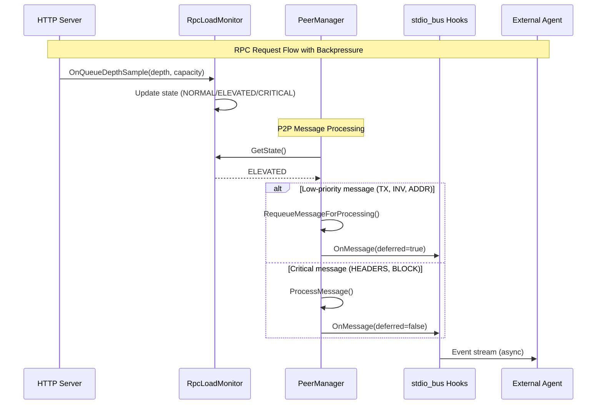
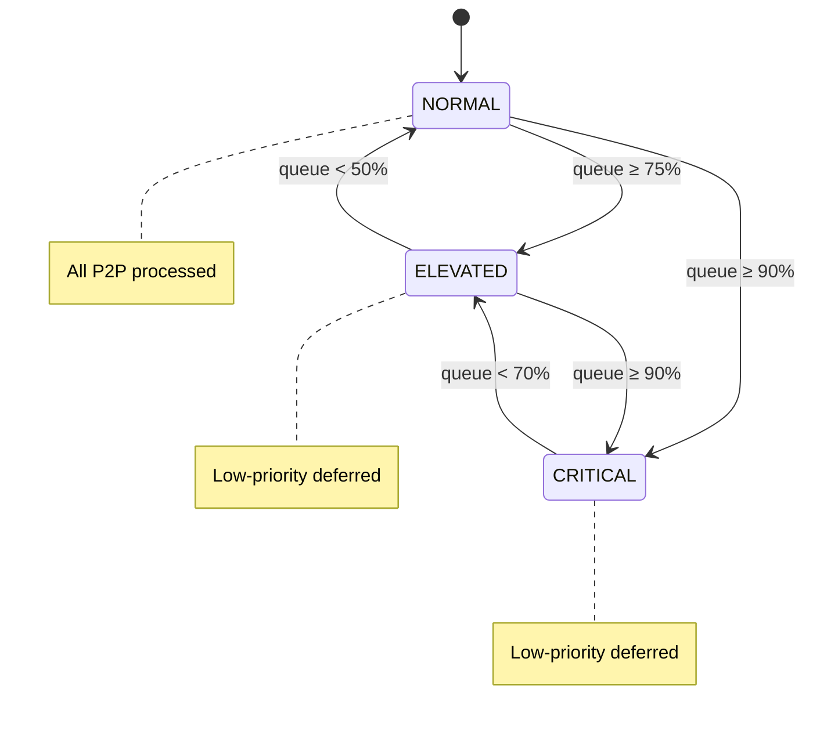
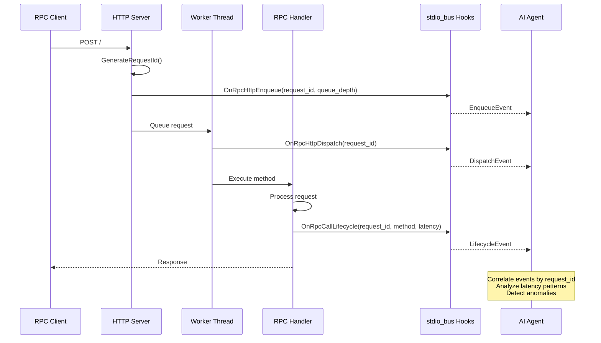
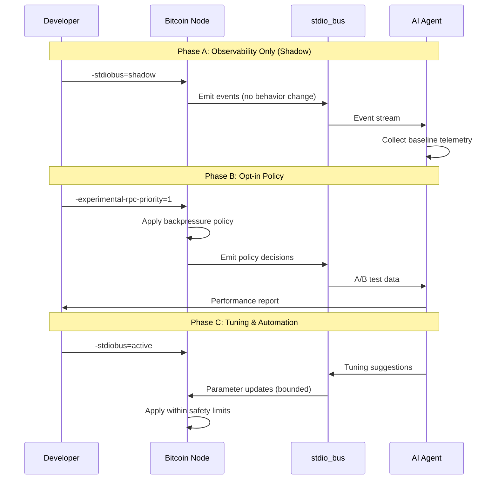

# RFC: Minimal-Invasive stdio_bus Integration Pattern for Bitcoin Core

## Abstract

This RFC proposes a design pattern for integrating `stdio_bus` observability and coordination hooks into Bitcoin Core. The pattern prioritizes safety, minimal invasiveness, and clear separation between observability/policy layers and consensus-critical code.

The #18678 backpressure PR demonstrates this pattern in practice.

## Motivation

### Problem Statement

Bitcoin Core development faces challenges in:
1. **Observability** - Understanding runtime behavior requires extensive logging or external profiling
2. **Policy experimentation** - Testing scheduling/resource policies requires code changes and rebuilds
3. **AI-assisted analysis** - Enabling agent-driven performance analysis without compromising security

### Goals

1. Define a safe integration pattern suitable for upstream review
2. Separate observability/control-plane from consensus-critical logic
3. Enable agent-driven analysis while maintaining fail-open runtime behavior
4. Provide a template for future R&D integrations

### Non-Goals

- Modifying consensus rules
- Changing P2P protocol semantics
- Adding mandatory dependencies
- Enabling remote control of consensus-critical paths

## Design Principles

### 1. Hooks are Optional, Non-blocking, Fail-open

```cpp
// Pattern: Always check enabled, never block
if (m_opts.stdio_bus_hooks && m_opts.stdio_bus_hooks->Enabled()) {
    m_opts.stdio_bus_hooks->OnMessage(event);  // Non-blocking
}
// Execution continues regardless of hook success/failure
```

### 2. No Consensus Data Mutation via Hooks

Hooks observe and emit events. They never:
- Modify block/transaction validation results
- Alter chain selection
- Change script execution
- Mutate UTXO state

### 3. Small, Explicit Hook Points

Hooks are placed at well-defined boundaries:
- Message ingress (`ProcessMessages`)
- Validation callbacks (`CValidationInterface`)
- RPC lifecycle (`HTTPReq_JSONRPC`)
- Queue depth sampling (`http_request_cb`)

### 4. Default Behavior Unchanged When Disabled

```cpp
// NoOpStdioBusHooks - zero-cost when disabled
class NoOpStdioBusHooks : public StdioBusHooks {
    bool Enabled() const override { return false; }
    void OnMessage(const MessageEvent&) override {}  // No-op
    // ...
};
```

## Pattern Demonstrated by #18678 PR

The RPC/P2P backpressure PR (#18678) demonstrates the stdio_bus integration pattern:

### Architecture





### Key Characteristics

1. **Core mitigation is native** - `RpcLoadMonitor` and backpressure gate live entirely within Bitcoin Core, no external dependencies

2. **stdio_bus provides observability** - Hooks emit events for queue depth, dispatch timing, and backpressure decisions

3. **Integration is additive** - No protocol change, no consensus rule change, no behavior change when feature is off

4. **Clear feature flagging** - `-experimental-rpc-priority` controls the policy; `-stdiobus=shadow` controls observability

## Observability Model for AI Coordination

### Event Stream Design



```cpp
// Deterministic event schema
struct RpcHttpEnqueueEvent {
    int64_t request_id;      // Correlation ID
    std::string uri;
    std::string peer_addr;
    int64_t received_us;     // Monotonic timestamp
    int queue_depth;
    int max_queue_depth;
    bool admitted;
};
```

### Use Cases

1. **Offline Attribution** - Correlate RPC latency spikes with P2P message patterns
2. **Campaign Replay** - Reproduce scenarios for regression testing
3. **Parameter Tuning** - Analyze threshold effectiveness across workloads
4. **Anomaly Detection** - Identify unusual patterns in queue behavior

### Safety Constraints

- Events are read-only snapshots
- No feedback loop to consensus paths
- Critical messages never affected by policy
- Fail-open on any hook error

## Minimal Change Footprint

### Interface Additions

| Component | Addition | Purpose |
|-----------|----------|---------|
| `node/` | `RpcLoadMonitor` | Queue state abstraction |
| `net_processing.h` | `Options` fields | Configuration injection |
| `net.h` | `RequeueMessageForProcessing()` | Defer mechanism |
| `httpserver.h` | `SetHttpServerRpcLoadMonitor()` | Wiring |

### Feature Flagging

```
-experimental-rpc-priority=<0|1>   Policy control (default: 0)
-stdiobus=<off|shadow|active>     Observability mode (default: off)
```

### Fallback Path

```cpp
// Always have a valid hooks object (never nullptr)
if (!options.stdio_bus_hooks) {
    options.stdio_bus_hooks = std::make_shared<NoOpStdioBusHooks>();
}
```

## Validation Requirements

### 1. No Behavior Change Tests

```python
# Functional test: shadow mode produces identical chain state
def test_shadow_mode_no_behavior_change():
    node_off = start_node(stdiobus="off")
    node_shadow = start_node(stdiobus="shadow")
    
    # Same blocks, same UTXO hash
    assert node_off.getbestblockhash() == node_shadow.getbestblockhash()
    assert node_off.gettxoutsetinfo()['hash'] == node_shadow.gettxoutsetinfo()['hash']
```

### 2. Overhead Budget Checks

| Path | Budget | Measurement |
|------|--------|-------------|
| Hot path (per message) | ≤100μs | `GetMonotonicTimeUs()` delta |
| Validation callback | ≤1ms | Timer around hook call |
| RPC lifecycle | ≤500μs | Request ID generation + emit |

### 3. A/B Performance Evidence

Required for any active policy mode:
- Baseline vs policy comparison
- Multiple runs (≥5) for statistical significance
- Clear improvement in target metric
- No regression in other metrics

## Rollout Strategy



### Phase A: Observability Only (Shadow Mode)

- Hooks emit events but don't affect behavior
- Validate overhead budget
- Collect baseline telemetry
- Duration: 1-2 release cycles

### Phase B: Opt-in Mitigation Policy

- Feature flag enables policy
- A/B testing with real workloads
- Gather feedback from operators
- Duration: 2-3 release cycles

### Phase C: Tuning and Automation

- stdio_bus active mode with hard safety guardrails
- Agent-driven parameter optimization
- Bounded by local safety rules (critical paths protected)
- Duration: Ongoing

## Open Questions

1. **Event Schema Versioning** - How to handle schema evolution without breaking consumers?

2. **Policy Tuning Ownership** - Who decides default threshold values? How are they updated?

3. **Experimental Flag Graduation** - What criteria promote `-experimental-*` to stable behavior?

4. **Cross-node Coordination** - Should stdio_bus support multi-node scenarios? What are the security implications?

## References

- #18678: RPC/P2P backpressure policy (demonstrates this pattern)
- #21803: Block processing delays
- #27623: Message handler saturation
- #27677: Mempool redesign
- `doc/design/stdio_bus_integration.md`: Detailed integration design

## Appendix: Event Schema v1.0

```cpp
// Core event types for RPC/P2P observability
namespace node {

struct MessageEvent {
    int peer_id;
    std::string msg_type;
    size_t size_bytes;
    int64_t received_us;
};

struct RpcHttpEnqueueEvent {
    int64_t request_id;
    std::string uri;
    std::string peer_addr;
    int64_t received_us;
    int queue_depth;
    int max_queue_depth;
    bool admitted;
};

struct RpcHttpDispatchEvent {
    int64_t request_id;
    int64_t enqueued_us;
    int64_t dispatched_us;
};

struct RpcCallLifecycleEvent {
    int64_t request_id;
    std::string method;
    std::string peer_addr;
    int64_t exec_start_us;
    int64_t exec_end_us;
    bool success;
    int http_status;
    size_t response_size;
};

} // namespace node
```
