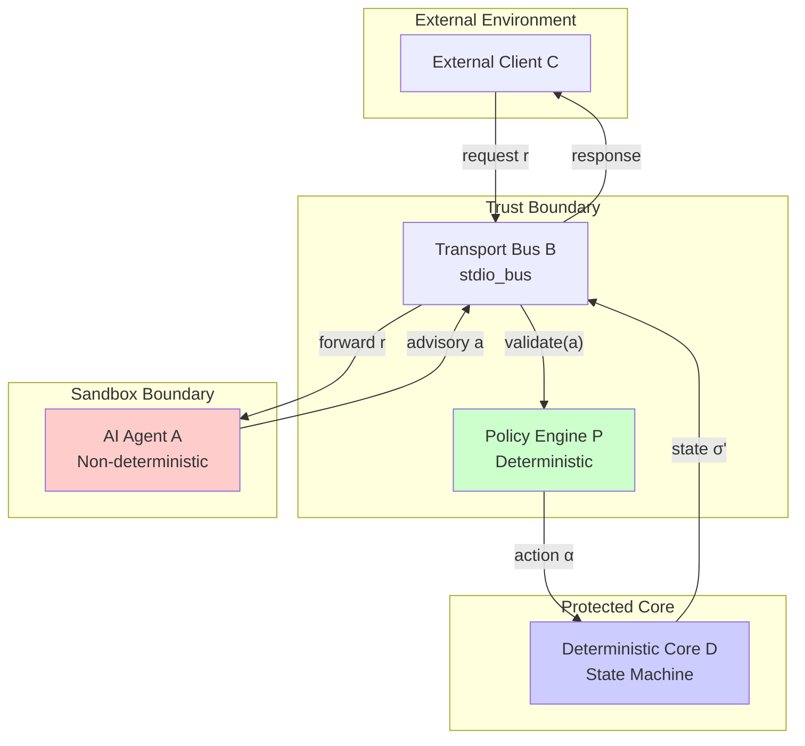
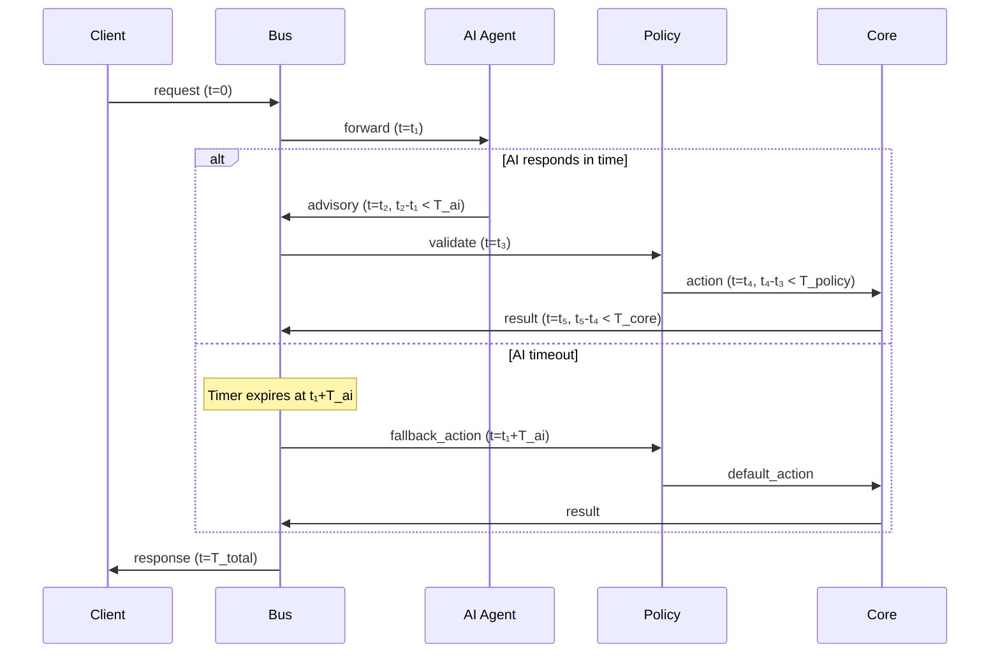
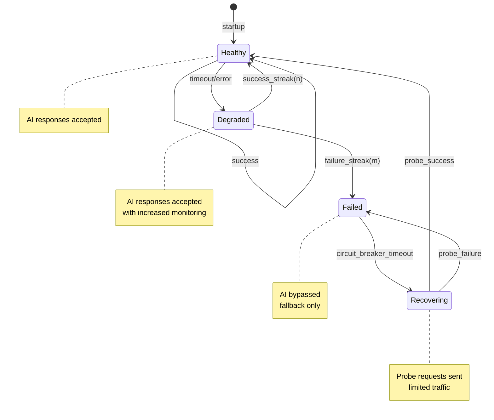
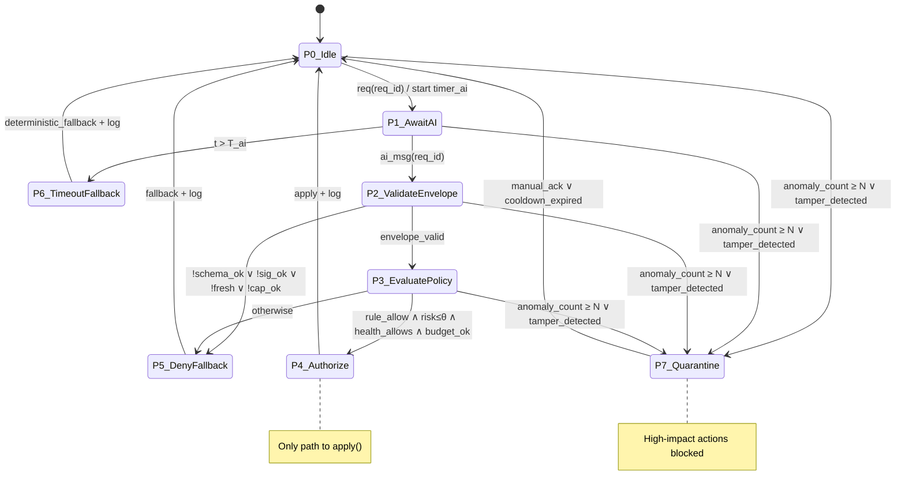
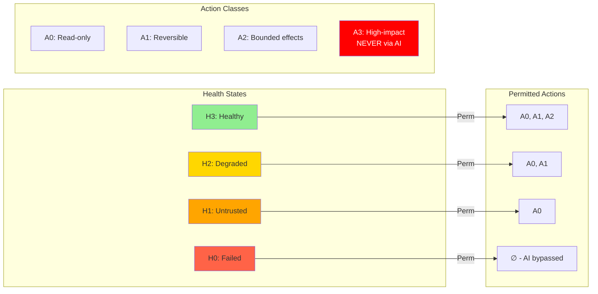
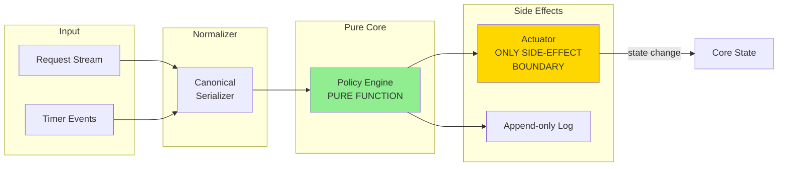
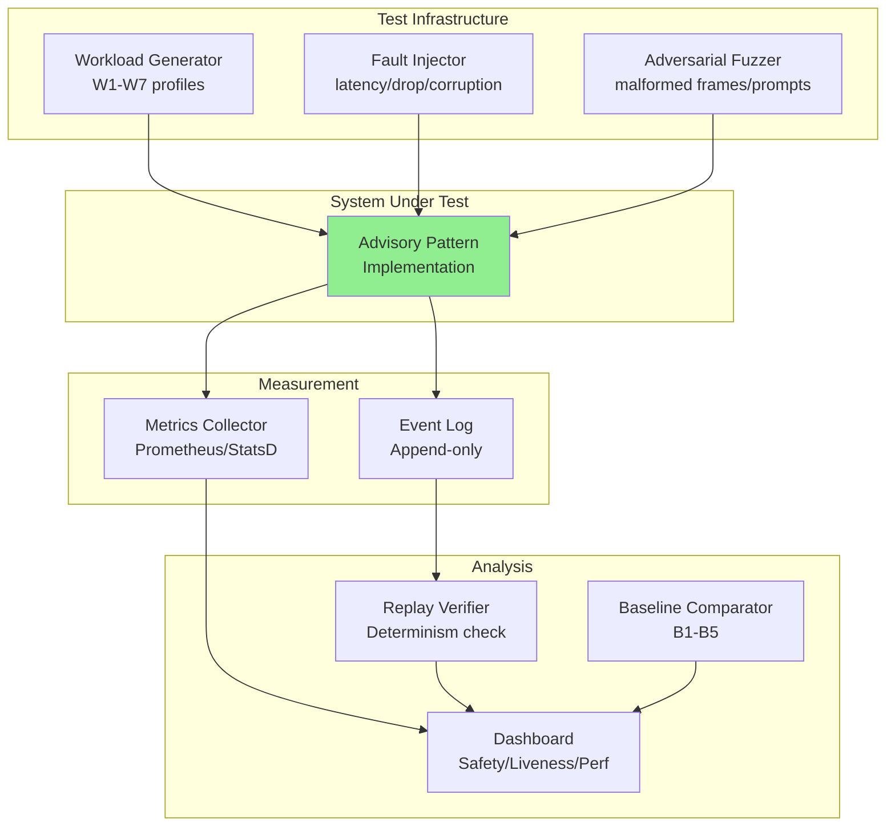

# AI Advisory Pattern: Safe Integration of Non-Deterministic AI into Deterministic Runtime Systems

## Abstract

This research presents a novel architectural pattern for integrating AI agents into systems with strict correctness requirements. We formalize the **AI Advisory Pattern** where AI output is treated as untrusted advisory input, validated by a deterministic policy layer before affecting system behavior. We prove safety invariants, define a complete failure mode state machine, and provide experimental methodology for evaluating the pattern.

**Keywords**: AI safety, deterministic systems, policy enforcement, advisory architecture, formal verification

---

## 1. Problem Statement

### 1.1 The Integration Challenge

Modern critical systems increasingly benefit from AI capabilities—anomaly detection, optimization, predictive analysis. However, AI systems exhibit fundamental properties that conflict with critical system requirements:

| AI Property | Critical System Requirement | Conflict |
|-------------|----------------------------|----------|
| Non-determinism | Reproducible behavior | Same input may produce different outputs |
| Opacity | Auditability | Decision rationale unclear |
| Failure modes | Graceful degradation | Hallucination, drift, adversarial attacks |
| Latency variance | Bounded response time | Inference time unpredictable |
| Training dependence | Stability | Model updates change behavior |

### 1.2 Formal Problem Definition

**Given**:
- A deterministic runtime system S with state space Σ and transition function δ: Σ × Input → Σ
- An AI agent A: Input → Advisory where Advisory is a probability distribution over recommendations
- Safety requirements R expressed as invariants over Σ

**Find**:
- An integration architecture that:
  1. Allows A to influence S's behavior (utility)
  2. Guarantees R holds regardless of A's output (safety)
  3. Maintains bounded response time (liveness)
  4. Degrades gracefully when A fails (availability)


---

## 2. Research Questions

### RQ1: Safety Under Adversarial Advisory
How can we guarantee system safety when AI advisory output is erroneous, malicious, or adversarially crafted?

### RQ2: Minimal Sufficient Policy Layer
What is the minimal policy layer that provides fail-safe execution guarantees?

### RQ3: Latency-Utility Tradeoff
How do AI timeout constraints affect decision quality and system throughput?

### RQ4: Advisory vs Authoritative Boundary
Under what conditions does advisory mode provide better risk-adjusted utility than rule-based baselines or authoritative AI?

---

## 3. Hypotheses

**H1: Safety Preservation** — The AI Advisory Pattern with deterministic policy enforcement reduces the rate of unsafe actions to zero, independent of AI model quality.

**H2: Graceful Degradation** — Deterministic fallback maintains system SLOs when AI is unavailable or times out.

**H3: Policy Completeness** — A finite set of policy rules can eliminate all unsafe actions for a given domain, independent of AI model behavior.

**H4: Utility Preservation** — Advisory mode achieves ≥90% of authoritative AI utility while maintaining safety guarantees.


---

## 4. System Model

### 4.1 Participants

We define four principal participants in the AI Advisory Pattern:

| Participant | Symbol | Properties | Trust Level |
|-------------|--------|------------|-------------|
| External Client | C | Initiates requests, receives responses | Untrusted |
| Transport Bus | B | Routes messages, enforces framing | Trusted (infrastructure) |
| AI Agent | A | Generates advisory output | Untrusted (by design) |
| Policy Engine | P | Validates AI output, enforces invariants | Trusted (deterministic) |
| Deterministic Core | D | Executes approved actions, maintains state | Trusted (verified) |




### 4.2 Communication Channels

**Definition 4.1 (Channel)**: A channel ch = (src, dst, props) where:
- src, dst ∈ {C, B, A, P, D} are participants
- props = {reliable, ordered, bounded_latency, authenticated}

| Channel | Source → Dest | Properties | Protocol |
|---------|---------------|------------|----------|
| ch₁ | C → B | reliable, ordered | NDJSON over TCP/Unix/stdio |
| ch₂ | B → A | reliable, ordered, bounded_latency | NDJSON over stdio pipe |
| ch₃ | A → B | reliable, ordered | NDJSON over stdio pipe |
| ch₄ | B → P | synchronous, in-process | Function call |
| ch₅ | P → D | synchronous, in-process | Function call |
| ch₆ | D → B | synchronous, in-process | Return value |
| ch₇ | B → C | reliable, ordered | NDJSON over TCP/Unix/stdio |

**Theorem 4.1 (Channel Isolation)**: AI Agent A can only communicate through channel ch₂ (input) and ch₃ (output). A has no direct channel to P, D, or C.

*Proof*: By construction of stdio_bus architecture. A runs in separate process with stdin/stdout as only I/O. □

### 4.3 Failure Modes

**Definition 4.2 (Failure Mode)**: A failure mode f = (participant, type, observable, recoverable)

| Participant | Failure Type | Observable By | Recoverable |
|-------------|--------------|---------------|-------------|
| A | Timeout | B (timer expiry) | Yes (fallback) |
| A | Crash | B (SIGCHLD/EOF) | Yes (restart) |
| A | Malformed output | B (parse error) | Yes (reject) |
| A | Schema violation | P (validation) | Yes (reject) |
| A | Policy violation | P (rule check) | Yes (reject) |
| A | Adversarial output | P (invariant check) | Yes (reject) |
| P | Bug | D (assertion) | No (fatal) |
| D | Bug | External audit | No (fatal) |
| B | Crash | C (connection lost) | Partial (reconnect) |


**Key Insight**: All AI failure modes (timeout, crash, malformed, schema violation, policy violation, adversarial) are recoverable through deterministic fallback. Only P and D failures are fatal, but these are deterministic and verifiable.

### 4.4 Timing Model

**Definition 4.3 (Timing Bounds)**:
- T_ai: Maximum time for AI to produce advisory (configurable, typically 50-250ms)
- T_policy: Maximum time for policy evaluation (bounded, typically <1ms)
- T_core: Maximum time for core state transition (bounded, typically <1ms)
- T_total = T_ai + T_policy + T_core

**Assumption 4.1 (Bounded AI Latency)**: AI response time is bounded by timeout T_ai. If A does not respond within T_ai, the system proceeds with deterministic fallback.

**Assumption 4.2 (Deterministic Policy/Core)**: T_policy and T_core are bounded by worst-case execution time (WCET) analysis of deterministic code.




---

## 5. Formal Safety Model

### 5.1 State Space Definition

**Definition 5.1 (System State)**: The system state σ ∈ Σ is a tuple:
```
σ = (σ_core, σ_ai, σ_policy, σ_bus)
```
where:
- σ_core ∈ Σ_core: State of deterministic core (application-specific)
- σ_ai ∈ {healthy, degraded, failed, recovering}: AI agent health state
- σ_policy ∈ PolicyConfig: Current policy configuration
- σ_bus ∈ BusState: Transport bus state (connections, sessions, buffers)

**Definition 5.2 (AI Health State Machine)**:



**Definition 5.3 (State Transitions)**:
- healthy → degraded: After k consecutive failures (k configurable, default k=3)
- degraded → healthy: After n consecutive successes (n configurable, default n=5)
- degraded → failed: After m consecutive failures in degraded state (m configurable, default m=5)
- failed → recovering: After circuit breaker timeout T_cb (configurable, default 30s)
- recovering → healthy: Probe request succeeds
- recovering → failed: Probe request fails


### 5.2 Safety Invariants

We define the following safety invariants that must hold in all reachable states:

**INV1: Non-Bypass Mediation**
```
G( apply(a) → ∃d: policy_allow(d) ∧ binds(d, a, req_id) ∧ valid(d) )
```
*No change to core state without a valid policy allow-decision.*

**INV2: Deny → Safe Fallback**
```
G( policy_deny(req_id) → F≤T_fb fallback(req_id, safe_mode) ∧ X(core' ∈ SafeSet) )
```
*Policy denial always leads to safe fallback within bounded time.*

**INV3: Timeout Determinism**
```
G( timeout(req_id) → F≤T_fb fallback(req_id, deterministic_action(req_id, input_snapshot)) )
```
*Timeout always triggers deterministic fallback behavior.*

**INV4: Fail-Closed on Uncertainty**
```
G( parse_error ∨ policy_error ∨ auth_error ∨ unknown_state → X deny_or_fallback )
```
*Any error condition leads to denial or fallback, never to uncontrolled execution.*

**INV5: Bounded AI Influence**
```
G( ai_msg affects only advisory_fields )
G( ai_msg cannot write core directly )
```
*AI output can only influence advisory fields; core state projection is independent of raw AI messages.*

**INV6: Freshness / Anti-Replay**
```
G( accept(ai_msg) → nonce_unused(ai_msg.nonce) ∧ within_ttl(ai_msg.ts) )
```
*AI messages must be fresh and not replayed.*

**INV7: Monotonic Degradation**
```
G( ai_health worsens → permitted_action_class non-increasing )
```
*As AI health degrades, permitted action classes can only decrease.*

**INV8: Audit Completeness**
```
G( decision(req_id) → F log(req_id, decision_id, hashes, policy_ver, outcome) )
```
*Every decision is eventually logged with full context.*

**INV9: Resource Safety**
```
G( cpu ≤ C_max ∧ mem ≤ M_max ∧ queue ≤ Q_max )
```
*Resource bounds are maintained; violation triggers deterministic shedding.*

**INV10: Replay Determinism**
```
∀ run1, run2: trace_in(run1) = trace_in(run2) ∧ policy_ver1 = policy_ver2 
    → core_trace1 = core_trace2
```
*Identical inputs and policy versions produce identical core state traces.*


### 5.3 Policy Decision State Machine

The Policy Engine operates as a deterministic state machine with the following states and transitions:



**State Descriptions:**

| State | Description | Allowed Actions |
|-------|-------------|-----------------|
| P0_Idle | Waiting for request | None |
| P1_AwaitAI | Waiting for AI response | Timer running |
| P2_ValidateEnvelope | Checking message format, signature, freshness | Validation only |
| P3_EvaluatePolicy | Evaluating policy rules | Rule evaluation |
| P4_Authorize | Approved, executing action | apply() |
| P5_DenyFallback | Denied, executing fallback | fallback() |
| P6_TimeoutFallback | Timeout, executing deterministic fallback | deterministic_fallback() |
| P7_Quarantine | Anomaly detected, system locked | Manual intervention required |

**Guard Conditions:**

```
schema_ok := ai_msg matches expected JSON schema
sig_ok := ai_msg.signature verifies (if required)
fresh := ai_msg.timestamp within TTL ∧ nonce not seen
cap_ok := ai_msg.requested_action ∈ agent_capabilities
rule_allow := policy_rules.evaluate(context, action) = ALLOW
risk ≤ θ := computed_risk_score ≤ risk_threshold
health_allows := action_class ∈ Perm(ai_health)
budget_ok := resource_budget.check(action) = OK
```


### 5.4 Policy Lattice and AI Health Mapping

We define a lattice of action classes ordered by risk/impact, and map AI health states to permitted action classes.

**Definition 5.4 (Action Class Lattice)**:
```
A0 ⊆ A1 ⊆ A2 ⊆ A3
```
where:
- A0: Read-only, logging, metrics (no side effects)
- A1: Reversible low-risk actions (cache hints, soft preferences)
- A2: Bounded side-effects (rate adjustments, priority changes)
- A3: High-impact actions (disconnections, state modifications)

**Definition 5.5 (Health Level Ordering)**:
```
H0 ≤ H1 ≤ H2 ≤ H3
```
where:
- H3: Healthy (full AI capability)
- H2: Degraded (reduced trust, increased monitoring)
- H1: Untrusted (minimal AI influence)
- H0: Failed (AI path disabled)

**Definition 5.6 (Permission Mapping)**:
```
Perm: Health → P(ActionClass)
Perm(H3) = {A0, A1, A2}
Perm(H2) = {A0, A1}
Perm(H1) = {A0}
Perm(H0) = ∅
```

**Theorem 5.1 (Monotonicity)**: The permission mapping is monotonic:
```
h1 ≤ h2 → Perm(h1) ⊆ Perm(h2)
```

*Proof*: By construction of Perm. □



**Note**: A3 (high-impact actions) are NEVER permitted through the AI advisory path. They require explicit human approval or deterministic rule-based execution.


### 5.5 Deterministic Replay Requirements

For audit, debugging, and compliance, the system must support deterministic replay of decision sequences.

**Requirement R1 (Pure Policy Engine)**: The policy engine must be a pure function:
- No calls to `now()`, `random()`, or external services
- All time-dependent logic uses logged timestamps
- All external data is captured in the event log

**Requirement R2 (Complete Event Sourcing)**: Log all events:
- Input events (requests, AI messages)
- Timeout events (with precise timestamps)
- Policy version and configuration
- Decision outcomes

**Requirement R3 (Time Control)**: 
- Runtime: Use monotonic clock for timeouts
- Replay: Inject recorded timestamp sequence

**Requirement R4 (AI Isolation in Replay)**:
- In replay mode, AI is not invoked
- Recorded `ai_msg` (with content hash) is used instead
- Envelope validation uses recorded data

**Requirement R5 (Canonical Serialization)**:
- Stable JSON serialization (sorted keys)
- Fixed encoding (UTF-8, no BOM)
- Deterministic floating-point representation

**Requirement R6 (Version Pinning)**:
- `policy_ver`, `schema_ver`, `fallback_ver` in decision record
- Version mismatch → separate replay domain

**Requirement R7 (Idempotency)**:
- `decision_id` as idempotency key
- Prevents double-apply during recovery

**Architecture Implication**:



---

## 6. Security Argument

### 6.1 Threat Model

We consider the following adversary capabilities:

| Threat ID | Threat | Adversary Capability | Attack Vector |
|-----------|--------|---------------------|---------------|
| T1 | Adversarial AI Output | Control AI model or training data | Hallucination, manipulation, harmful recommendations |
| T2 | Timing Attacks | Influence AI response time | Slow responses to trigger timeouts strategically |
| T3 | Resource Exhaustion | Generate high load | DoS through excessive requests or large payloads |
| T4 | Model Poisoning | Access to training pipeline | Gradual drift toward unsafe recommendations |
| T5 | Prompt Injection | Craft malicious input | Inject instructions via context or tool outputs |
| T6 | Protocol Confusion | Manipulate wire format | Frame smuggling, partial writes, desync |
| T7 | Replay Attacks | Capture and replay messages | Reuse valid AI responses out of context |
| T8 | TOCTOU | Timing between check and use | State change between validation and apply |
| T9 | Capability Escalation | Exploit policy gaps | Request actions beyond permitted budget |
| T10 | Policy Tampering | Access to policy config | Rollback to permissive policy version |
| T11 | Side-Channel Leakage | Observe logs/errors | Extract sensitive data through error messages |
| T12 | Cross-Tenant Contamination | Shared runtime | Influence other tenants through shared model |
| T13 | Supply-Chain Drift | Model update process | Silent model replacement with different behavior |


### 6.2 Security Controls

| Threat | Control | Invariant Enforced |
|--------|---------|-------------------|
| T1 | Policy validation, action class limits | INV1, INV5, INV7 |
| T2 | Bounded timeout, deterministic fallback | INV3, INV4 |
| T3 | Rate limiting, queue bounds, load shedding | INV9 |
| T4 | Model versioning, anomaly detection, quarantine | INV7, INV8 |
| T5 | Input sanitization, context isolation | INV5 |
| T6 | Strict framing, schema validation | INV4 |
| T7 | Nonce checking, TTL enforcement | INV6 |
| T8 | Atomic decision-apply, single actuator | INV1, INV2 |
| T9 | Capability budget, health-based limits | INV7 |
| T10 | Policy version in audit, monotonic versioning | INV8 |
| T11 | Structured logging, error sanitization | INV8 |
| T12 | Process isolation, separate model instances | INV5 |
| T13 | Model hash verification, attestation | INV8 |

### 6.3 Proof Obligations

We formalize the security guarantees as proof obligations in temporal logic:

**PO-S1 (State Safety)**:
```
Init ∧ □[Next]_vars ⇒ □(core ∈ SafeSet)
```
*The system never leaves the safe state set.*

**PO-S2 (Mediation)**:
```
□(CoreChanged ⇒ ∃d ∈ Decisions: ValidAllow(d) ∧ Binds(d, req_id, action))
```
*Every core state change has a valid policy decision.*

**PO-S3 (Fail-Closed)**:
```
□(PolicyErr ∨ ParseErr ∨ AuthErr ⇒ X(Denied ∨ Fallback))
```
*Errors lead to denial or fallback.*

**PO-S4 (Timeout Safety)**:
```
□(TimedOut(req_id) ⇒ ◇≤T_fb DeterministicFallback(req_id))
```
*Timeouts trigger deterministic fallback within bounded time.*

**PO-L1 (Bounded Response Liveness)**:
```
□(Request(req_id) ⇒ ◇≤T_resp_max Terminal(req_id))
```
where `Terminal := Applied ∨ Fallback ∨ Rejected`

**PO-L2 (No Infinite Blocking by AI)**:
```
□(AwaitAI(req_id) ⇒ ◇(AIReceived(req_id) ∨ TimedOut(req_id)))
```
*Requires weak fairness of timer: WF_vars(TimerTick)*

**PO-F1 (Fair Service)**:
```
□(Enqueued(req_id) ∧ Admissible(req_id) ⇒ ◇Served(req_id))
```
*Under bounded load, all admissible requests are eventually served.*

**PO-A1 (Audit Completeness)**:
```
□(Terminal(req_id) ⇒ ◇Logged(req_id, decision_id, policy_ver, hashes))
```
*All terminal states are logged.*

**PO-R1 (Replay Determinism)**:
```
∀run1, run2: trace_in(run1) = trace_in(run2) ∧ policy_ver1 = policy_ver2 
    ⇒ core_trace1 = core_trace2
```
*Identical inputs produce identical outputs.*

**PO-Q1 (Quarantine Soundness)**:
```
□(Quarantine ⇒ ¬HighImpactApply)
```
*In quarantine state, high-impact actions are blocked.*


### 6.4 Verification Methods

| Proof Obligation | Verification Method | Evidence Artifact |
|------------------|--------------------|--------------------|
| PO-S1 | Model checking (TLA+/Alloy) | Verified model, counterexample absence |
| PO-S2 | Static analysis of policy engine | Code coverage, invariant assertions |
| PO-S3 | Property-based testing | Test suite with error injection |
| PO-S4 | Fault injection testing | Timeout storm scenarios |
| PO-L1 | Load testing with SLO monitoring | Latency percentile reports |
| PO-L2 | Timer fairness analysis | Scheduler verification |
| PO-F1 | Queuing theory analysis | Throughput under load metrics |
| PO-A1 | Log completeness audit | Log coverage analysis |
| PO-R1 | Replay regression tests | Determinism test suite |
| PO-Q1 | Quarantine state testing | Blocked action verification |

---

## 7. Experimental Design

### 7.1 Metrics

**Safety Metrics:**
- `unsafe_state_count`: Number of times core entered unsafe state (target: 0)
- `policy_bypass_rate`: Fraction of actions without valid policy decision (target: 0)
- `high_impact_block_rate_degraded`: Rate of A2+ actions blocked when health < H3

**Liveness/Performance Metrics:**
- `request_completion_rate`: Fraction of requests reaching terminal state
- `p50/p95/p99_decision_latency`: Decision latency percentiles
- `timeout_ratio`: Fraction of requests timing out
- `fallback_ratio`: Fraction of requests using fallback path
- `throughput`: Requests per second under load

**Resilience Metrics:**
- `MTTR_ai_failure`: Mean time to recover from AI failure
- `quarantine_precision`: True positive rate for quarantine triggers
- `quarantine_recall`: Detection rate for actual anomalies
- `graceful_degradation_score`: Service quality during degraded state

### 7.2 Workload Profiles

| Profile | Description | Purpose |
|---------|-------------|---------|
| W1: Nominal | Steady-state traffic within capacity | Baseline performance |
| W2: Burst | 10x traffic spike for 60 seconds | Overload handling |
| W3: Adversarial | Malformed frames, invalid schemas | Robustness testing |
| W4: Timeout Storm | AI responses delayed beyond T_ai | Fallback path testing |
| W5: Replay Attack | Duplicate messages with same nonce | Anti-replay verification |
| W6: Resource Pressure | CPU/memory at 90% utilization | Graceful degradation |
| W7: Mixed Failure | Combination of W3-W6 | Realistic failure scenarios |

### 7.3 Baselines

| Baseline | Description | Expected Outcome |
|----------|-------------|------------------|
| B1: Direct AI | AI output directly affects core | Unsafe states possible |
| B2: Validation Only | Schema validation, no policy | Partial safety |
| B3: Sandbox Only | Process isolation, no mediation | Resource safety only |
| B4: Supervisor Only | Restart on failure, no policy | Availability, not safety |
| B5: Advisory Pattern | Full pattern implementation | Full safety guarantees |


### 7.4 Experimental Protocol



**Protocol Steps:**

1. **Setup**: Deploy SUT and baselines B1-B4 in isolated environments
2. **Calibration**: Run W1 to establish baseline metrics
3. **Safety Testing**: Run W3-W5 against all configurations
4. **Performance Testing**: Run W1-W2 with latency measurement
5. **Resilience Testing**: Run W6-W7 with degradation monitoring
6. **Replay Verification**: Replay logged events, verify determinism
7. **Comparison**: Compare SUT metrics against baselines

### 7.5 Success Criteria

| Criterion | Threshold | Rationale |
|-----------|-----------|-----------|
| `unsafe_state_count` | = 0 | Safety is non-negotiable |
| `policy_bypass_rate` | = 0 | Mediation must be complete |
| `replay_divergence_rate` | = 0 | Determinism required for audit |
| `request_completion_rate` | ≥ 99.9% | High availability |
| `p99_decision_latency` | ≤ T_resp_max | Bounded response time |
| `fallback_ratio` under W1 | ≤ 1% | AI should be useful |
| `MTTR_ai_failure` | ≤ 30s | Quick recovery |

---

## 8. Results Template

*This section will be populated with experimental results.*

### 8.1 Safety Results

| Configuration | unsafe_state_count | policy_bypass_rate | Notes |
|---------------|-------------------|-------------------|-------|
| B1: Direct AI | TBD | N/A | Expected failures |
| B2: Validation Only | TBD | TBD | Partial protection |
| B3: Sandbox Only | TBD | TBD | Resource protection |
| B4: Supervisor Only | TBD | TBD | Availability focus |
| B5: Advisory Pattern | TBD | TBD | Expected: 0, 0 |

### 8.2 Performance Results

| Configuration | p50 (ms) | p95 (ms) | p99 (ms) | Throughput (rps) |
|---------------|----------|----------|----------|------------------|
| B1: Direct AI | TBD | TBD | TBD | TBD |
| B5: Advisory Pattern | TBD | TBD | TBD | TBD |
| Overhead | TBD | TBD | TBD | TBD |

### 8.3 Resilience Results

| Scenario | B1 | B2 | B3 | B4 | B5 |
|----------|----|----|----|----|-----|
| W3: Adversarial | TBD | TBD | TBD | TBD | TBD |
| W4: Timeout Storm | TBD | TBD | TBD | TBD | TBD |
| W6: Resource Pressure | TBD | TBD | TBD | TBD | TBD |


---

## 9. Novel Contributions

This research makes the following novel contributions to the field of AI system integration:

### 9.1 Contribution Summary

| # | Contribution | Novelty Claim |
|---|--------------|---------------|
| C1 | AI Advisory Pattern | First formal treatment of AI as untrusted advisory input with policy mediation |
| C2 | Health-to-Capability Lattice | Novel mapping from AI health states to permitted action classes |
| C3 | Deterministic Fallback Semantics | Compilation of timeouts into deterministic behavior (not best-effort retries) |
| C4 | Proof-Carrying Decisions | Every core state change accompanied by verifiable decision trail |
| C5 | Unified Safety Framework | Combination of capability budget + policy mediation + deterministic replay |

### 9.2 Comparison with Related Work

| Approach | Strengths | Gaps Addressed by Advisory Pattern |
|----------|-----------|-----------------------------------|
| **Erlang/OTP Supervisors** | Excellent fault tolerance, process restart | No semantic safety for AI advice; no policy mediation |
| **Capability-Based Security** | Fine-grained access control | No timeout determinism; no health-based degradation |
| **Sandboxing** | Strong isolation | No decision flow correctness; no replay guarantee |
| **Input Validation** | Format/range checking | No state-transition safety; no policy enforcement |
| **RLHF/Constitutional AI** | Reduces harmful model outputs | No runtime mediation; no system-level guarantees |
| **Guardrails Libraries** | Easy integration | No formal invariants; no complete failure handling |

### 9.3 Key Differentiators

1. **Advice-as-Data**: AI output is treated as data to be validated, not as commands to be executed. This inverts the typical AI integration model.

2. **Health-Capability Coupling**: The permission lattice formally connects AI reliability to permitted actions, enabling graceful degradation.

3. **Deterministic Timeout Semantics**: Unlike retry-based approaches, timeouts compile to specific deterministic actions, enabling formal verification.

4. **Audit-First Design**: Every decision is logged with sufficient context for replay, enabling post-hoc verification and compliance.

5. **Composable Safety**: Safety properties compose—adding new action classes or health states preserves existing invariants.

---

## 10. Limitations

### 10.1 Provable Guarantees vs. Assumptions

**What We Prove:**
- Safety relative to defined `SafeSet` and policy rules
- Mediation completeness (no bypass)
- Timeout determinism
- Replay consistency

**What We Assume:**
- Policy rules correctly capture safety requirements
- `SafeSet` is correctly defined for the domain
- Trusted components (P, D) are bug-free
- Cryptographic primitives are secure

### 10.2 Inherent Limitations

| Limitation | Description | Mitigation |
|------------|-------------|------------|
| **Policy Completeness** | Cannot guarantee policy covers ALL unsafe scenarios | Domain expert review, incident-driven refinement |
| **Semantic Gap** | Policy checks observable features, not hidden intent | Defense in depth, anomaly detection |
| **Latency Overhead** | Mediation adds 10-40% to decision path | Optimize policy engine, accept tradeoff |
| **Availability Tradeoff** | Fail-closed increases fallback rate | Tune thresholds, improve AI reliability |
| **Expressiveness Ceiling** | AI cannot initiate side-effects directly | By design—this is a feature, not a bug |
| **Replay Constraints** | Requires strict canonicalization and versioning | Tooling support, version management |
| **Human Factors** | Quality depends on rule engineering discipline | Training, review processes, automation |

### 10.3 Scope Boundaries

This pattern is designed for:
- Systems where safety is more important than AI autonomy
- Domains with well-defined safety requirements
- Applications tolerant of fallback behavior

This pattern is NOT designed for:
- Fully autonomous AI systems
- Domains where AI must make irreversible decisions
- Real-time systems with sub-millisecond latency requirements


---

## 11. Related Work

### 11.1 AI Safety and Alignment

- **RLHF (Reinforcement Learning from Human Feedback)**: Trains models to produce safer outputs but provides no runtime guarantees. Advisory Pattern complements RLHF by adding system-level mediation.

- **Constitutional AI**: Embeds principles into model training. Advisory Pattern operates at runtime, independent of training methodology.

- **AI Guardrails**: Libraries like NeMo Guardrails provide input/output filtering. Advisory Pattern extends this with formal invariants and complete failure handling.

### 11.2 Formal Methods

- **TLA+ / PlusCal**: Specification languages for concurrent systems. We use similar temporal logic for proof obligations.

- **Alloy**: Relational modeling for software design. Applicable to policy rule verification.

- **Model Checking**: Exhaustive state space exploration. Applicable to verify INV1-INV10.

### 11.3 Systems Security

- **Capability-Based Security**: Fine-grained access control (e.g., Capsicum, seL4). Advisory Pattern adds health-based capability degradation.

- **Reference Monitors**: Mediate all access to resources. Policy Engine serves as reference monitor for AI advice.

- **Sandboxing**: Process isolation (seccomp, containers). Advisory Pattern uses sandboxing for AI workers but adds semantic mediation.

### 11.4 Fault Tolerance

- **Erlang/OTP Supervisors**: Process supervision with restart strategies. Advisory Pattern adds policy-mediated decision safety.

- **Circuit Breakers**: Prevent cascade failures (e.g., Hystrix). AI Health State Machine incorporates circuit breaker semantics.

- **Saga Pattern**: Compensating transactions for distributed systems. Future work may integrate saga semantics for multi-step AI workflows.

---

## 12. Future Directions

### 12.1 Open Problems

| Problem | Description | Research Direction |
|---------|-------------|-------------------|
| **Automatic Policy Synthesis** | Generate policy rules from incidents/traces | Learning from counterexamples, proof-carrying constraints |
| **Runtime Model Checking** | Verify invariants during execution | Lightweight monitoring, statistical model checking |
| **Distributed Advisory** | Multi-service AI coordination | Distributed consensus, Byzantine-tolerant voting |
| **Quantitative Risk** | Dynamic risk budgets vs. static classes | Continuous risk scoring, adaptive thresholds |
| **Verified Policy Compiler** | Compile DSL to guards without divergence | Certified compilation, proof-carrying code |
| **Cross-Model Resilience** | Multiple AI models with adjudication | Ensemble methods, disagreement detection |
| **Standardized Audit Format** | Interoperable compliance evidence | Industry standards, regulatory alignment |

### 12.2 Research Roadmap

```mermaid
gantt
    title Advisory Pattern Research Roadmap
    dateFormat  YYYY-Q
    section Foundation
    Formal Model (TLA+)           :done, 2024-Q1, 2024-Q2
    Reference Implementation      :active, 2024-Q2, 2024-Q3
    Conformance Test Suite        :2024-Q3, 2024-Q4
    section Validation
    Experimental Evaluation       :2024-Q3, 2024-Q4
    Case Studies (Bitcoin, Industrial) :2024-Q4, 2025-Q1
    section Extensions
    Distributed Advisory          :2025-Q1, 2025-Q2
    Automatic Policy Synthesis    :2025-Q2, 2025-Q3
    Verified Policy Compiler      :2025-Q3, 2025-Q4
```

### 12.3 Standardization Path

1. **Internal Specification**: Complete formal model and reference implementation
2. **Community Review**: Open source release, gather feedback
3. **Industry Pilots**: Deploy in production environments
4. **Standards Proposal**: Submit to relevant standards bodies (IEEE, IETF)
5. **Ecosystem Development**: SDKs, tooling, certification programs


---

## 13. Reproducibility

### 13.1 Artifact Availability

| Artifact | Location | Description |
|----------|----------|-------------|
| Formal Model | `spec/tla/advisory-pattern.tla` | TLA+ specification |
| Reference Implementation | `src/` (C), `worker/` (TypeScript) | stdio_bus implementation |
| Conformance Vectors | `conformance/vectors/` | Test cases for verification |
| Experimental Scripts | `experiments/` | Workload generators, analysis |
| Documentation | `docs/universal-transport/research/` | This document and related |

### 13.2 Environment Requirements

```
C Daemon:
- C11 compiler (gcc 7+ or clang 5+)
- POSIX-compliant OS (Linux, macOS)
- CMake 3.10+ or Make

TypeScript Worker:
- Node.js 18+
- TypeScript 5+
- npm

Verification:
- TLA+ Toolbox (for model checking)
- Alloy Analyzer (for policy verification)
```

### 13.3 Reproduction Steps

1. Clone repository
2. Build C daemon: `make`
3. Build TypeScript worker: `cd worker && npm install && npm run build`
4. Run conformance tests: `./conformance/harness/runner.js`
5. Run experiments: `./experiments/run-all.sh`
6. Verify model: `tlc spec/tla/advisory-pattern.tla`

---

## Appendix A: Formal Notation

### A.1 State Space

```
σ = (σ_core, σ_ai, σ_policy, σ_bus)

σ_core ∈ Σ_core           -- Application-specific state
σ_ai ∈ {H0, H1, H2, H3}   -- AI health state
σ_policy ∈ PolicyConfig    -- Policy rules and version
σ_bus ∈ BusState          -- Transport state
```

### A.2 Events

```
E = {req, ai_msg, timeout, policy_allow, policy_deny, apply, fallback}

req(req_id, payload)      -- Client request
ai_msg(req_id, advisory)  -- AI response
timeout(req_id)           -- Timer expiry
policy_allow(d)           -- Policy approval
policy_deny(d)            -- Policy rejection
apply(action)             -- Core state change
fallback(req_id, mode)    -- Fallback execution
```

### A.3 Predicates

```
SafeSet ⊆ Σ_core          -- Safe states
ValidAllow(d)             -- Decision d is valid approval
Binds(d, req_id, action)  -- Decision d authorizes action for request
Terminal(req_id)          -- Request reached terminal state
Perm(h)                   -- Permitted action classes for health h
```

### A.4 Temporal Operators

```
□ φ                       -- Always φ (globally)
◇ φ                       -- Eventually φ (finally)
X φ                       -- Next state φ
◇≤t φ                     -- Eventually within time t
φ → ψ                     -- φ implies ψ
WF_vars(A)                -- Weak fairness of action A
```

---

## Appendix B: Policy Rule Examples

### B.1 Dual-Control Rule

```json
{
  "rule_id": "dual-control-transfer",
  "action_class": "A2",
  "conditions": {
    "require_distinct_subjects": true,
    "min_approvers": 2,
    "allowed_roles": ["initiator", "approver"],
    "deny_if_actor_equals": ["initiator"]
  }
}
```

### B.2 Health-Based Restriction

```json
{
  "rule_id": "health-gate",
  "conditions": {
    "min_health": "H2",
    "action_classes": ["A1", "A2"],
    "fallback_on_degraded": "A0_only"
  }
}
```

### B.3 Rate Limiting

```json
{
  "rule_id": "rate-limit-alerts",
  "action": "alert",
  "limits": {
    "max_per_minute": 10,
    "max_per_hour": 100,
    "burst_allowance": 5
  }
}
```

---

## References

1. Amodei, D., et al. "Concrete Problems in AI Safety." arXiv:1606.06565 (2016).
2. Bai, Y., et al. "Constitutional AI: Harmlessness from AI Feedback." arXiv:2212.08073 (2022).
3. Lamport, L. "Specifying Systems: The TLA+ Language and Tools for Hardware and Software Engineers." Addison-Wesley (2002).
4. Armstrong, J. "Making Reliable Distributed Systems in the Presence of Software Errors." PhD Thesis (2003).
5. Dennis, J.B., Van Horn, E.C. "Programming Semantics for Multiprogrammed Computations." CACM (1966).
6. Anderson, J.P. "Computer Security Technology Planning Study." ESD-TR-73-51 (1972).

---

*Document Version: 1.0*
*Last Updated: 2026-03-25*
*Authors: Kiro + Codex (AI Research Collaboration)*
