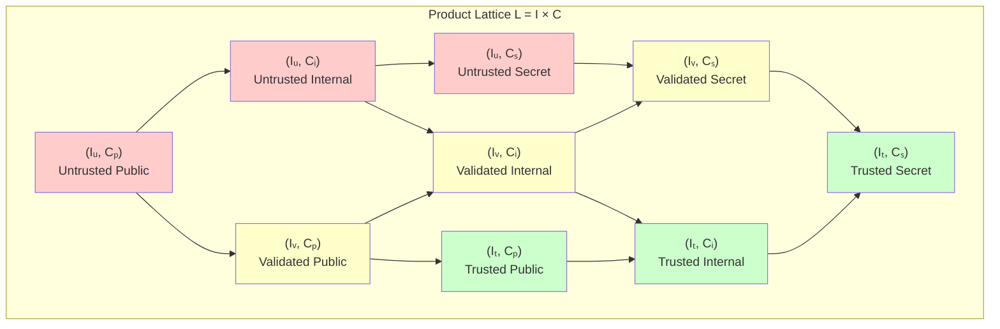
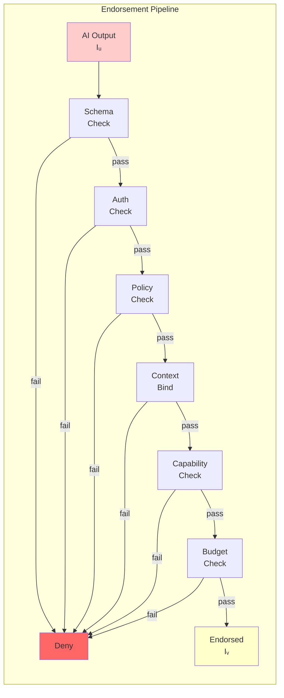
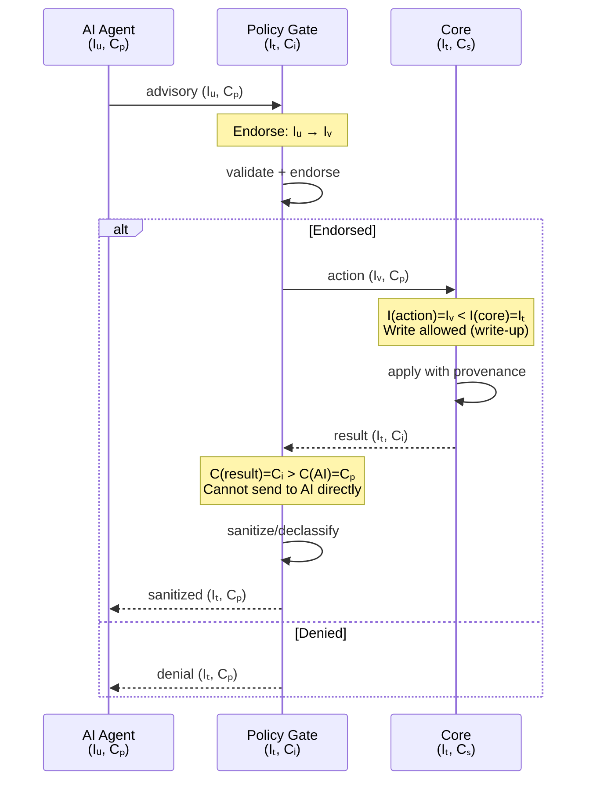
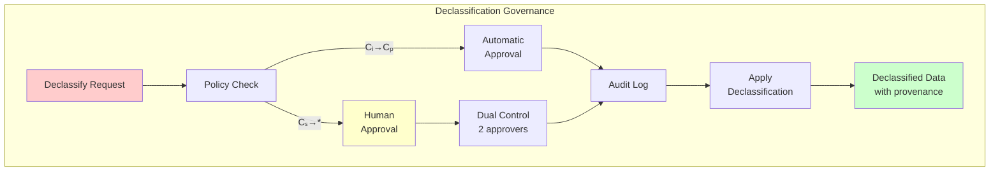
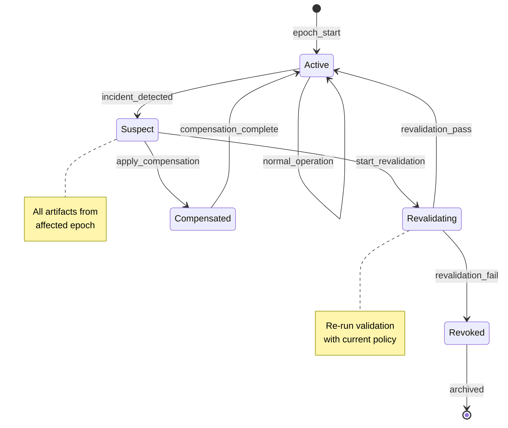
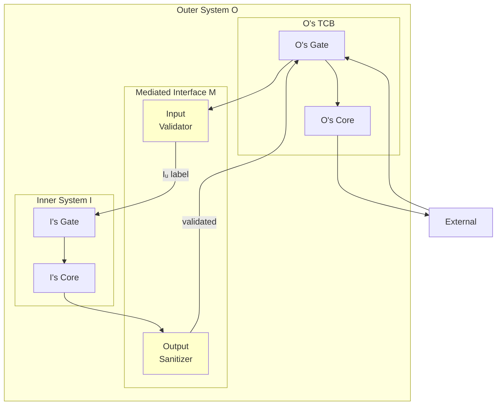
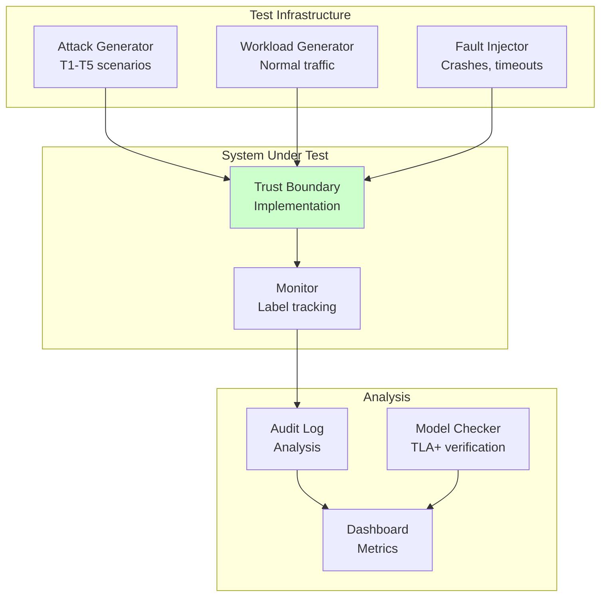
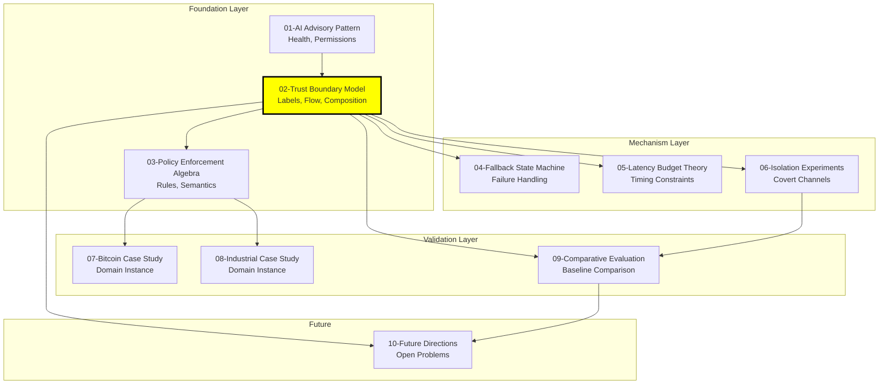

# Trust Boundary Model: Formal Trust Semantics for AI-Deterministic System Integration

## Abstract

This document formalizes the trust relationships between AI agents and deterministic system cores using a dual-lattice model combining integrity and confidentiality. We define trust algebra with explicit axioms, establish information flow rules with anti-laundering semantics through provenance tracking, prove key security theorems including confinement and non-interference, and specify composition conditions. The model provides a rigorous foundation for reasoning about AI integration safety.

**Keywords**: trust model, information flow control, dual-lattice, formal verification, security boundaries, non-interference, declassification, provenance

---

## 1. Problem Scope and Threat Assumptions

### 1.1 Problem Statement

How do we formally reason about trust when integrating non-deterministic AI agents with deterministic safety-critical systems?

**Challenges**:
- AI output is inherently untrusted (non-deterministic, opaque, potentially adversarial)
- System core requires integrity guarantees (deterministic, auditable, safe)
- Data flows must be controlled to prevent both integrity violations and information leakage
- Traditional IFC models don't address AI-specific concerns (health degradation, advisory semantics)

### 1.2 Threat Assumptions

**Trusted Computing Base (TCB)**:
| Component | Trust Level | Justification |
|-----------|-------------|---------------|
| Policy Gate | Trusted | Minimal, deterministic, formally verifiable |
| Actuator | Trusted | Single write path to core |
| Label Manager | Trusted | Assigns and tracks trust labels |
| Audit Logger | Trusted | Append-only, no decision influence |
| Transport Bus | Trusted | Infrastructure, extensively tested |

**Untrusted Components**:
| Component | Threat | Capability |
|-----------|--------|------------|
| AI Agent | Adversarial output | Generate any syntactically valid output |
| External Client | Malicious input | Craft arbitrary requests |
| AI Model | Drift/poisoning | Gradual behavior change |

### 1.3 Scope Boundaries

**In Scope**:
- Integrity of core state
- Confidentiality of sensitive data
- Information flow control
- Trust composition
- Provenance tracking (anti-laundering)

**Out of Scope**:
- Kernel/hardware vulnerabilities
- Side-channel attacks (addressed in 06-isolation-experiments)
- Availability guarantees (addressed in 04-fallback-state-machine, 05-latency-budget-theory)

### 1.4 TCB Registry

**Definition 1.1 (Trusted Computing Base)**:
The TCB consists of all components whose correctness is required for security guarantees.

| Component | Privilege | Invariants Protected | Est. LOC | Assurance Level |
|-----------|-----------|---------------------|----------|-----------------|
| Policy Gate | Validate, endorse, deny | INV1 (mediation), INV4 (fail-closed) | ~500 | Formal verification target |
| Actuator | write_core | INV1 (single write path) | ~100 | Formal verification |
| Label Manager | Assign labels, track provenance | INV5 (label integrity) | ~300 | Extensive testing + review |
| Context Builder | Build immutable context | Determinism, no side effects | ~200 | Testing + review |
| Audit Logger | Append to log | INV8 (audit completeness) | ~200 | Testing + review |
| Timeout Controller | Set T_ai, mode transitions | Bounded completion | ~300 | Testing + review |
| Declassification Authority | Lower C labels | INV (declassification governance) | ~200 | Dual-control + audit |

**TCB Boundary Rule**: Any component that can:
1. Modify Core state without mediation
2. Bypass label checks
3. Suppress audit records
4. Override timeout/fallback

MUST be in TCB and subject to enhanced verification.

**TCB Size Target**: < 2000 LOC total for formal verification feasibility.

### 1.5 Long-Lived State Provenance Policy

**Problem**: Provenance may "fade" for long-lived state derived from AI input.

**Definition 1.2 (Provenance Retention Policy)**:
```
ProvRetention := {
    ai_influenced_ttl: Duration,      // How long ai_influenced tag persists
    review_required_after: Duration,  // When human review required
    relabel_policy: RelabelPolicy     // How to upgrade trust after review
}
```

**Default Policy**:
| State Type | ai_influenced TTL | Review Required | Relabel Allowed |
|------------|-------------------|-----------------|-----------------|
| Transient (request-scoped) | Request lifetime | No | No |
| Session state | Session lifetime | No | No |
| Persistent config | 7 days | Yes, after TTL | Yes, with dual-control |
| Security-critical | Forever | Always | No (must be re-derived from I_t source) |

**Rule 1.1 (Provenance Expiry)**:
```
if now > creation_time + ai_influenced_ttl then
    if state_type = security_critical then
        status := suspect (requires re-derivation)
    else
        status := review_required
```

### 1.6 DA Compromise Recovery Protocol

**Scenario**: Declassification Authority account or rule-set compromised.

**Detection Signals**:
- Anomalous declassification rate
- Declassification outside normal patterns
- Failed dual-control attempts
- External incident report

**Recovery Protocol**:

| Phase | Actions | Duration |
|-------|---------|----------|
| 1. Detect | Anomaly alert, manual report | Immediate |
| 2. Contain | Suspend DA account, freeze declassification rules | < 5 min |
| 3. Assess | Identify affected time window, enumerate declassified data | < 1 hour |
| 4. Revoke | Mark affected data as suspect, re-classify to original level | < 4 hours |
| 5. Replay | Re-evaluate decisions in affected window with clean policy | < 24 hours |
| 6. Recover | Restore DA with new credentials, audit rule changes | < 48 hours |
| 7. Report | Incident report, lessons learned, policy updates | < 1 week |

**Invariant**: Compromised declassification cannot permanently lower security level without detection and recovery path.

---

## 2. Notation and System Model

### 2.1 Participants and Roles

We define the set of participants P in the system:

```
P = {AI, Gate, Core, Client, Auditor, Actuator}
```

| Participant | Symbol | Role | Trust Status |
|-------------|--------|------|--------------|
| AI Agent | AI | Generates advisory output | Untrusted |
| Policy Gate | Gate | Validates and endorses | TCB |
| Deterministic Core | Core | Maintains system state | TCB |
| External Client | Client | Initiates requests | Untrusted |
| Audit Logger | Auditor | Records decisions | TCB |
| Actuator | Actuator | Single write path to Core | TCB |

### 2.2 Objects and Labels

**Definition 2.1 (Object)**: An object o ∈ O represents any data item, message, or state component in the system.

**Definition 2.2 (Label)**: A label λ(o) = (I(o), C(o), Prov(o)) consists of:
- I(o): Integrity level
- C(o): Confidentiality level  
- Prov(o): Provenance information

### 2.3 Trust Lattice L = I × C

**Definition 2.3 (Integrity Lattice I)**:
```
I = {Iᵤ, Iᵥ, Iₜ}  with ordering  Iᵤ ⊏ Iᵥ ⊏ Iₜ
```

| Level | Symbol | Semantics |
|-------|--------|-----------|
| Untrusted | Iᵤ | Raw AI/external output, no validation |
| Validated | Iᵥ | Passed endorsement pipeline, bounded trust |
| Trusted | Iₜ | TCB-derived or cryptographically verified |

**Critical Distinction**: Iᵥ (validated) means data passed schema, policy, and authenticity checks. It does NOT mean the data is trusted to the same degree as TCB-derived data. AI output can reach Iᵥ but NEVER Iₜ.

**Definition 2.4 (Confidentiality Lattice C)**:
```
C = {Cₚ, Cᵢ, Cₛ}  with ordering  Cₚ ⊏ Cᵢ ⊏ Cₛ
```

| Level | Symbol | Semantics |
|-------|--------|-----------|
| Public | Cₚ | Can be disclosed to any participant |
| Internal | Cᵢ | Restricted to system components |
| Secret | Cₛ | Restricted to TCB only |

**Definition 2.5 (Product Lattice)**:
```
L = I × C = {(i, c) | i ∈ I, c ∈ C}
```

The product lattice has 9 elements with component-wise ordering:
```
(i₁, c₁) ⊑ (i₂, c₂)  iff  i₁ ⊑ᵢ i₂ ∧ c₁ ⊑ᶜ c₂
```



### 2.4 Provenance Model

**Definition 2.6 (Provenance - Runtime Layer)**:
```
ProvLite(o) = {origins, ai_influenced, req_id, decision_id}
```

| Field | Type | Purpose |
|-------|------|---------|
| origins | Set⟨Source⟩ | Set of data sources {ai, core, client, external} |
| ai_influenced | Boolean | True if any ancestor is AI-derived |
| req_id | ID | Request identifier for correlation |
| decision_id | ID | Policy decision that endorsed this data |

**Definition 2.7 (Provenance - Audit Layer)**:
```
ProvFull(o) = (event_id, parent_event_ids, input_hashes, transform_id, policy_ver, ts)
```

This richer structure supports replay and forensic analysis.

**Provenance Propagation Rule**:
```
Prov(output) = ⋃{Prov(input) | input ∈ inputs(operation)}
ai_influenced(output) = ∨{ai_influenced(input) | input ∈ inputs(operation)}
```

### 2.5 Channels and Channel Policy

**Definition 2.8 (Channel)**: A channel ch = (src, dst, type, guard) where:
- src, dst ∈ P are participants
- type ∈ {sync, async, pipe, call}
- guard: predicate that must hold for transmission

| Channel | Source → Dest | Guard | Purpose |
|---------|---------------|-------|---------|
| ch₁ | Client → Gate | rate_limit | Request ingress |
| ch₂ | Gate → AI | timeout_bound | Advisory request |
| ch₃ | AI → Gate | schema_check | Advisory response |
| ch₄ | Gate → Actuator | policy_allow | Endorsed action |
| ch₅ | Actuator → Core | single_writer | State mutation |
| ch₆ | Core → Auditor | append_only | Audit trail |
| ch₇ | Gate → Client | sanitize | Response egress |

### 2.6 System State

**Definition 2.9 (System State)**:
```
S = (s_ai, s_gate, s_core, s_log, s_health, s_queue, s_clock)
```

| Component | Type | Description |
|-----------|------|-------------|
| s_ai | AIState | AI agent internal state (opaque) |
| s_gate | GateState | Policy engine state, pending validations |
| s_core | CoreState | Deterministic core state |
| s_log | Log | Append-only audit log |
| s_health | Health | AI health level {H₀, H₁, H₂, H₃} |
| s_queue | Queue | Pending requests and responses |
| s_clock | Time | Monotonic clock for timeouts |

### 2.7 Events and Transitions

**Definition 2.10 (Events)**:
```
E = {req, ai_out, validate_ok, validate_fail, allow, deny, 
     apply, fallback, timeout, declassify, audit_write, health_change}
```

**Definition 2.11 (Transition Relation)**:
```
δ: S × E → S
```
or equivalently: S →ᵉ S'

### 2.8 Decision Artifacts

**Definition 2.12 (Decision Record)**:
```
d = (req_id, decision_id, policy_ver, input_hash, context_hash, 
     outcome, label_before, label_after, ts, sig)
```

Every state change in Core must be accompanied by a valid decision record.

### 2.9 Capability Model

**Definition 2.13 (Capability Function)**:
```
cap: P → 2^Ops
```

| Participant | Capabilities |
|-------------|--------------|
| AI | {emit_advisory} |
| Gate | {validate, endorse, deny, invoke_actuator} |
| Actuator | {write_core} |
| Core | {read_state, compute} |
| Auditor | {append_log, read_log} |
| Client | {send_request, receive_response} |

**Critical Constraint**: Only Actuator has write_core capability. This is the foundation of mediation guarantees.

### 2.10 Adversary Model

**Definition 2.14 (Adversary Capabilities)**:
- Controls: AI outputs, Client inputs, external network
- Does NOT control: Gate, Actuator, Core, Auditor (TCB)
- Goal: Violate integrity of Core state or leak confidential data

---

## 3. Trust Algebra

### 3.1 Lattice Operations

**Definition 3.1 (Join - Least Upper Bound)**:
```
(i₁, c₁) ⊔ (i₂, c₂) = (i₁ ⊔ᵢ i₂, c₁ ⊔ᶜ c₂)
```

For integrity (higher = more trusted):
```
Iᵤ ⊔ᵢ Iᵥ = Iᵥ,  Iᵥ ⊔ᵢ Iₜ = Iₜ,  Iᵤ ⊔ᵢ Iₜ = Iₜ
```

For confidentiality (higher = more secret):
```
Cₚ ⊔ᶜ Cᵢ = Cᵢ,  Cᵢ ⊔ᶜ Cₛ = Cₛ,  Cₚ ⊔ᶜ Cₛ = Cₛ
```

**Definition 3.2 (Meet - Greatest Lower Bound)**:
```
(i₁, c₁) ⊓ (i₂, c₂) = (i₁ ⊓ᵢ i₂, c₁ ⊓ᶜ c₂)
```

### 3.2 Label Assignment Rules

**Rule 3.1 (AI Output Label)**:
```
λ(ai_output) = (Iᵤ, Cₚ, {origins: {ai}, ai_influenced: true, ...})
```
AI output always starts at Iᵤ regardless of content.

**Rule 3.2 (Core State Label)**:
```
λ(core_state) = (Iₜ, c, {origins: {core}, ai_influenced: false, ...})
```
where c depends on the specific state component.

**Rule 3.3 (Computation Label)**:
```
λ(f(o₁, ..., oₙ)) = (⊓{I(oᵢ)}, ⊔{C(oᵢ)}, ⋃{Prov(oᵢ)})
```
Integrity: conservative (minimum). Confidentiality: conservative (maximum).

### 3.3 Endorsement Semantics

**Definition 3.3 (Endorsement Pipeline)**:

Endorsement is the process of elevating integrity from Iᵤ to Iᵥ. It requires ALL of:

| Check | Predicate | Purpose |
|-------|-----------|---------|
| Schema | schema_ok(msg) | Syntactic validity |
| Authenticity | auth_ok(msg) | Signature/nonce/TTL |
| Policy | policy_ok(msg, ctx) | Semantic constraints |
| Context Binding | bind_ok(msg, req_id) | Request correlation |
| Capability | cap_ok(msg, actor) | Actor has permission |
| Budget | budget_ok(msg, actor) | Resource limits |



**Theorem 3.1 (Endorsement Soundness)**:
```
endorse(o) = Iᵥ  ⟹  schema_ok(o) ∧ auth_ok(o) ∧ policy_ok(o) ∧ 
                     bind_ok(o) ∧ cap_ok(o) ∧ budget_ok(o)
```

**Theorem 3.2 (No Direct Elevation to Iₜ)**:
```
origin(o) = AI  ⟹  I(o) ≤ Iᵥ  (never Iₜ)
```
AI-originated data cannot reach trusted level regardless of validation.

### 3.4 Trust Axioms

**Axiom A1 (Reflexivity)**:
```
∀l ∈ L: l ⊑ l
```

**Axiom A2 (Transitivity)**:
```
l₁ ⊑ l₂ ∧ l₂ ⊑ l₃ ⟹ l₁ ⊑ l₃
```

**Axiom A3 (Antisymmetry)**:
```
l₁ ⊑ l₂ ∧ l₂ ⊑ l₁ ⟹ l₁ = l₂
```

**Axiom A4 (Non-Transitive Trust Delegation)**:
```
trusted(actor) ∧ endorses(actor, data) ⟹ I(data) = Iᵥ  (not Iₜ)
```
Trust is NOT transitively delegated through endorsement.

**Axiom A5 (Provenance Preservation)**:
```
∀ operation: Prov(output) ⊇ ⋃{Prov(input)}
```
Provenance can only grow, never shrink.

---

## 4. Boundary Semantics and Rules

### 4.1 Information Flow Rules

**Rule 4.1 (Integrity Write-Up)**:
```
write(subject, object)  requires  I(subject) ≥ I(object)
```
Low-integrity subjects cannot write to high-integrity objects.

**Rule 4.2 (Confidentiality Read-Down)**:
```
read(subject, object)  requires  C(subject) ≥ C(object)
```
Low-clearance subjects cannot read high-confidentiality objects.

**Rule 4.3 (Combined Flow Rule)**:
```
flow(src, dst)  allowed iff  I(src) ≥ I(dst) ∧ C(src) ≤ C(dst)
```



### 4.2 Boundary Types

**Definition 4.1 (Trust Boundary)**:
A trust boundary B = (P₁, P₂, policy) separates participants with different trust levels.

| Boundary | Between | Policy | Purpose |
|----------|---------|--------|---------|
| B_ingress | Client ↔ Gate | rate_limit, auth | External input control |
| B_ai | AI ↔ Gate | endorse, timeout | AI output mediation |
| B_core | Gate ↔ Core | capability, audit | Core protection |
| B_egress | Gate ↔ Client | sanitize, declassify | Output control |

### 4.3 Mediation Requirements

**Requirement 4.1 (Complete Mediation)**:
```
∀ flow(src, dst): src ∉ TCB ∧ dst ∈ TCB ⟹ ∃ boundary B: mediates(B, flow)
```
All flows from untrusted to trusted must cross a mediated boundary.

**Requirement 4.2 (No Ambient Authority)**:
```
∀ action: execute(action) ⟹ ∃ decision d: authorizes(d, action) ∧ valid(d)
```
No action executes without explicit authorization.

**Requirement 4.3 (Subject Binding)**:
```
∀ action: subject(action) = initiator(request)  (not mediator)
```
Actions are authorized for the initiator, not the mediating component.

### 4.4 Anti-Laundering Rules

**Problem**: Without provenance tracking, AI-influenced data could be "laundered" through the system to appear as trusted.

**Rule 4.4 (Provenance Non-Erasure)**:
```
ai_influenced(input) ⟹ ai_influenced(output)
```
Once data is AI-influenced, all derivatives remain AI-influenced.

**Rule 4.5 (Decision Binding)**:
```
apply(action, core) ⟹ ∃ d: decision_id(action) = d ∧ 
                          input_hash(d) = hash(original_input) ∧
                          ai_influenced(d) recorded
```
Every core mutation records its AI influence status.

**Rule 4.6 (Audit Trail Integrity)**:
```
∀ core_change: ∃ log_entry: 
    log_entry.decision_id = decision_id(core_change) ∧
    log_entry.provenance = Prov(input) ∧
    log_entry.ai_influenced = ai_influenced(input)
```

---

## 5. Information Flow and Taint Semantics

### 5.1 Explicit vs Implicit Flow

**Definition 5.1 (Explicit Flow)**:
Direct data transfer: `y := x` creates flow from x to y.

**Definition 5.2 (Implicit Flow)**:
Control-dependent flow: `if (x) then y := 1` creates implicit flow from x to y.

**Rule 5.1 (Explicit Flow Label)**:
```
y := x  ⟹  λ(y) := λ(x)
```

**Rule 5.2 (Implicit Flow Label)**:
```
if (x) then y := e  ⟹  λ(y) := λ(e) ⊔ λ(x)
```
The label of y includes the label of the condition.

### 5.2 Taint Propagation

**Definition 5.3 (Taint)**:
```
taint(o) = ai_influenced(Prov(o))
```

**Taint Propagation Rules**:
```
taint(f(o₁, ..., oₙ)) = ∨{taint(oᵢ)}
```

**Theorem 5.1 (Taint Monotonicity)**:
```
taint(input) ⟹ taint(output)  for any deterministic computation
```

### 5.3 Covert Channel Considerations

**Definition 5.4 (Covert Channel)**:
A communication path not intended for information transfer.

| Channel Type | Example | Mitigation |
|--------------|---------|------------|
| Timing | Response latency varies with secret | Time bucketing |
| Storage | Error messages reveal state | Error sanitization |
| Resource | Memory usage patterns | Resource normalization |

**Scope Note**: Full covert channel analysis is in document 06-isolation-experiments. Here we acknowledge their existence and define the explicit flow model.

**Assumption 5.1 (Explicit Flow Focus)**:
This document proves properties for explicit information flow. Covert channels are addressed operationally, not formally.

### 5.4 Aggregate and Statistical Flows

**Problem**: Aggregates over secret data may leak information.

**Example**:
```
count = SELECT COUNT(*) FROM transactions WHERE signed = true
```
If transactions are Cₛ, what is the label of count?

**Rule 5.3 (Conservative Aggregate Label)**:
```
λ(aggregate(data)) = (I(data), C(data), Prov(data))
```
Aggregates inherit the label of their inputs by default.

**Rule 5.4 (Declassified Aggregate)**:
```
λ(declassify(aggregate(data), policy)) = (I(data), C_lower, Prov(data) ∪ {declassify_event})
```
Aggregates can be declassified with explicit policy and audit.

---

## 6. Declassification Model and Governance

### 6.1 Declassification Authority

**Definition 6.1 (Declassification Authority - DA)**:
A trusted component authorized to lower confidentiality labels under governance.

**Constraint 6.1**: AI is NEVER a Declassification Authority.

**Definition 6.2 (Declassification Request)**:
```
declassify_req = (data_ref, from_level, to_level, purpose, requestor, justification)
```

### 6.2 Declassification Policy

**Definition 6.3 (Declassification Policy)**:
```
DeclassPolicy = {(from, to, conditions, approval_type)}
```

| From | To | Conditions | Approval |
|------|-----|------------|----------|
| Cₛ | Cᵢ | purpose_bound ∧ minimized | Dual-control (human) |
| Cₛ | Cₚ | purpose_bound ∧ minimized ∧ anonymized | Dual-control (human) |
| Cᵢ | Cₚ | purpose_bound ∧ rate_limited | Automatic (policy rule) |

### 6.3 Declassification Governance



**Rule 6.1 (Declassification Preconditions)**:
```
declassify(d, c₁ → c₂) allowed iff:
  DA_authorized(actor, rule_id) ∧
  purpose_bound(d, purpose) ∧
  minimization_ok(d) ∧
  c₂ < c₁ ∧
  audit_written(d, c₁, c₂, actor, purpose, ts)
```

**Rule 6.2 (Declassification Provenance)**:
```
Prov(declassified) = Prov(original) ∪ {declassify_event(rule_id, actor, ts)}
```
Declassification adds to provenance, never removes.

### 6.4 Endorsement vs Declassification

| Aspect | Endorsement | Declassification |
|--------|-------------|------------------|
| Dimension | Integrity (I) | Confidentiality (C) |
| Direction | Iᵤ → Iᵥ (up) | Cₛ → Cᵢ → Cₚ (down) |
| Actor | Gate (automatic) | DA (governed) |
| AI involvement | AI output is subject | AI NEVER declassifies |
| Reversibility | N/A (one-way) | Irreversible (data exposed) |

---

## 7. Dynamic Trust and Health-Coupled Permissions

### 7.1 Connection to Advisory Pattern (Document 01)

Document 01 defines AI health states and permission mapping:
```
Health = {H₀, H₁, H₂, H₃}  with  H₀ ≤ H₁ ≤ H₂ ≤ H₃
Perm: Health → P(ActionClass)
```

### 7.2 Unified Decision Predicate

**Definition 7.1 (Allowed Predicate)**:
```
Allowed(op, data, target) := 
    HealthGate(health, op) ∧ 
    LabelGate(λ(data), target) ∧ 
    PolicyGate(context, op)
```

| Gate | Checks | Purpose |
|------|--------|---------|
| HealthGate | health ≥ min_health(op) | Capability envelope |
| LabelGate | I(data) ≥ I(target) ∧ C(data) ≤ C(target) | Information flow |
| PolicyGate | policy_rules(context, op) = allow | Contextual constraints |

### 7.3 Health-Label Interaction

**Theorem 7.1 (Health Degradation Restricts Flow)**:
```
health' < health ⟹ Allowed'(op, data, target) ⊆ Allowed(op, data, target)
```
As health degrades, fewer operations are allowed.

**Corollary 7.1 (H₀ Blocks AI Flow)**:
```
health = H₀ ⟹ ∀ op ∈ AI_ops: ¬HealthGate(H₀, op)
```
At health H₀, no AI-driven operations are permitted.

### 7.4 Dynamic Trust Transitions

**Definition 7.2 (Trust Epoch)**:
```
epoch = (epoch_id, policy_ver, model_ver, start_ts, end_ts)
```

**Rule 7.1 (Epoch Binding)**:
```
∀ decision d: epoch(d) = current_epoch
```
All decisions are bound to their epoch.

### 7.5 Retroactive Trust Downgrade

**Definition 7.3 (Revocation Set)**:
```
RevocationSet = {(epoch_range, rule_ids, model_vers, reason)}
```

**Rule 7.2 (Suspect Marking)**:
```
artifact ∈ RevocationSet ⟹ status(artifact) := suspect
```

**Rule 7.3 (Revalidation Requirement)**:
```
status(artifact) = suspect ⟹ 
    (revalidate(artifact) ∨ compensate(artifact))
```

**Theorem 7.2 (Crash-Safety Non-Escalation)**:
```
crash(system) ⟹ ∀ artifact: I(artifact)' ≤ I(artifact)
```
System crash cannot elevate trust levels.



---

## 8. Composition Theorems

### 8.1 Safety Properties

We define three safety properties for composition:

**Property 8.1 (Integrity Preservation - IP)**:
```
∀ reachable state s: core_state(s) ∈ SafeSet
```

**Property 8.2 (Confidentiality Non-Interference - CNI)**:
```
∀ low observer: high_input_variation ⟹ low_output_invariant
```
(with explicit declassification exceptions)

**Property 8.3 (Confinement - CONF)**:
```
∀ untrusted component u: effects(u) ⊆ mediated_channels
```

### 8.2 Sequential Composition

**Theorem 8.1 (Sequential Composition Safety)**:

Let S₁ and S₂ be systems satisfying IP, CNI, CONF.
Let S₁ → S₂ be connected via validated channel with interface contract IC.

Then S₁ ; S₂ satisfies IP, CNI, CONF if:
1. IC specifies label requirements: λ_min, λ_max
2. IC specifies provenance requirements: required_fields
3. IC specifies decision witness: decision_id, policy_ver, input_hash
4. S₁ output satisfies IC
5. S₂ input validation enforces IC

**Proof Sketch**:
- IP: By induction on transitions. S₁ preserves IP. Interface validates. S₂ preserves IP.
- CNI: Information flow through interface bounded by IC labels.
- CONF: Interface is the only channel; both systems confine to their boundaries.

### 8.3 Parallel Composition

**Theorem 8.2 (Parallel Composition Safety)**:

Let S₁ and S₂ be systems satisfying IP, CNI, CONF.
Let S₁ ∥ S₂ share no mutable state except through mediated interface M.

Then S₁ ∥ S₂ satisfies IP, CNI, CONF if:
1. M enforces label checking on all cross-system flows
2. M maintains separate provenance namespaces
3. No direct memory/channel sharing outside M

**Proof Sketch**:
- IP: Each system maintains its own SafeSet. M prevents cross-contamination.
- CNI: M enforces flow rules. No covert channels through shared state (by assumption).
- CONF: M is the only interaction point.

### 8.4 Hierarchical Composition

**Theorem 8.3 (Hierarchical Composition Safety)**:

Let O (outer) and I (inner) be systems satisfying IP, CNI, CONF.
Let O[I] denote I embedded within O, communicating only through mediated interface M.

Then O[I] satisfies IP, CNI, CONF if:
1. M is part of O's TCB
2. I's outputs are treated as untrusted by O (label Iᵤ)
3. O's declassification policy governs what I can receive
4. Provenance tracks cross-boundary flows

**Proof Sketch**:
- IP: O treats I as untrusted source. O's validation preserves O's SafeSet.
- CNI: O controls what I sees (declassification). I cannot observe O's secrets without explicit release.
- CONF: I confined to M interface. O mediates all I's effects.



### 8.5 External System Composition

**Theorem 8.4 (External Boundary Safety)**:

Let S be a system satisfying IP, CNI, CONF.
Let E be an external system without compatible trust model.

Then S remains safe when interacting with E if:
1. Egress adapter: All outputs to E pass through declassify/sanitize
2. Ingress adapter: All inputs from E labeled Iᵤ (or Iᵥ with strong attestation)
3. S's guarantees are for S only, not for S+E end-to-end

**Corollary 8.1**: We prove boundary safety of S, not correctness of E.

---

## 9. Security Theorems and Proof Sketches

### 9.1 Main Theorems

**Theorem 9.1 (Confinement)**:
```
∀ untrusted u, ∀ reachable s: 
    effects(u, s) ⊆ {e | ∃ boundary B: mediates(B, e)}
```
Untrusted components can only affect the system through mediated boundaries.

**Proof Sketch**:
1. By construction, untrusted components (AI, Client) have no direct channels to Core.
2. All channels from untrusted cross a boundary (B_ai, B_ingress).
3. Boundaries enforce validation before forwarding.
4. Therefore, all effects are mediated. □

**Theorem 9.2 (Integrity Preservation)**:
```
Init(s₀) ∧ □[Next]_vars ⟹ □(core_state ∈ SafeSet)
```
The system never leaves the safe state set.

**Proof Sketch**:
1. Init establishes core_state ∈ SafeSet.
2. Next transitions are: apply(action) or fallback or internal.
3. apply(action) requires valid decision d with policy_allow(d).
4. Policy rules are designed to preserve SafeSet (domain assumption).
5. fallback is deterministic and safe by construction.
6. Internal transitions don't modify core_state.
7. By induction, SafeSet is preserved. □

**Theorem 9.3 (Non-Interference)**:
```
∀ low observer L, ∀ high input variations H₁, H₂:
    (s₀, H₁) →* s₁ ∧ (s₀, H₂) →* s₂ ⟹ 
    observe(L, s₁) = observe(L, s₂)  
    (modulo explicit declassification)
```

**Proof Sketch**:
1. High inputs (Cₛ, Cᵢ) cannot flow to low outputs (Cₚ) by Rule 4.2.
2. Implicit flows through control are labeled conservatively (Rule 5.2).
3. Declassification is explicit and audited.
4. Therefore, low observations are independent of high inputs. □

**Theorem 9.4 (Provenance Integrity)**:
```
∀ artifact a: ai_influenced(origin(a)) ⟹ ai_influenced(Prov(a))
```
AI influence is never lost in provenance.

**Proof Sketch**:
1. Initial AI output has ai_influenced = true (Rule 3.1).
2. Propagation rule: ai_influenced(output) = ∨{ai_influenced(inputs)}.
3. No operation sets ai_influenced := false.
4. By induction, ai_influenced propagates. □

### 9.2 Confused Deputy Prevention

**Theorem 9.5 (No Confused Deputy)**:
```
∀ action a executed by Gate on behalf of AI:
    authorized(a) ⟹ Can(AI, a, target)  (not Can(Gate, a, target))
```
Authorization is checked against the initiator, not the mediator.

**Proof Sketch**:
1. Subject binding (Requirement 4.3): subject(action) = initiator.
2. Capability check uses subject's capabilities, not Gate's.
3. Gate has invoke_actuator but not arbitrary write_core.
4. Therefore, Gate cannot use its privileges for AI's requests. □

### 9.3 Anti-Laundering

**Theorem 9.6 (No Trust Laundering)**:
```
∀ data d with origin(d) = AI:
    ∀ transformation t: I(t(d)) ≤ Iᵥ ∧ ai_influenced(Prov(t(d)))
```
AI-originated data cannot be laundered to appear trusted.

**Proof Sketch**:
1. AI output starts at Iᵤ with ai_influenced = true.
2. Endorsement can raise to Iᵥ but not Iₜ (Theorem 3.2).
3. Computation preserves or lowers integrity (Rule 3.3).
4. Provenance propagates ai_influenced (Theorem 9.4).
5. Therefore, AI origin is always traceable and bounded. □

### 9.4 Failure Mode Safety

**Theorem 9.7 (Fail-Closed)**:
```
error_state ⟹ X(deny ∨ fallback)
```
Errors lead to denial or safe fallback, never uncontrolled execution.

**Proof Sketch**:
1. Error states: parse_error, policy_error, auth_error, timeout.
2. Each error state has explicit handler in Gate state machine.
3. Handlers transition to deny or fallback states.
4. No error state transitions to apply without re-validation. □

**Theorem 9.8 (Timeout Determinism)**:
```
timeout(req_id) ⟹ ◇≤T_fb deterministic_fallback(req_id)
```
Timeouts trigger deterministic fallback within bounded time.

**Proof Sketch**:
1. Timer is part of TCB with weak fairness.
2. Timeout event triggers fallback handler.
3. Fallback is deterministic function of (req_id, input_snapshot, policy_ver).
4. Fallback completes within T_fb (WCET bound). □

---

## 10. Proof Obligations and TLA+ Mapping

### 10.1 TLA+ Module Structure

```tla
---------------------------- MODULE TrustBoundary ----------------------------
EXTENDS Integers, Sequences, FiniteSets

CONSTANTS 
    Participants,    \* {AI, Gate, Core, Client, Auditor, Actuator}
    IntegrityLevels, \* {Iu, Iv, It}
    ConfidLevels,    \* {Cp, Ci, Cs}
    Actions,         \* Domain-specific actions
    SafeSet          \* Safe core states

VARIABLES
    core_state,      \* Current core state
    labels,          \* labels[obj] = <<i, c, prov>>
    health,          \* AI health level
    pending,         \* Pending requests
    log,             \* Audit log
    clock            \* Monotonic clock

vars == <<core_state, labels, health, pending, log, clock>>
-----------------------------------------------------------------------------
```

### 10.2 Lattice Operations in TLA+

```tla
\* Integrity ordering
LeqI(i1, i2) == 
    CASE i1 = "Iu" -> TRUE
      [] i1 = "Iv" -> i2 \in {"Iv", "It"}
      [] i1 = "It" -> i2 = "It"

\* Confidentiality ordering  
LeqC(c1, c2) ==
    CASE c1 = "Cp" -> TRUE
      [] c1 = "Ci" -> c2 \in {"Ci", "Cs"}
      [] c1 = "Cs" -> c2 = "Cs"

\* Join operations
JoinI(i1, i2) == IF LeqI(i1, i2) THEN i2 ELSE i1
JoinC(c1, c2) == IF LeqC(c1, c2) THEN c2 ELSE c1

\* Flow allowed
FlowAllowed(src_label, dst_label) ==
    /\ LeqI(src_label.i, dst_label.i)  \* Write-up for integrity
    /\ LeqC(dst_label.c, src_label.c)  \* Read-down for confidentiality
```

### 10.3 Invariants

```tla
\* INV1: Core state safety
CoreSafety == core_state \in SafeSet

\* INV2: No bypass - all core changes have decision
NoBypass == 
    \A change \in core_changes:
        \E d \in log: d.type = "decision" /\ d.authorizes = change

\* INV3: Provenance integrity
ProvenanceIntegrity ==
    \A obj \in DOMAIN labels:
        labels[obj].prov.ai_origin => labels[obj].prov.ai_influenced

\* INV4: Label flow correctness
LabelFlowCorrect ==
    \A flow \in flows:
        FlowAllowed(labels[flow.src], labels[flow.dst])

\* Combined invariant
TypeInvariant == CoreSafety /\ NoBypass /\ ProvenanceIntegrity /\ LabelFlowCorrect
```

### 10.4 Actions

```tla
\* AI emits advisory
AIEmit(req_id, advisory) ==
    /\ pending' = pending \cup {<<req_id, advisory, "Iu", clock>>}
    /\ labels' = [labels EXCEPT ![advisory] = <<"Iu", "Cp", AIProvenance(req_id)>>]
    /\ UNCHANGED <<core_state, health, log>>

\* Gate validates and endorses
Endorse(req_id) ==
    /\ \E p \in pending: p[1] = req_id
    /\ SchemaOK(p[2]) /\ AuthOK(p[2]) /\ PolicyOK(p[2])
    /\ labels' = [labels EXCEPT ![p[2]].i = "Iv"]
    /\ log' = Append(log, DecisionRecord(req_id, "endorse", clock))
    /\ UNCHANGED <<core_state, health, pending>>

\* Apply endorsed action to core
Apply(req_id, action) ==
    /\ \E d \in log: d.req_id = req_id /\ d.outcome = "endorse"
    /\ HealthGate(health, action)
    /\ LabelGate(labels[action], core_state)
    /\ core_state' \in SafeSet  \* Domain constraint
    /\ log' = Append(log, ApplyRecord(req_id, action, clock))
    /\ UNCHANGED <<labels, health, pending>>

\* Timeout triggers fallback
Timeout(req_id) ==
    /\ clock > deadline(req_id)
    /\ \E p \in pending: p[1] = req_id
    /\ core_state' = DeterministicFallback(req_id, core_state)
    /\ log' = Append(log, FallbackRecord(req_id, "timeout", clock))
    /\ pending' = pending \ {p}
    /\ UNCHANGED <<labels, health>>

\* Declassification (governed)
Declassify(obj, from_c, to_c, actor, purpose) ==
    /\ DAAuthorized(actor, from_c, to_c)
    /\ PurposeBound(obj, purpose)
    /\ to_c \prec from_c  \* Strictly lower
    /\ labels' = [labels EXCEPT ![obj].c = to_c,
                                ![obj].prov = AddDeclassify(labels[obj].prov, actor, purpose)]
    /\ log' = Append(log, DeclassifyRecord(obj, from_c, to_c, actor, purpose, clock))
    /\ UNCHANGED <<core_state, health, pending>>
```

### 10.5 Liveness Properties

```tla
\* Every request eventually terminates
RequestTermination ==
    \A req_id \in Requests:
        <>(Applied(req_id) \/ Denied(req_id) \/ Fallback(req_id))

\* Fairness assumptions
Fairness == 
    /\ WF_vars(Endorse)
    /\ WF_vars(Apply)
    /\ WF_vars(Timeout)

\* Specification
Spec == Init /\ [][Next]_vars /\ Fairness
```

### 10.6 Verification Commands

```
\* Model checking
tlc TrustBoundary.tla -config TrustBoundary.cfg

\* Proof checking (TLAPS)
tlapm TrustBoundary.tla
```

---

## 11. Experimental Validation Plan

### 11.1 Validation Objectives

| Objective | Method | Success Criterion |
|-----------|--------|-------------------|
| Invariant preservation | Model checking | No counterexamples |
| Boundary bypass | Adversarial testing | 0 bypasses |
| Provenance integrity | Audit analysis | 100% traceable |
| Label overhead | Performance testing | < 5% latency increase |
| False deny rate | Operational testing | < 1% legitimate denials |

### 11.2 Test Scenarios

**Scenario T1: Confused Deputy Attack**
```
1. AI crafts request that exploits Gate's capabilities
2. Expected: Request denied (subject binding check)
3. Measure: Bypass rate = 0
```

**Scenario T2: Provenance Laundering**
```
1. AI output → Gate → Core → derived data
2. Query: Is derived data ai_influenced?
3. Expected: Yes, always
4. Measure: Laundering success rate = 0
```

**Scenario T3: TOCTOU Attack**
```
1. AI sends valid request
2. Attacker modifies request between validation and apply
3. Expected: Hash mismatch detected, denied
4. Measure: TOCTOU success rate = 0
```

**Scenario T4: Declassification Abuse**
```
1. AI attempts to trigger declassification
2. Expected: Denied (AI not DA)
3. Measure: Unauthorized declassification rate = 0
```

**Scenario T5: Health Degradation Flow**
```
1. AI health degrades H3 → H2 → H1 → H0
2. At each level, attempt operations
3. Expected: Permitted operations decrease monotonically
4. Measure: Monotonicity violations = 0
```

### 11.3 Metrics

| Metric | Definition | Target |
|--------|------------|--------|
| BoundaryBypassRate | Unauthorized flows / total flows | 0 |
| ProvenanceCompleteness | Artifacts with full provenance / total | 100% |
| LabelCheckLatency | p99 latency of label operations | < 1ms |
| FalseBlockRate | Legitimate requests blocked / total | < 1% |
| AuditCoverage | Decisions with complete audit / total | 100% |
| AttackDetectionRate | Detected attacks / total attacks | > 99% |

### 11.4 Experimental Protocol



---

## 12. Limitations and Assumptions Ledger

### 12.1 Explicit Assumptions

| ID | Assumption | Justification | If Violated |
|----|------------|---------------|-------------|
| A1 | TCB is bug-free | Minimal, formally verified | Safety guarantees void |
| A2 | Cryptographic primitives secure | Standard algorithms | Authenticity checks fail |
| A3 | SafeSet correctly defined | Domain expert review | False safety claims |
| A4 | Policy rules complete | Incident-driven refinement | Gaps exploitable |
| A5 | Clock monotonic | OS guarantee | Timeout logic fails |
| A6 | No hardware attacks | Out of scope | Physical security needed |

### 12.2 Inherent Limitations

| Limitation | Description | Mitigation |
|------------|-------------|------------|
| **Covert Channels** | Timing/size channels not formally closed | Operational controls (doc 06) |
| **Policy Completeness** | Cannot prove policy covers all threats | Defense in depth, monitoring |
| **Semantic Gap** | Labels track syntax, not intent | Anomaly detection |
| **Spec-Code Gap** | Model ≠ implementation | Testing, code review |
| **Provenance Cost** | Storage and computation overhead | Two-layer model (lite/full) |
| **False Denials** | Strict policy may block legitimate requests | Threshold tuning |
| **Human Factors** | Declassification governance quality | Training, automation |
| **AI Usefulness** | Model guarantees safety, not utility | Separate concern |

### 12.3 What We Do NOT Claim

1. **End-to-end correctness with external systems** - Only boundary safety of our system
2. **Covert channel elimination** - Only explicit flow control
3. **Policy correctness** - Only policy enforcement
4. **AI output quality** - Only bounded influence
5. **Zero overhead** - Accept performance cost for safety

### 12.4 Failure Modes and Recovery

| Failure | Detection | Recovery |
|---------|-----------|----------|
| Gate crash | Watchdog timeout | Restart, revalidate pending |
| Label corruption | Checksum mismatch | Restore from log, re-label |
| Provenance loss | Audit gap detection | Mark affected data suspect |
| Policy version mismatch | Version check | Reject or revalidate |
| Clock skew | NTP monitoring | Fallback to sequence numbers |

---

## 13. Cross-Document Mapping

### 13.1 Dependencies

| This Document | Depends On | Relationship |
|---------------|------------|--------------|
| Section 7 (Health-Coupled) | 01-ai-advisory-pattern | Health states, Perm mapping |
| Section 5.3 (Covert Channels) | 06-isolation-experiments | Detailed analysis |
| Section 6 (Declassification) | 03-policy-enforcement-algebra | Formal policy rules |
| Section 9.8 (Timeout) | 04-fallback-state-machine | Fallback semantics |
| Section 11 (Validation) | 05-latency-budget-theory | Timing constraints |

### 13.2 Provides To

| This Document | Provides To | What |
|---------------|-------------|------|
| Trust Lattice L | 03-policy-enforcement-algebra | Label types for rules |
| Provenance Model | 07-bitcoin-case-study | Audit requirements |
| Composition Theorems | 08-industrial-case-study | Integration patterns |
| TLA+ Mapping | 09-comparative-evaluation | Verification baseline |
| Limitations | 10-future-directions | Open problems |

### 13.3 Document Relationship Diagram



---

## 14. Novel Contributions

### 14.1 Contribution Summary

| # | Contribution | Novelty Claim |
|---|--------------|---------------|
| C1 | **Validated-but-not-Trusted Semantics** | First formal treatment of Iᵥ as distinct from Iₜ for AI advisory |
| C2 | **Dual-Lattice with Provenance Taint** | Extension of classical IFC with anti-laundering for AI pipelines |
| C3 | **Unified Decision Predicate** | HealthGate ∧ LabelGate ∧ PolicyGate combining runtime reliability and IFC |
| C4 | **Retroactive Trust Downgrade** | Epoch-based revocation with revalidation model |
| C5 | **Composition Contracts for AI Boundaries** | Sequential/parallel/hierarchical theorems for AI-deterministic integration |
| C6 | **Subject Binding for Confused Deputy** | Formal prevention of privilege escalation through mediation |

### 14.2 Comparison with Prior Art

| Approach | Strengths | Gaps Addressed |
|----------|-----------|----------------|
| Classical IFC (Bell-LaPadula, Biba) | Strong formal foundation | No AI-specific semantics, no health coupling |
| Capability Systems | Fine-grained access | No information flow, no provenance |
| Taint Tracking | Data flow visibility | No formal composition, no declassification governance |
| AI Guardrails | Easy integration | No formal invariants, no complete mediation |
| Sandboxing | Strong isolation | No semantic flow control |

### 14.3 What Is NOT Novel

- Lattice-based information flow (classical)
- Capability-based access control (classical)
- Provenance tracking concept (established)
- Non-interference property (classical)

**Our contribution**: Integration and formalization specifically for AI advisory integration with deterministic systems.

---

## 15. Conclusion

This document establishes a formal trust boundary model for AI-deterministic system integration. Key results:

1. **Dual-lattice L = I × C** with provenance provides complete label semantics
2. **Endorsement pipeline** formalizes Iᵤ → Iᵥ transition (never to Iₜ)
3. **Anti-laundering rules** prevent trust escalation through computation
4. **Composition theorems** enable modular system construction
5. **TLA+ mapping** provides path to mechanized verification

The model enables formal reasoning about AI integration safety while acknowledging practical limitations around covert channels and policy completeness.

---

## Appendix A: Symbol Reference

| Symbol | Meaning |
|--------|---------|
| L | Product lattice I × C |
| I | Integrity lattice {Iᵤ, Iᵥ, Iₜ} |
| C | Confidentiality lattice {Cₚ, Cᵢ, Cₛ} |
| λ(o) | Label of object o |
| Prov(o) | Provenance of object o |
| ⊑ | Lattice ordering (less than or equal) |
| ⊔ | Join (least upper bound) |
| ⊓ | Meet (greatest lower bound) |
| TCB | Trusted Computing Base |
| DA | Declassification Authority |

---

## Appendix B: Glossary

| Term | Definition |
|------|------------|
| Endorsement | Process of elevating integrity from Iᵤ to Iᵥ through validation |
| Declassification | Governed lowering of confidentiality level |
| Provenance | Record of data origin and transformations |
| Taint | Boolean flag indicating AI influence |
| Confinement | Property that untrusted components only affect system through mediated channels |
| Non-interference | Property that high inputs don't affect low observations |
| Laundering | Illegitimate elevation of trust through computation |

---

## References

1. Bell, D.E., LaPadula, L.J. "Secure Computer Systems: Mathematical Foundations." MITRE (1973).
2. Biba, K.J. "Integrity Considerations for Secure Computer Systems." MITRE (1977).
3. Denning, D.E. "A Lattice Model of Secure Information Flow." CACM (1976).
4. Myers, A.C., Liskov, B. "A Decentralized Model for Information Flow Control." SOSP (1997).
5. Sabelfeld, A., Myers, A.C. "Language-Based Information-Flow Security." IEEE J-SAC (2003).
6. Dennis, J.B., Van Horn, E.C. "Programming Semantics for Multiprogrammed Computations." CACM (1966).
7. Lamport, L. "Specifying Systems: The TLA+ Language." Addison-Wesley (2002).

---

*Document Version: 1.0*
*Last Updated: 2026-03-25*
*Authors: Kiro + Codex (AI Research Collaboration)*
*R&D Dialogue Rounds: 20 questions across 5 sessions*
