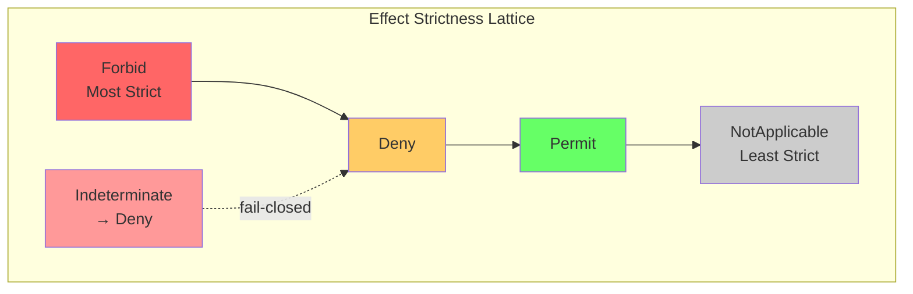
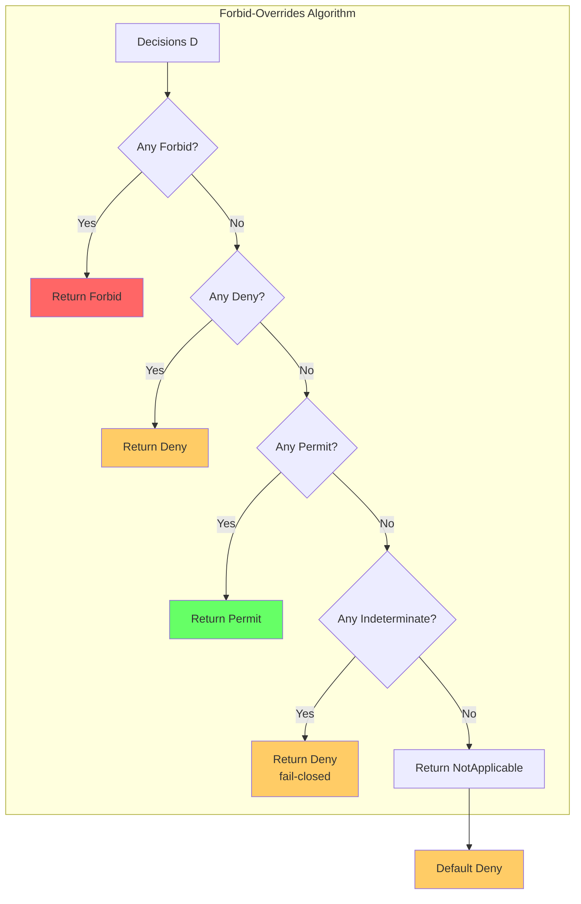
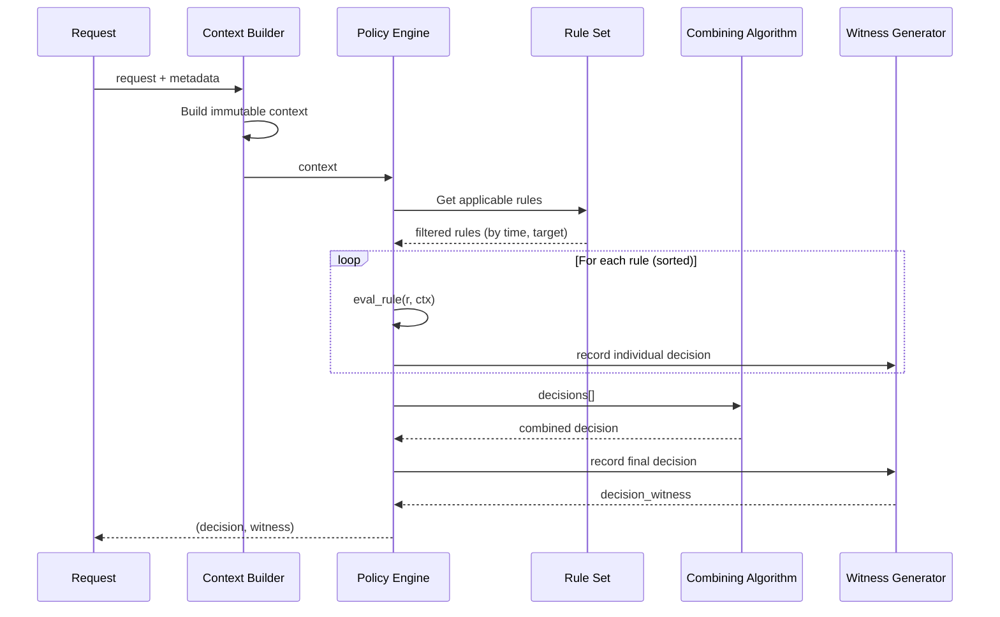
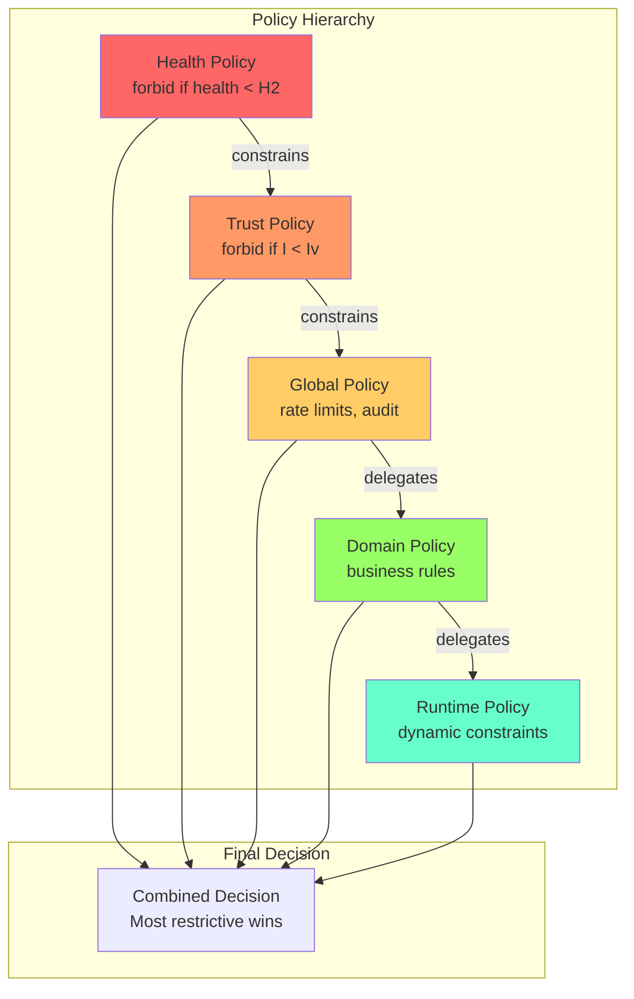
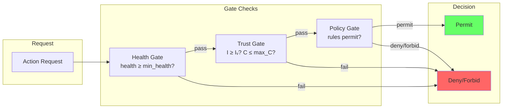
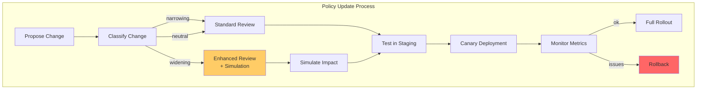
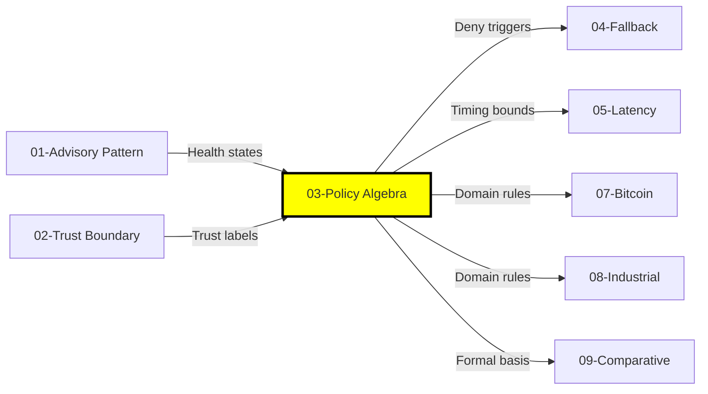

# Policy Enforcement Algebra: Formal Semantics for AI-Aware Access Control

## Abstract

This document formalizes the policy enforcement algebra for AI-deterministic system integration. We define a two-layer model consisting of policy language syntax and decision algebra semantics. The algebra supports health-aware predicates, trust label conditions, provenance constraints, and obligation composition. We prove key properties including soundness, fail-closed behavior, determinism, and monotonicity. The model enables formal reasoning about policy correctness and provides a foundation for verified policy enforcement.

**Keywords**: policy algebra, access control, ABAC, combining algorithms, obligations, formal verification, decision semantics

---

## 1. Introduction

### 1.1 Motivation

Policy enforcement is the critical mechanism that mediates between AI advisory output and deterministic system actions. A formal policy algebra enables:

1. **Precise semantics**: Unambiguous interpretation of policy rules
2. **Composition**: Combining multiple policies with predictable outcomes
3. **Verification**: Proving safety properties about policy behavior
4. **Auditability**: Explaining decisions with complete witness

### 1.2 Scope

This document covers:
- Policy language syntax and semantics
- Decision algebra with combining algorithms
- Obligation model and composition
- Integration with health states (doc 01) and trust labels (doc 02)
- Formal properties and proof sketches

### 1.3 Relationship to Other Documents

| Document | Relationship |
|----------|--------------|
| 01-ai-advisory-pattern | Health states H0-H3, Action classes A0-A3 |
| 02-trust-boundary-model | Trust labels (I, C, Prov), endorsement semantics |
| 04-fallback-state-machine | Fallback triggered by policy deny |
| 05-latency-budget-theory | Timing constraints on policy evaluation |

---

## 2. Policy Language

### 2.1 Syntax

**Definition 2.1 (Policy Rule)**:
```
Rule := {
    rule_id: ID,
    priority: Int,
    scope: Scope,
    version: Version,
    target: TargetExpr,
    condition: ConditionExpr,
    effect: Effect,
    obligations: [Obligation],
    on_error: ErrorHandler,
    valid_from: Timestamp?,
    valid_to: Timestamp?
}
```

**Definition 2.2 (Target Expression)**:
```
TargetExpr ::= action_class ∈ ActionClassSet
             | method ∼ Pattern
             | resource ∈ ResourceSet
             | subject ∈ SubjectSet
             | TargetExpr ∧ TargetExpr
             | TargetExpr ∨ TargetExpr
```

**Definition 2.3 (Condition Expression)**:
```
ConditionExpr ::= label.I ≥ IntegrityLevel
                | label.C ≤ ConfidentialityLevel
                | health ≥ HealthLevel
                | budget.remaining > Threshold
                | rate(window) < Limit
                | provenance.ai_influenced = Boolean
                | time ∈ TimeWindow
                | ConditionExpr ∧ ConditionExpr
                | ConditionExpr ∨ ConditionExpr
                | ¬ ConditionExpr
```

### 2.2 Effects

**Definition 2.4 (Effect)**:
```
Effect ::= permit | deny | forbid
```

| Effect | Semantics | Override Behavior |
|--------|-----------|-------------------|
| permit | Allow the action | Can be overridden by deny or forbid |
| deny | Reject the action | Can be overridden by permit (in some algorithms) |
| forbid | Absolutely reject | Cannot be overridden (veto) |

**Key Distinction**:
- `deny`: "I don't allow this, but another rule might"
- `forbid`: "This is categorically prohibited, no override possible"

Use `forbid` for invariants, regulatory requirements, and safety constraints.

### 2.3 Obligations

**Definition 2.5 (Obligation)**:
```
Obligation := {
    obligation_id: ID,
    trigger: Trigger,
    action: ObligationAction,
    priority: Int,
    required: Boolean
}

Trigger ::= on_permit | on_deny | always

ObligationAction ::= log(level, fields)
                   | notify(channel, message)
                   | escalate(level)
                   | quarantine(duration)
                   | audit(detail_level)
```

**Note on Negative Obligations**: Rather than "must not do X", model prohibitions as `forbid` rules or constraints on subsystems. This simplifies obligation composition.

### 2.4 Error Handling

**Definition 2.6 (Error Handler)**:
```
ErrorHandler ::= deny_on_error | fallback_on_error | indeterminate
```

Default: `deny_on_error` (fail-closed)

---

## 3. Decision Algebra

### 3.1 Decision Domain

**Definition 3.1 (Effect Domain)**:
```
E = {Permit, Deny, Forbid, NotApplicable, Indeterminate}
```

| Value | Meaning |
|-------|---------|
| Permit | Action is allowed |
| Deny | Action is rejected (overridable) |
| Forbid | Action is absolutely rejected (veto) |
| NotApplicable | Rule does not apply to this request |
| Indeterminate | Evaluation error occurred |

**Definition 3.2 (Decision)**:
```
Decision = (effect: E, obligations: Set⟨Obligation⟩)
```

### 3.2 Effect Ordering

**Definition 3.3 (Strictness Ordering)**:
```
Forbid > Deny > Permit > NotApplicable
Indeterminate treated as Deny (fail-closed)
```



### 3.3 Combining Algorithms

**Definition 3.4 (Combining Algorithm)**:
```
Combine: Set⟨Decision⟩ → Decision
```

#### 3.3.1 Forbid-Overrides

```
forbid_overrides(D) =
    if ∃d ∈ D: d.effect = Forbid then (Forbid, obligations(D))
    else if ∃d ∈ D: d.effect = Deny then (Deny, obligations(D))
    else if ∃d ∈ D: d.effect = Permit then (Permit, obligations(D))
    else if ∃d ∈ D: d.effect = Indeterminate then (Deny, obligations(D))
    else (NotApplicable, ∅)
```

#### 3.3.2 Deny-Overrides

```
deny_overrides(D) =
    if ∃d ∈ D: d.effect ∈ {Forbid, Deny} then (Deny, obligations(D))
    else if ∃d ∈ D: d.effect = Permit then (Permit, obligations(D))
    else if ∃d ∈ D: d.effect = Indeterminate then (Deny, obligations(D))
    else (NotApplicable, ∅)
```

#### 3.3.3 First-Applicable

```
first_applicable(D_ordered) =
    let d = first(D_ordered, λd. d.effect ≠ NotApplicable)
    in if d exists then d else (NotApplicable, ∅)
```

#### 3.3.4 Obligation Composition

```
obligations(D) = ⋃{d.obligations | d ∈ D}
```

Obligations are combined via union with deduplication by `obligation_id`.

**Recommended Default**: `forbid_overrides` with `default_deny`



### 3.4 Default Decision

**Definition 3.5 (Default Decision)**:
```
default_decision = (Deny, {audit(full)})
```

When all rules return NotApplicable, the default is Deny with full audit.

---

## 4. Policy Evaluation

### 4.1 Evaluation Context

**Definition 4.1 (Context)**:
```
Context := {
    request: Request,
    label: (I, C, Prov),
    health: Health,
    budget: Budget,
    time: Timestamp,
    session: SessionState,
    subject: Subject,
    resource: Resource
}
```

**Constraint**: Context is immutable during evaluation. Rules cannot modify context.

### 4.2 Evaluation Function

**Definition 4.2 (Rule Evaluation)**:
```
eval_rule: Rule × Context → Decision

eval_rule(r, ctx) =
    if ¬target_match(r.target, ctx) then (NotApplicable, ∅)
    else try
        if condition_eval(r.condition, ctx) then (r.effect, r.obligations)
        else (NotApplicable, ∅)
    catch error →
        handle_error(r.on_error, error)
```

**Definition 4.3 (Policy Evaluation)**:
```
eval_policy: PolicySet × Context → Decision

eval_policy(P, ctx) =
    let applicable = {r ∈ P | valid_time(r, ctx.time)}
    let decisions = {eval_rule(r, ctx) | r ∈ applicable}
    let combined = combine(decisions, P.combining_algorithm)
    in if combined.effect = NotApplicable 
       then default_decision
       else combined
```

### 4.3 Evaluation Order

For determinism, evaluation follows a fixed order:

1. Filter rules by `valid_time`
2. Sort by `(priority DESC, rule_id ASC)`
3. Evaluate in sorted order
4. Combine results using specified algorithm

**Theorem 4.1 (Evaluation Determinism)**:
```
∀ P, ctx: eval_policy(P, ctx) is deterministic
```

*Proof*: Fixed sorting order + deterministic condition evaluation + deterministic combining algorithm. □

### 4.4 Evaluation Flow



---

## 5. Policy Hierarchy and Delegation

### 5.1 Policy Layers

**Definition 5.1 (Policy Hierarchy)**:
```
PolicyStack = [HealthPolicy, TrustPolicy, GlobalPolicy, DomainPolicy, RuntimePolicy]
```

| Layer | Purpose | Override Capability |
|-------|---------|---------------------|
| HealthPolicy | AI health constraints | Cannot be overridden |
| TrustPolicy | Trust label constraints | Cannot be overridden |
| GlobalPolicy | Organization-wide rules | Can add restrictions |
| DomainPolicy | Domain-specific rules | Can add restrictions |
| RuntimePolicy | Dynamic/contextual rules | Most restrictive only |

**Evaluation Order**: Top-down. Higher layers constrain lower layers.

### 5.2 Unified Decision Predicate

From documents 01 and 02, we have:
```
Allowed(op, data, target) := 
    HealthGate(health, op) ∧ 
    LabelGate(λ(data), target) ∧ 
    PolicyGate(context, op)
```

This maps to our hierarchy:
- `HealthGate` = HealthPolicy evaluation
- `LabelGate` = TrustPolicy evaluation
- `PolicyGate` = Global + Domain + Runtime evaluation

### 5.3 Delegation

**Definition 5.2 (Delegation)**:
```
delegate(scope, policy_ref, constraints) :=
    eval_policy(policy_ref, ctx) 
    restricted_by constraints
    restricted_by parent_bounds
```

**Constraint Inheritance**: Child policy cannot permit what parent forbids.

```
P_total = P_parent ⊗ (P_child restricted_by bounds(P_parent))
```



---

## 6. Integration with Health and Trust

### 6.1 Health-Aware Predicates

From document 01, health states map to permitted action classes:
```
Perm(H3) = {A0, A1, A2}
Perm(H2) = {A0, A1}
Perm(H1) = {A0}
Perm(H0) = ∅
```

**Health Policy Rules**:
```
Rule: health_gate_a2
  target: action_class ∈ {A2}
  condition: health < H3
  effect: forbid
  obligations: [log(warn, "A2 blocked due to health")]

Rule: health_gate_a1
  target: action_class ∈ {A1}
  condition: health < H2
  effect: forbid
  obligations: [log(warn, "A1 blocked due to health")]

Rule: health_gate_all
  target: action_class ∈ {A0, A1, A2, A3}
  condition: health = H0
  effect: forbid
  obligations: [escalate(critical), log(error, "AI path disabled")]
```

### 6.2 Trust-Aware Predicates

From document 02, trust labels constrain information flow:
```
I = {Iᵤ, Iᵥ, Iₜ}  (Untrusted, Validated, Trusted)
C = {Cₚ, Cᵢ, Cₛ}  (Public, Internal, Secret)
```

**Trust Policy Rules**:
```
Rule: trust_gate_integrity
  target: action_class ∈ {A1, A2}
  condition: label.I < Iᵥ
  effect: forbid
  obligations: [log(warn, "Unvalidated data blocked")]

Rule: trust_gate_confidentiality
  target: resource.confidentiality = Cₛ
  condition: subject.clearance < Cₛ
  effect: forbid
  obligations: [audit(full)]

Rule: provenance_anti_laundering
  target: action_class ∈ {A2, A3}
  condition: provenance.ai_influenced = true
  effect: deny
  obligations: [log(info, "AI-influenced action requires review")]
```

### 6.3 Combined Predicate Evaluation



---

## 7. Decision Witness

### 7.1 Witness Structure

**Definition 7.1 (Decision Witness)**:
```
DecisionWitness := {
    decision_id: ID,
    request_id: ID,
    timestamp: Timestamp,
    
    // Input hashes for replay
    input_hash: Hash,
    context_hash: Hash,
    
    // Policy version
    policy_ver: Version,
    rule_set_hash: Hash,
    
    // Evaluation trace
    rules_evaluated: [(rule_id, individual_decision, match_reason)],
    combining_algorithm: Algorithm,
    combining_trace: CombineTrace,
    
    // Final outcome
    final_effect: Effect,
    obligations_triggered: [Obligation],
    obligation_results: [(obligation_id, result)],
    
    // Provenance
    provenance_snapshot: Prov,
    ai_influenced: Boolean
}
```

### 7.2 Witness Properties

**Property 7.1 (Completeness)**:
Every terminal decision has a complete witness.

**Property 7.2 (Sufficiency)**:
Witness contains all information needed for replay.

**Property 7.3 (Integrity)**:
Witness is tamper-evident (signed or hash-chained).

### 7.3 Replay Verification

```
replay_verify(witness, policy_archive) :=
    let ctx = reconstruct_context(witness.input_hash, witness.context_hash)
    let policy = load_policy(witness.policy_ver, policy_archive)
    let replayed = eval_policy(policy, ctx)
    in replayed.effect = witness.final_effect
```

---

## 8. Example Policy Rules

### 8.1 Health-Based Restriction

```json
{
  "rule_id": "health-gate-a2",
  "priority": 1000,
  "target": {"action_class": ["A2"]},
  "condition": {"health": {"lt": "H3"}},
  "effect": "forbid",
  "obligations": [
    {"action": "log", "level": "warn", "message": "A2 blocked: health degraded"}
  ]
}
```

### 8.2 Rate Limiting

```json
{
  "rule_id": "rate-limit-global",
  "priority": 900,
  "target": {"action_class": ["A0", "A1", "A2"]},
  "condition": {"rate": {"window": "1m", "gt": 100}},
  "effect": "deny",
  "obligations": [
    {"action": "log", "level": "info", "message": "Rate limit exceeded"},
    {"action": "notify", "channel": "ops", "message": "Rate limit triggered"}
  ]
}
```

### 8.3 Trust-Based Access

```json
{
  "rule_id": "trust-gate-validated",
  "priority": 950,
  "target": {"action_class": ["A1", "A2"]},
  "condition": {"label.I": {"lt": "Iv"}},
  "effect": "forbid",
  "obligations": [
    {"action": "audit", "detail": "full"}
  ]
}
```

### 8.4 Dual-Control for High-Impact Actions

```json
{
  "rule_id": "dual-control-a3",
  "priority": 1000,
  "target": {"action_class": ["A3"]},
  "condition": {"approvers": {"count": {"lt": 2}}},
  "effect": "forbid",
  "obligations": [
    {"action": "escalate", "level": "critical"},
    {"action": "audit", "detail": "full"}
  ]
}
```

### 8.5 Time Window Restriction

```json
{
  "rule_id": "business-hours-only",
  "priority": 800,
  "target": {"action_class": ["A2"]},
  "condition": {"time": {"not_in": "09:00-17:00 Mon-Fri"}},
  "effect": "deny",
  "obligations": [
    {"action": "log", "level": "info", "message": "Outside business hours"}
  ]
}
```

### 8.6 Provenance Anti-Laundering

```json
{
  "rule_id": "ai-influence-restriction",
  "priority": 950,
  "target": {"action_class": ["A2", "A3"]},
  "condition": {"provenance.ai_influenced": true},
  "effect": "deny",
  "obligations": [
    {"action": "log", "level": "warn", "message": "AI-influenced action blocked"},
    {"action": "audit", "detail": "full", "include": ["provenance"]}
  ]
}
```

### 8.7 Declassification Rule

```json
{
  "rule_id": "declassify-secret-to-internal",
  "priority": 900,
  "target": {"action": "declassify", "from": "Cs", "to": "Ci"},
  "condition": {
    "and": [
      {"subject.role": {"in": ["data_steward", "compliance_officer"]}},
      {"purpose": {"in": ["audit", "compliance", "legal"]}},
      {"approvers": {"count": {"gte": 2}}}
    ]
  },
  "effect": "permit",
  "obligations": [
    {"action": "audit", "detail": "full"},
    {"action": "notify", "channel": "compliance", "message": "Declassification performed"}
  ]
}
```

### 8.8 Quarantine Trigger

```json
{
  "rule_id": "quarantine-on-anomaly",
  "priority": 1000,
  "target": {"action_class": ["A1", "A2", "A3"]},
  "condition": {"anomaly_count": {"window": "5m", "gte": 5}},
  "effect": "forbid",
  "obligations": [
    {"action": "quarantine", "duration": "30m"},
    {"action": "escalate", "level": "critical"},
    {"action": "notify", "channel": "security", "message": "Quarantine triggered"}
  ]
}
```

---

## 9. Formal Properties

### 9.1 Soundness

**Theorem 9.1 (Policy Soundness)**:
```
eval_policy(P, ctx).effect = Permit ⟹ action_safe(ctx.request, SafeSet)
```

*Assumption*: Policy rules correctly encode safety requirements.

*Proof Sketch*:
1. Permit requires passing all forbid/deny rules.
2. Health and Trust gates are in policy hierarchy.
3. If gates pass and no deny/forbid, action is within SafeSet bounds.
4. Therefore, Permit implies safety (relative to policy correctness). □

### 9.2 Fail-Closed

**Theorem 9.2 (Fail-Closed)**:
```
error_in_evaluation ⟹ eval_policy(P, ctx).effect ≠ Permit
```

*Proof*:
1. `on_error` defaults to `deny_on_error`.
2. Indeterminate is treated as Deny in combining.
3. Default decision is Deny.
4. Therefore, errors never result in Permit. □

### 9.3 Determinism

**Theorem 9.3 (Evaluation Determinism)**:
```
∀ P, ctx₁, ctx₂: ctx₁ = ctx₂ ⟹ eval_policy(P, ctx₁) = eval_policy(P, ctx₂)
```

*Proof*:
1. Context is immutable during evaluation.
2. Rule sorting is deterministic (priority, rule_id).
3. Condition evaluation is deterministic (no side effects).
4. Combining algorithm is deterministic.
5. Therefore, same input produces same output. □

### 9.4 Termination

**Theorem 9.4 (Evaluation Termination)**:
```
∀ P, ctx: eval_policy(P, ctx) terminates
```

*Proof*:
1. PolicySet is finite.
2. Each rule evaluation is bounded (no recursion in conditions).
3. Delegation depth is bounded (no circular delegation).
4. Combining is O(|rules|).
5. Therefore, evaluation always terminates. □

### 9.5 Monotonicity

**Theorem 9.5 (Restrictive Monotonicity)**:
```
P' = P ∪ {r_deny} ⟹ Permit(P') ⊆ Permit(P)
```
Adding a deny/forbid rule can only shrink the permit set.

*Proof*:
1. New rule r_deny has effect deny or forbid.
2. For any ctx where r_deny applies, combined effect becomes more restrictive.
3. For ctx where r_deny doesn't apply, result unchanged.
4. Therefore, Permit(P') ⊆ Permit(P). □

**Corollary 9.1 (Forbid Dominance)**:
```
∃ r ∈ P: r.effect = forbid ∧ applies(r, ctx) ⟹ eval_policy(P, ctx).effect = Forbid
```

### 9.6 Totality

**Theorem 9.6 (Decision Totality)**:
```
∀ P, ctx: eval_policy(P, ctx).effect ∈ {Permit, Deny, Forbid}
```
Every evaluation produces a terminal decision (not NotApplicable or Indeterminate).

*Proof*:
1. If all rules return NotApplicable, default_decision = Deny.
2. Indeterminate is converted to Deny (fail-closed).
3. Therefore, final effect is always terminal. □

### 9.7 Precedence Soundness

**Theorem 9.7 (Forbid Precedence)**:
```
∃ r ∈ P: applies(r, ctx) ∧ r.effect = forbid ⟹ 
    ∀ r' ∈ P: r'.effect = permit ⟹ eval_policy(P, ctx).effect ≠ Permit
```
Forbid always takes precedence over permit.

*Proof*: By definition of forbid_overrides combining algorithm. □

### 9.8 Obligation Safety

**Theorem 9.8 (Obligation Non-Interference)**:
```
obligations(decision) cannot change decision.effect
```
Obligations are side effects that don't influence the access decision.

*Proof*: By construction. Obligations are collected separately from effect evaluation. □

### 9.9 Audit Completeness

**Theorem 9.9 (Witness Completeness)**:
```
∀ terminal decision d: ∃ witness w: complete(w) ∧ binds(w, d)
```

*Proof*: Witness generation is mandatory step in eval_policy. □

### 9.10 Replay Consistency

**Theorem 9.10 (Versioned Replay)**:
```
∀ w: replay_verify(w, archive) = true
```
Given the same policy version and input, replay produces the same decision.

*Proof*: Follows from Theorem 9.3 (Determinism) + witness completeness. □

---

## 10. TLA+ Specification

### 10.1 Module Structure

```tla
---------------------------- MODULE PolicyAlgebra ----------------------------
EXTENDS Integers, Sequences, FiniteSets

CONSTANTS
    Rules,              \* Set of policy rules
    Effects,            \* {Permit, Deny, Forbid, NA, IND}
    Actions,            \* Domain actions
    HealthLevels,       \* {H0, H1, H2, H3}
    IntegrityLevels,    \* {Iu, Iv, It}
    ConfidLevels        \* {Cp, Ci, Cs}

VARIABLES
    context,            \* Current evaluation context
    decisions,          \* Individual rule decisions
    combined,           \* Combined decision
    witness             \* Decision witness

vars == <<context, decisions, combined, witness>>
-----------------------------------------------------------------------------
```

### 10.2 Effect Ordering

```tla
\* Strictness ordering
Stricter(e1, e2) ==
    LET order == [Forbid |-> 4, Deny |-> 3, Permit |-> 2, NA |-> 1, IND |-> 3]
    IN order[e1] > order[e2]

\* Most strict effect
MostStrict(effects) ==
    CHOOSE e \in effects: \A e2 \in effects: ~Stricter(e2, e)
```

### 10.3 Combining Algorithm

```tla
\* Forbid-overrides combining
ForbidOverrides(decs) ==
    LET effects == {d.effect : d \in decs}
        obls == UNION {d.obligations : d \in decs}
    IN IF "Forbid" \in effects THEN [effect |-> "Forbid", obligations |-> obls]
       ELSE IF "Deny" \in effects \/ "IND" \in effects 
            THEN [effect |-> "Deny", obligations |-> obls]
       ELSE IF "Permit" \in effects 
            THEN [effect |-> "Permit", obligations |-> obls]
       ELSE [effect |-> "NA", obligations |-> {}]

\* Apply default if NA
ApplyDefault(dec) ==
    IF dec.effect = "NA" 
    THEN [effect |-> "Deny", obligations |-> {"audit_full"}]
    ELSE dec
```

### 10.4 Policy Evaluation

```tla
\* Evaluate single rule
EvalRule(rule, ctx) ==
    IF ~TargetMatch(rule.target, ctx) THEN [effect |-> "NA", obligations |-> {}]
    ELSE IF ConditionEval(rule.condition, ctx) 
         THEN [effect |-> rule.effect, obligations |-> rule.obligations]
         ELSE [effect |-> "NA", obligations |-> {}]

\* Evaluate policy set
EvalPolicy(rules, ctx) ==
    LET applicable == {r \in rules : ValidTime(r, ctx.time)}
        decs == {EvalRule(r, ctx) : r \in applicable}
        combined == ForbidOverrides(decs)
    IN ApplyDefault(combined)
```

### 10.5 Invariants

```tla
\* Fail-closed invariant
FailClosed ==
    \A ctx \in Contexts:
        EvalPolicy(Rules, ctx).effect \in {"Permit", "Deny", "Forbid"}

\* Forbid dominance
ForbidDominance ==
    \A ctx \in Contexts:
        (\E r \in Rules: TargetMatch(r.target, ctx) /\ 
                         ConditionEval(r.condition, ctx) /\ 
                         r.effect = "Forbid")
        => EvalPolicy(Rules, ctx).effect = "Forbid"

\* Monotonicity (adding deny shrinks permit set)
Monotonicity ==
    \A r_new \in DenyRules:
        LET P_old == Rules
            P_new == Rules \cup {r_new}
        IN \A ctx \in Contexts:
            EvalPolicy(P_new, ctx).effect = "Permit" 
            => EvalPolicy(P_old, ctx).effect = "Permit"

\* Combined invariant
TypeInvariant == FailClosed /\ ForbidDominance
```

### 10.6 Liveness

```tla
\* Every request gets a decision
RequestCompletion ==
    \A req \in Requests:
        <>(EvalPolicy(Rules, ContextOf(req)).effect \in {"Permit", "Deny", "Forbid"})

\* Specification
Spec == Init /\ [][Next]_vars /\ WF_vars(Evaluate)
```

---

## 11. Policy Evolution and Migration

### 11.1 Version Management

**Definition 11.1 (Policy Version)**:
```
PolicyVersion := {
    version_id: ID,
    parent_version: ID?,
    rules: Set⟨Rule⟩,
    created_at: Timestamp,
    created_by: Subject,
    change_type: ChangeType,
    change_description: String
}

ChangeType ::= narrowing | widening | neutral
```

### 11.2 Change Classification

| Change Type | Definition | Risk Level |
|-------------|------------|------------|
| Narrowing | Permit(P') ⊆ Permit(P) | Low |
| Widening | Permit(P') ⊇ Permit(P) | High |
| Neutral | Permit(P') = Permit(P) | Low |

### 11.3 Migration Protocol



### 11.4 Safety Constraints on Updates

**Constraint 11.1**: Updates cannot remove HealthPolicy or TrustPolicy rules.

**Constraint 11.2**: Widening changes require dual approval.

**Constraint 11.3**: All changes must preserve global safety invariants.

---

## 12. Static Analysis

### 12.1 Conflict Detection

**Definition 12.1 (Rule Conflict)**:
Two rules r1, r2 conflict if:
```
overlap(r1.target, r2.target) ∧ 
overlap(r1.condition, r2.condition) ∧
r1.effect ≠ r2.effect
```

### 12.2 Analysis Checks

| Check | Description | Severity |
|-------|-------------|----------|
| Conflict | Rules with overlapping scope and different effects | Warning |
| Shadowing | Rule never applies due to higher-priority rule | Warning |
| Unreachable | Rule condition is always false | Error |
| Gap | No rule covers certain request patterns | Warning |
| Circular Delegation | Delegation creates cycle | Error |

### 12.3 Analysis Output

```json
{
  "analysis_id": "...",
  "policy_ver": "...",
  "timestamp": "...",
  "findings": [
    {
      "type": "conflict",
      "severity": "warning",
      "rules": ["rule-1", "rule-2"],
      "overlap_description": "Both match action_class=A1 with health>=H2",
      "recommendation": "Review priority ordering"
    }
  ],
  "coverage_report": {
    "covered_patterns": 0.95,
    "gap_patterns": ["action_class=A3 with health=H3"]
  }
}
```

---

## 12.4 Obligation Consistency Rules

**Problem**: Obligations may conflict (e.g., `escalate` + `auto-apply`, `log` + `suppress_log`).

**Definition 12.1 (Obligation Conflict)**:
Two obligations o1, o2 conflict if:
```
incompatible(o1.action, o2.action) ∧ 
same_trigger(o1.trigger, o2.trigger)
```

**Incompatibility Matrix**:

| Obligation 1 | Obligation 2 | Conflict? | Resolution |
|--------------|--------------|-----------|------------|
| escalate | auto-apply | Yes | Error: cannot escalate and auto-apply |
| log(full) | suppress_log | Yes | Error: contradictory |
| quarantine | permit | Yes | Error: quarantine implies deny |
| notify(A) | notify(A) | No | Deduplicate |
| audit(full) | audit(minimal) | No | Use stricter (full) |

**Static Checker Specification**:
```
check_obligation_consistency(policy) :=
    for each rule_pair (r1, r2) in policy:
        if overlap(r1.target, r2.target) and overlap(r1.condition, r2.condition):
            for each (o1, o2) in r1.obligations × r2.obligations:
                if incompatible(o1, o2):
                    report_error(r1, r2, o1, o2)
    return errors
```

**Deployment Gate**: Policy with obligation conflicts MUST NOT be deployed.

---

## 12.5 Policy Migration Protocol

**Problem**: Policy changes may inadvertently widen permit-set (security regression).

**Definition 12.2 (Change Classification)**:
```
classify_change(P_old, P_new) :=
    let permit_old = {(ctx, a) | eval(P_old, ctx, a) = Permit}
    let permit_new = {(ctx, a) | eval(P_new, ctx, a) = Permit}
    in
        if permit_new ⊆ permit_old then Narrowing
        else if permit_old ⊆ permit_new then Widening
        else if permit_old = permit_new then Neutral
        else Mixed
```

**Migration Protocol by Change Type**:

| Change Type | Required Steps | Approval |
|-------------|----------------|----------|
| Narrowing | Test → Review → Deploy | Single approver |
| Neutral | Test → Review → Deploy | Single approver |
| Widening | Test → Simulate → Review → Canary → Monitor → Deploy | Dual-control |
| Mixed | Decompose into Narrowing + Widening, apply separately | Per component |

**Widening Gate Criteria**:
1. Explicit justification documented
2. Impact simulation on historical traffic
3. Security review sign-off
4. Canary deployment (5% traffic, 24h)
5. Rollback trigger defined (e.g., anomaly rate > 1%)
6. Monitoring dashboard active

**Rollback Protocol**:
```
if anomaly_detected or slo_violated:
    revert_to(P_old)
    alert(security_team)
    create_incident_report()
```

**Invariant**: Widening changes cannot be deployed without explicit security approval and rollback plan.

---

## 13. Limitations

### 13.1 Explicit Limitations

| Limitation | Description | Mitigation |
|------------|-------------|------------|
| Policy Completeness | Cannot prove policy covers all threats | Defense in depth, monitoring |
| Semantic Gap | Policy checks syntax, not intent | Anomaly detection |
| Expressiveness | DSL may not cover all use cases | Extension points |
| Performance | Complex policies add latency | Optimization, caching |
| Human Factors | Policy quality depends on authors | Training, review |

### 13.2 What We Do NOT Claim

1. **Policy correctness**: We prove enforcement, not that rules are right
2. **Complete coverage**: Gaps may exist in rule set
3. **Zero false denials**: Strict policies may block legitimate requests
4. **Semantic understanding**: Policy operates on observable features

---

## 14. Novel Contributions

### 14.1 Contribution Summary

| # | Contribution | Novelty Claim |
|---|--------------|---------------|
| C1 | **Health + Trust + Provenance Predicates** | Unified predicate space for AI-aware access control |
| C2 | **Decision Algebra with Obligations** | Formal composition of effects and side-effects |
| C3 | **Delegation with Constraint Inheritance** | Child policies cannot exceed parent bounds |
| C4 | **Replay-Grade Decision Witness** | Complete audit trail as formal requirement |
| C5 | **Policy Evolution Safety** | Formal classification of widening vs narrowing changes |

### 14.2 Comparison with Prior Art

| Approach | Strengths | Gaps Addressed |
|----------|-----------|----------------|
| XACML | Rich policy language | No health/trust integration, complex |
| OPA/Rego | Flexible, programmable | No formal combining algebra |
| AWS IAM | Practical, scalable | No provenance tracking |
| RBAC | Simple, well-understood | No attribute-based conditions |
| ABAC | Attribute-rich | No formal composition theorems |

### 14.3 What Is NOT Novel

- Combining algorithms (XACML heritage)
- Obligation concept (established)
- Policy hierarchy (common pattern)
- Static analysis for conflicts (known techniques)

**Our contribution**: Integration specifically for AI advisory systems with health-aware, trust-aware, provenance-tracking policy enforcement.

---

## 15. Cross-Document Mapping

### 15.1 Dependencies

| This Document | Depends On | Relationship |
|---------------|------------|--------------|
| Section 5 (Health-Aware) | 01-ai-advisory-pattern | Health states, Perm mapping |
| Section 6 (Trust-Aware) | 02-trust-boundary-model | Trust labels, Provenance |
| Section 8.7 (Declassification) | 02-trust-boundary-model | Declassification governance |

### 15.2 Provides To

| This Document | Provides To | What |
|---------------|-------------|------|
| Policy Algebra | 04-fallback-state-machine | Deny triggers fallback |
| Evaluation Timing | 05-latency-budget-theory | Policy eval latency bounds |
| Example Rules | 07-bitcoin-case-study | Domain instantiation |
| Example Rules | 08-industrial-case-study | Domain instantiation |
| Formal Properties | 09-comparative-evaluation | Verification baseline |
| Open Problems | 10-future-directions | Auto policy synthesis |

### 15.3 Document Relationship



---

## 16. Conclusion

This document establishes a formal policy enforcement algebra for AI-deterministic system integration. Key results:

1. **Two-layer model**: Policy language syntax + decision algebra semantics
2. **Effect domain**: {Permit, Deny, Forbid, NA, IND} with strict ordering
3. **Combining algorithms**: Forbid-overrides as default for safety
4. **Unified predicates**: Health, trust labels, and provenance as first-class conditions
5. **Formal properties**: Soundness, fail-closed, determinism, monotonicity proven

The algebra enables formal reasoning about policy correctness and provides a foundation for verified policy enforcement in AI advisory systems.

---

## Appendix A: Policy DSL Grammar

```ebnf
policy      ::= rule+
rule        ::= 'rule' rule_id '{' rule_body '}'
rule_body   ::= priority? target condition effect obligations? on_error?

priority    ::= 'priority' ':' INTEGER
target      ::= 'target' ':' target_expr
condition   ::= 'condition' ':' cond_expr
effect      ::= 'effect' ':' ('permit' | 'deny' | 'forbid')
obligations ::= 'obligations' ':' '[' obligation (',' obligation)* ']'
on_error    ::= 'on_error' ':' ('deny' | 'fallback' | 'indeterminate')

target_expr ::= target_atom | target_expr 'and' target_expr | target_expr 'or' target_expr
target_atom ::= 'action_class' 'in' set | 'method' '~' pattern | 'resource' 'in' set

cond_expr   ::= cond_atom | cond_expr 'and' cond_expr | cond_expr 'or' cond_expr | 'not' cond_expr
cond_atom   ::= attr_ref comparator value
attr_ref    ::= 'label.I' | 'label.C' | 'health' | 'budget' | 'rate' '(' window ')' | ...
comparator  ::= '<' | '<=' | '=' | '>=' | '>' | 'in' | 'not_in'

obligation  ::= '{' 'action' ':' obl_action ',' obl_params '}'
obl_action  ::= 'log' | 'notify' | 'escalate' | 'quarantine' | 'audit'
```

---

## Appendix B: Combining Algorithm Comparison

| Algorithm | Forbid Handling | Deny Handling | Default | Use Case |
|-----------|-----------------|---------------|---------|----------|
| forbid-overrides | Forbid wins | Deny wins over Permit | Deny | Safety-critical |
| deny-overrides | Forbid=Deny | Deny wins | Deny | Standard access control |
| permit-overrides | Forbid wins | Permit wins over Deny | Deny | Permissive systems |
| first-applicable | First non-NA | First non-NA | Deny | Ordered rule sets |
| only-one-applicable | Error if multiple | Single rule | Deny | Strict policies |

---

## References

1. OASIS. "eXtensible Access Control Markup Language (XACML) Version 3.0." (2013).
2. Open Policy Agent. "Rego Policy Language." https://www.openpolicyagent.org/docs/latest/policy-language/
3. Sandhu, R., et al. "Role-Based Access Control Models." IEEE Computer (1996).
4. Hu, V.C., et al. "Guide to Attribute Based Access Control (ABAC)." NIST SP 800-162 (2014).
5. Li, N., et al. "Access Control Policy Combining: Theory Meets Practice." SACMAT (2009).

---

*Document Version: 1.0*
*Last Updated: 2026-03-25*
*Authors: Kiro + Codex (AI Research Collaboration)*
*R&D Dialogue Rounds: 20 questions across 4 sessions*
