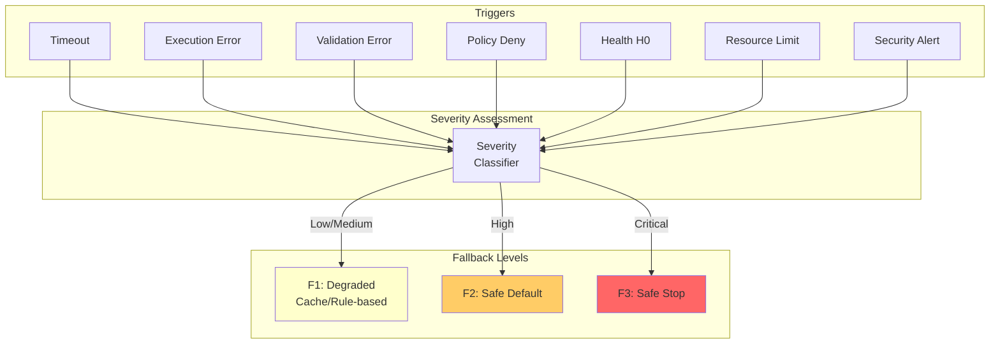
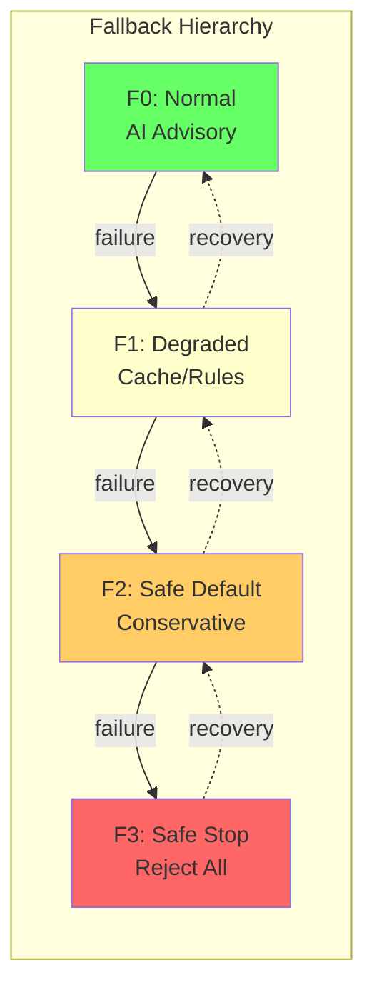
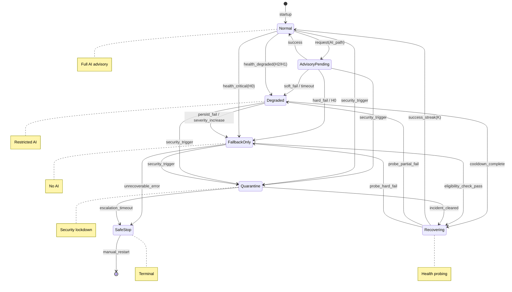
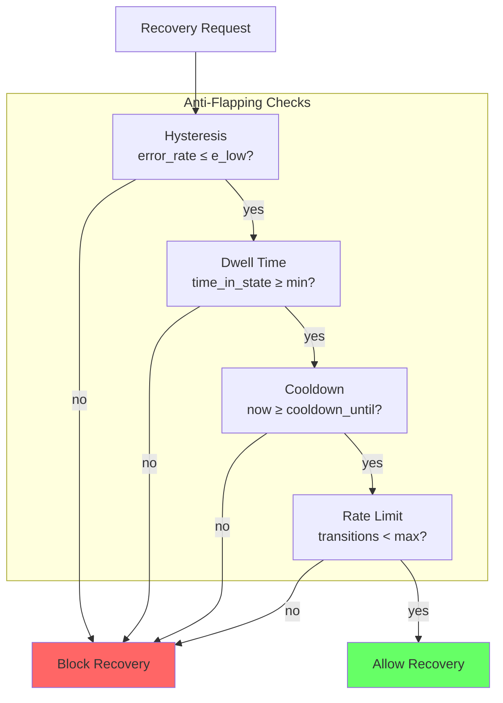
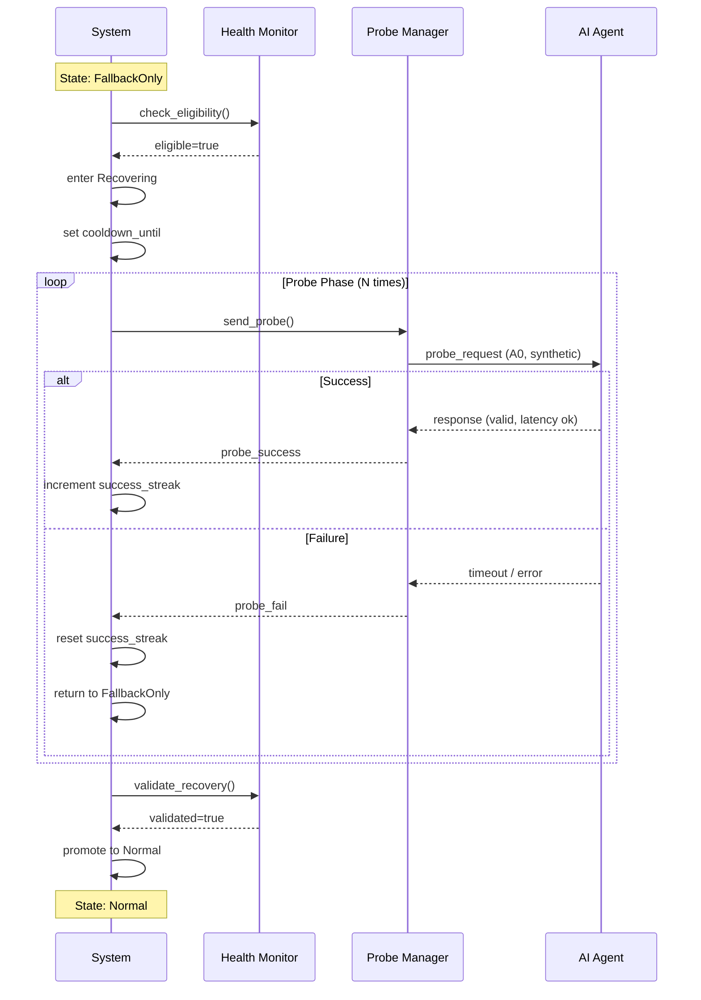
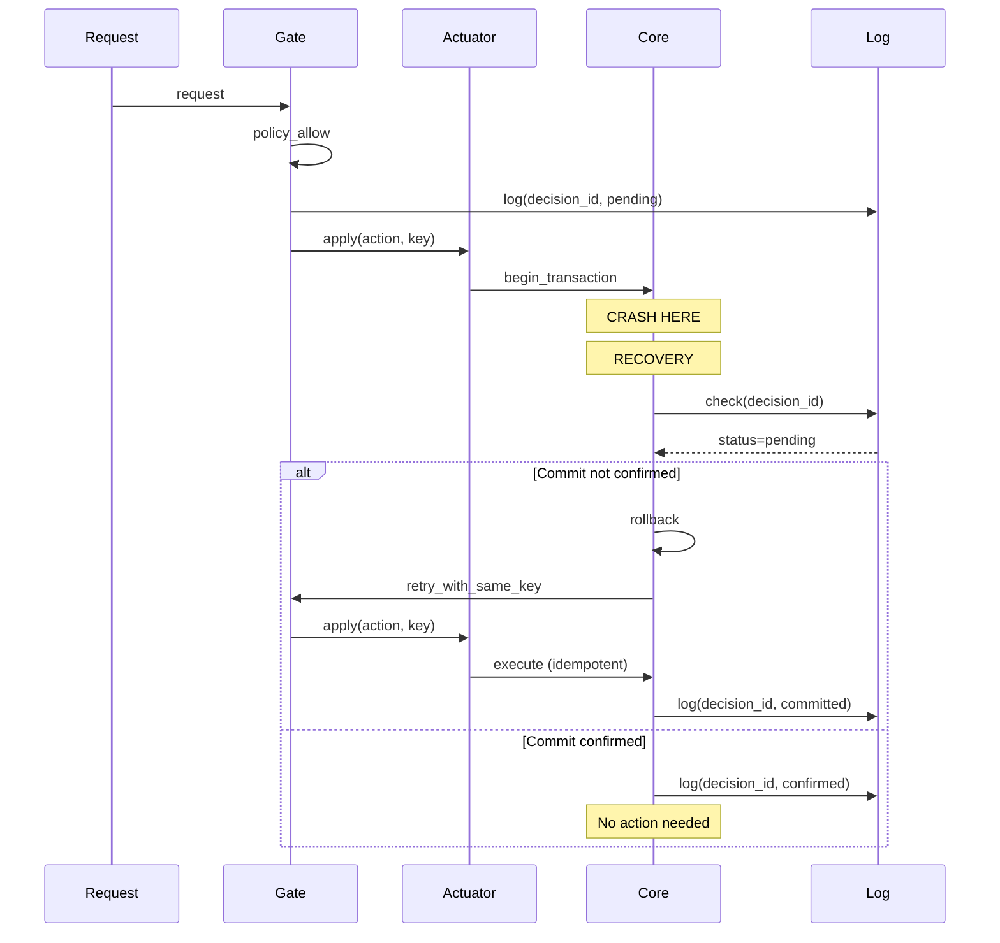
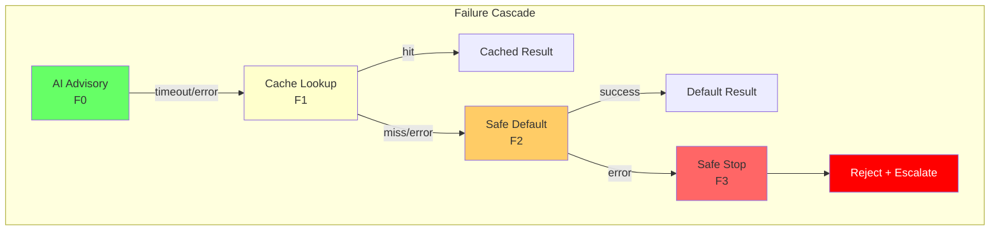
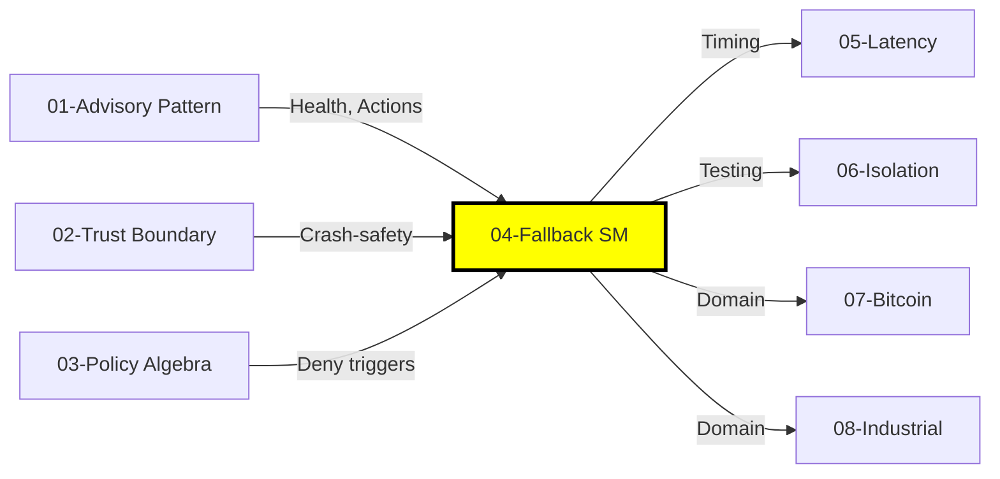

# Fallback State Machine: Deterministic Degradation for AI-Integrated Systems

## Abstract

This document formalizes the fallback state machine for AI-deterministic system integration. We define a hierarchical fallback model with four levels (F0-F3), establish state transitions with anti-flapping mechanisms, and prove key properties including totality, bounded completion, and safety preservation. The model ensures that system failures always result in deterministic, safe outcomes while enabling graceful recovery.

**Keywords**: fallback, state machine, graceful degradation, fault tolerance, deterministic recovery, anti-flapping, circuit breaker

---

## 1. Introduction

### 1.1 Motivation

When AI advisory paths fail, the system must:
1. **Respond deterministically**: Same failure conditions produce same fallback behavior
2. **Preserve safety**: Never enter unsafe states regardless of failure mode
3. **Bound latency**: Complete within maximum time budget
4. **Enable recovery**: Return to normal operation when conditions improve

### 1.2 Scope

This document covers:
- Fallback trigger classification
- Hierarchical fallback levels (F0-F3)
- State machine formalization
- Anti-flapping mechanisms
- Recovery protocol
- Formal properties and proofs

### 1.3 Relationship to Other Documents

| Document | Relationship |
|----------|--------------|
| 01-ai-advisory-pattern | Health states, timeout triggers, Perm mapping |
| 02-trust-boundary-model | Fail-closed semantics, crash-safety |
| 03-policy-enforcement-algebra | Policy deny triggers fallback |
| 05-latency-budget-theory | Timing constraints T_ai, T_fb |

---

## 2. Fallback Triggers

### 2.1 Trigger Classification

**Definition 2.1 (Fallback Trigger)**:
```
Trigger := (category, severity, source, recoverable)
```

| Category | Examples | Severity | Recoverable |
|----------|----------|----------|-------------|
| Timeout | AI response timeout | Medium | Yes |
| Execution | AI crash, OOM, transport error | High | Yes |
| Validation | Parse, schema, signature, freshness error | Medium | Yes |
| Policy | Deny, forbid, indeterminate | Low-High | Yes |
| Health | H0 state, health degradation | High | Yes |
| Resource | Queue full, CPU/memory limit | Medium | Yes |
| Security | Tamper, replay, anomaly threshold | Critical | Manual |
| Dependency | Model unavailable, storage failure | High | Depends |

### 2.2 Severity Levels

**Definition 2.2 (Severity)**:
```
Severity = {Low, Medium, High, Critical}
```

| Severity | Response | Fallback Level |
|----------|----------|----------------|
| Low | Log, continue with fallback | F1 |
| Medium | Alert, use conservative fallback | F1-F2 |
| High | Escalate, restrict to safe defaults | F2 |
| Critical | Quarantine, safe stop | F3 |

### 2.3 Trigger to Fallback Mapping



### 2.4 Policy Outcome to Fallback Mapping (Normative)

**Definition 2.3 (Policy-Fallback Mapping)**:

This table defines the NORMATIVE mapping from policy outcomes to fallback behavior. This mapping is consistent across all action classes and is deterministic.

| Policy Outcome | Effect | Fallback Triggered? | Fallback Level | Terminal State |
|----------------|--------|---------------------|----------------|----------------|
| Permit | Allow | No | F0 (normal) | Applied |
| Deny (soft) | Reject | Yes | F1 or F2 | Fallback result |
| Deny (hard) | Reject | Yes | F2 | Safe default |
| Forbid | Absolute reject | No | F3 | Rejected |
| Indeterminate | Error | Yes | F2 | Safe default |
| NotApplicable + Default | Deny | Yes | F2 | Safe default |

**Key Distinctions**:

1. **Deny vs Forbid**:
   - `Deny`: "Request not approved, but system attempts graceful fallback"
   - `Forbid`: "Request categorically rejected, no fallback attempted"

2. **Fallback vs Rejection**:
   - Fallback (F1, F2): System provides degraded but useful response
   - Rejection (F3): System returns error, no useful response

**Action Class Modifiers**:

| Action Class | Deny Behavior | Forbid Behavior |
|--------------|---------------|-----------------|
| A0 (read-only) | F1: cached/empty | F3: reject |
| A1 (reversible) | F1: no-op | F3: reject |
| A2 (bounded) | F2: conservative | F3: reject + escalate |
| A3 (high-impact) | F3: reject | F3: reject + escalate + audit |

**Invariant**: This mapping is identical in runtime and replay. Policy outcome deterministically selects fallback path.

---

## 3. Fallback Hierarchy

### 3.1 Fallback Levels

**Definition 3.1 (Fallback Level)**:
```
FallbackLevel = {F0, F1, F2, F3}  with ordering  F0 ≺ F1 ≺ F2 ≺ F3
```

| Level | Name | Description | AI Involvement |
|-------|------|-------------|----------------|
| F0 | Normal | Full AI advisory path | Full |
| F1 | Degraded | Cache/rule-based fallback | None (cached) |
| F2 | Safe Default | Conservative deterministic outcome | None |
| F3 | Safe Stop | Reject all, escalate | None |

### 3.2 Level Semantics

**F0 (Normal)**:
- AI advisory path fully operational
- All action classes available per health state
- Full policy evaluation

**F1 (Degraded)**:
- AI path disabled for current request
- Use cached responses or rule-based logic
- Restricted to A0, A1 action classes

**F2 (Safe Default)**:
- No AI influence
- Return conservative default values
- Restricted to A0 action class only

**F3 (Safe Stop)**:
- Reject all requests
- Escalate to operators
- No state changes permitted

### 3.3 Monotonic Degradation

**Theorem 3.1 (Monotonic Degradation)**:
```
failure_at(Fk) ⟹ transition_to(Fj) where j > k
```
Failure at level Fk can only transition to a stricter level.

**Corollary 3.1**: Upward transitions (Fk → Fj where j < k) only through recovery protocol.



### 3.4 Action Class × Severity Matrix

**Definition 3.2 (Fallback Selection Function)**:
```
FB: ActionClass × Severity × Health → FallbackLevel × Outcome
```

| Action Class | Low Severity | Medium Severity | High Severity | Critical |
|--------------|--------------|-----------------|---------------|----------|
| A0 (read-only) | F1: cached | F1: cached | F2: empty/default | F3: reject |
| A1 (reversible) | F1: no-op | F2: safe default | F2: safe default | F3: reject |
| A2 (bounded) | F2: conservative | F2: conservative | F3: reject | F3: reject |
| A3 (high-impact) | F3: reject | F3: reject | F3: reject | F3: reject |

**Note**: A3 actions always go to F3 on any failure - they require full AI advisory path with explicit approval.

---

## 4. State Machine

### 4.1 States

**Definition 4.1 (System States)**:
```
State = {Normal, AdvisoryPending, Degraded, FallbackOnly, Quarantine, Recovering, SafeStop}
```

| State | Description | AI Path | Allowed Actions |
|-------|-------------|---------|-----------------|
| Normal | Full operation | Active | A0, A1, A2 (per health) |
| AdvisoryPending | Waiting for AI | Pending | None (waiting) |
| Degraded | Partial operation | Restricted | A0, A1 |
| FallbackOnly | AI disabled | Disabled | A0 only |
| Quarantine | Security lockdown | Disabled | None |
| Recovering | Probing health | Probing | A0 (probes only) |
| SafeStop | Terminal rejection | Disabled | None |

### 4.2 Transitions



### 4.3 Transition Guards

**Definition 4.2 (Transition Guards)**:

| Transition | Guard Condition |
|------------|-----------------|
| Normal → AdvisoryPending | request.requires_ai ∧ health ≥ H1 |
| AdvisoryPending → Normal | ai_response ∧ policy_allow ∧ apply_success |
| AdvisoryPending → Degraded | timeout ∨ (error ∧ severity ≤ Medium) |
| AdvisoryPending → FallbackOnly | health = H0 ∨ (error ∧ severity = High) |
| * → Quarantine | security_trigger ∨ anomaly_count ≥ threshold |
| Degraded → Recovering | time_in_state ≥ cooldown ∧ error_rate ≤ e_low |
| Recovering → Normal | success_streak ≥ K ∧ latency ≤ bound |
| Recovering → Degraded | probe_fail ∧ severity ≤ Medium |
| Recovering → FallbackOnly | probe_fail ∧ severity > Medium |

### 4.4 State Variables

**Definition 4.3 (State Variables)**:
```
StateVars := {
    current_state: State,
    health: Health,
    fb_level: FallbackLevel,
    error_count: Int,           // sliding window
    success_count: Int,         // for recovery
    last_transition: Timestamp,
    cooldown_until: Timestamp,
    transition_count: Int,      // for anti-flapping
    pending_requests: Set⟨Request⟩
}
```

---

## 5. Anti-Flapping Mechanisms

### 5.1 The Oscillation Problem

Without protection, the system can oscillate rapidly:
```
Normal → error → Degraded → success → Normal → error → Degraded → ...
```

This causes:
- Unpredictable behavior
- Log noise
- Resource waste
- User confusion

### 5.2 Hysteresis

**Definition 5.1 (Hysteresis Thresholds)**:
```
degrade_threshold = e_high    // errors to trigger degradation
recover_threshold = e_low     // max errors to allow recovery
where e_low < e_high
```

Example: `e_high = 5 errors/minute`, `e_low = 1 error/minute`

**Rule 5.1 (Hysteresis)**:
```
degrade: error_rate ≥ e_high
recover: error_rate ≤ e_low
```

### 5.3 Dwell Time

**Definition 5.2 (Dwell Time)**:
```
min_dwell_time: Duration  // minimum time in state before upward transition
```

Example: `min_dwell_time = 60 seconds`

**Rule 5.2 (Dwell Time)**:
```
upward_transition allowed iff time_in_state ≥ min_dwell_time
```

### 5.4 Cooldown

**Definition 5.3 (Cooldown Period)**:
```
cooldown_period: Duration  // delay before recovery attempt
```

Example: `cooldown_period = 30 seconds`

**Rule 5.3 (Cooldown)**:
```
enter_recovering allowed iff now ≥ cooldown_until
```

### 5.5 Transition Rate Limit

**Definition 5.4 (Transition Rate Limit)**:
```
max_transitions_per_window: Int
transition_window: Duration
```

Example: `max_transitions = 5 per 5 minutes`

**Rule 5.4 (Rate Limit)**:
```
transition allowed iff transition_count < max_transitions_per_window
```

### 5.6 Combined Anti-Flapping



---

## 6. Recovery Protocol

### 6.1 Recovery Phases

**Definition 6.1 (Recovery Protocol)**:
```
Recovery := Eligibility → Probing → Validation → Promotion
```

### 6.2 Eligibility Check

**Definition 6.2 (Eligibility Criteria)**:
```
eligible_for_recovery iff:
    time_in_state ≥ cooldown_period ∧
    error_rate ≤ e_low ∧
    transition_count < max_transitions ∧
    no_active_security_incident ∧
    dependencies_healthy
```

### 6.3 Probing Phase

**Definition 6.3 (Probe Request)**:
```
Probe := {
    type: A0,           // read-only only
    synthetic: true,    // not user request
    timeout: T_probe,   // shorter than normal
    count: N_probes     // number of probes
}
```

**Rule 6.1 (Probe Success)**:
```
probe_success iff:
    response_received ∧
    latency ≤ T_probe ∧
    response_valid
```

### 6.4 Validation Phase

**Definition 6.4 (Recovery Validation)**:
```
recovery_validated iff:
    success_streak ≥ K ∧
    avg_latency ≤ latency_bound ∧
    error_rate ≤ e_low
```

Typical values: `K = 5`, `latency_bound = p95_normal * 1.5`

### 6.5 Promotion

**Definition 6.5 (State Promotion)**:
```
promote(current_state) :=
    case current_state of
        Recovering → Normal (if from FallbackOnly via Degraded)
        Recovering → Degraded (if from FallbackOnly direct)
        FallbackOnly → Recovering
        Degraded → Recovering
        Quarantine → Recovering (if incident_cleared)
```

### 6.6 Recovery Sequence



---

## 7. Deterministic Fallback Function

### 7.1 Fallback Function Definition

**Definition 7.1 (Fallback Function)**:
```
FB: Request × ContextSnapshot × PolicyVer × FBVer → Outcome

FB(req, ctx, policy_ver, fb_ver) :=
    let level = select_level(req.action_class, severity, health)
    let outcome = execute_fallback(level, req, ctx)
    in (outcome, witness(req, ctx, level, outcome))
```

### 7.2 Level-Specific Fallback

**Definition 7.2 (Level Execution)**:
```
execute_fallback(level, req, ctx) :=
    case level of
        F1 → try_cache(req) 
             orElse try_rules(req, ctx) 
             orElse escalate(F2)
        F2 → safe_default(req.action_class)
        F3 → reject_with_escalation(req)
```

### 7.3 Fallback Outcomes by Action Class

| Action Class | F1 Outcome | F2 Outcome | F3 Outcome |
|--------------|------------|------------|------------|
| A0 (read) | Cached value / empty | Empty / null | Reject |
| A1 (reversible) | No-op / skip | No-op | Reject |
| A2 (bounded) | Conservative default | Conservative default | Reject |
| A3 (high-impact) | N/A (always F3) | N/A | Reject + escalate |

### 7.4 Determinism Requirements

**Requirement 7.1 (Deterministic Fallback)**:
```
∀ req, ctx₁, ctx₂, pv, fv:
    ctx₁ = ctx₂ ⟹ FB(req, ctx₁, pv, fv) = FB(req, ctx₂, pv, fv)
```

**Requirement 7.2 (Context Snapshot)**:
```
ContextSnapshot := {
    input_hash: Hash,
    health: Health,
    time: Timestamp,
    policy_ver: Version,
    fb_ver: Version,
    cache_state_hash: Hash
}
```

All time-dependent logic uses logged timestamps, not `now()`.

---

## 8. Timing Model

### 8.1 Time Budgets

**Definition 8.1 (Time Budget)**:
```
T_total ≤ T_ai + T_fb + T_apply

where:
    T_ai: Maximum AI response time (configurable, e.g., 100ms)
    T_fb: Maximum fallback execution time (bounded, e.g., 10ms)
    T_apply: Maximum apply time (bounded, e.g., 5ms)
```

### 8.2 Timeout Escalation

**Definition 8.2 (Timeout Escalation)**:
```
timeout_escalation :=
    if elapsed > T_ai then trigger(Timeout, Medium)
    if elapsed > T_ai + T_fb then trigger(FallbackTimeout, High)
    if elapsed > T_total then trigger(TotalTimeout, Critical)
```



```mermaid
gantt
    title Request Timing Budget
    dateFormat X
    axisFormat %L ms
    
    section Normal Path
    AI Advisory     :a1, 0, 100
    Policy Eval     :a2, after a1, 5
    Apply           :a3, after a2, 5
    
    section Fallback Path
    AI Timeout      :crit, t1, 0, 100
    Fallback Exec   :t2, after t1, 10
    Apply           :t3, after t2, 5
    
    section Deadlines
    T_ai (100ms)    :milestone, m1, 100, 0
    T_total (115ms) :milestone, m2, 115, 0
```

### 8.3 Fallback I/O Timing

**Definition 8.3 (Fallback I/O Budget)**:
```
T_fb = T_fb_compute + T_fb_io

where:
    T_fb_compute: CPU-bound fallback logic (bounded)
    T_fb_io: I/O for cache lookup (bounded with timeout)
```

**Rule 8.1 (I/O Timeout Escalation)**:
```
if T_fb_io exceeded then escalate(F_current → F_current+1)
```

---

## 9. Idempotency and Partial Execution

### 9.1 Idempotency Model

**Definition 9.1 (Idempotency Key)**:
```
IdempotencyKey := (request_id, decision_id, action_hash)
```

**Rule 9.1 (Idempotent Apply)**:
```
apply(action, key) :=
    if key ∈ committed_keys then return previous_result(key)
    else execute_and_commit(action, key)
```

### 9.2 Partial Execution Recovery

**Scenario**: Crash during apply phase



### 9.3 Transaction States

**Definition 9.2 (Transaction State)**:
```
TxState = {Pending, Committed, RolledBack, Compensated}
```

| State | Meaning | Recovery Action |
|-------|---------|-----------------|
| Pending | Started, not committed | Retry or rollback |
| Committed | Successfully applied | None (idempotent) |
| RolledBack | Explicitly rolled back | Retry allowed |
| Compensated | Compensating action applied | Audit only |

### 9.4 Compensating Actions

For non-idempotent operations:

**Definition 9.3 (Compensation)**:
```
Compensation := {
    original_decision_id: ID,
    compensating_action: Action,
    reason: Reason,
    audit_link: ID
}
```

---

## 10. Cascading Failure Handling

### 10.1 Failure Chain

**Definition 10.1 (Failure Chain)**:
```
F0 fail → F1 fail → F2 fail → F3 (terminal)
```

### 10.2 Cascade Scenarios

**Scenario 1: Cache Unavailable**
```
AI timeout → F1 (cache) → cache miss → F2 (default)
```

**Scenario 2: Default Computation Fails**
```
AI timeout → F1 (cache) → cache fail → F2 (default) → compute error → F3 (reject)
```

**Scenario 3: Complete Failure**
```
AI crash → F1 fail → F2 fail → F3 (safe stop)
```

### 10.3 Cascade Diagram



### 10.4 Totality Theorem

**Theorem 10.1 (Fallback Totality)**:
```
∀ failure_mode: ∃ terminal_outcome ∈ {Result, Reject}
```
Every failure mode eventually reaches a terminal outcome.

*Proof*: By construction of cascade chain. F3 is always reachable and terminal. □

---

## 11. Formal Properties

### 11.1 Totality

**Theorem 11.1 (Fallback Totality)**:
```
∀ trigger t: ∃ outcome o: FB(t) →* o ∧ terminal(o)
```
Every trigger eventually produces a terminal outcome.

### 11.2 Bounded Completion

**Theorem 11.2 (Bounded Completion)**:
```
∀ request r: completion_time(r) ≤ T_total
```
Every request completes within the maximum time budget.

*Proof*: Each phase has bounded timeout. Cascade has finite depth (3 levels). □

### 11.3 Safety Preservation

**Theorem 11.3 (Safety Preservation)**:
```
∀ state s, fallback f: execute(f, s) →* s' ⟹ s' ∈ SafeSet
```
Fallback execution never violates safety invariants.

*Proof*: 
1. F1 uses cached/rule-based (pre-validated)
2. F2 uses conservative defaults (safe by construction)
3. F3 rejects (no state change)
□

### 11.4 Monotonic Degradation

**Theorem 11.4 (Monotonic Degradation)**:
```
failure_at(Fk) ⟹ next_level ∈ {Fj | j > k}
```
Failure only transitions to stricter fallback levels.

*Proof*: By transition rules. No failure transition goes to lower level. □

### 11.5 Recovery Soundness

**Theorem 11.5 (Recovery Soundness)**:
```
promote(s, s') ⟹ 
    time_in_state(s) ≥ cooldown ∧
    error_rate ≤ e_low ∧
    success_streak ≥ K
```
Recovery only occurs when health criteria are met.

### 11.6 No Oscillation

**Theorem 11.6 (Bounded Oscillation)**:
```
∀ window w: |transitions(w)| ≤ max_transitions
```
State transitions are bounded within any time window.

*Proof*: By rate limit guard on all transitions. □

### 11.7 Idempotency

**Theorem 11.7 (Idempotent Retry)**:
```
∀ key k, action a:
    apply(a, k); apply(a, k) ≡ apply(a, k)
```
Retry with same key produces same outcome.

### 11.8 Determinism

**Theorem 11.8 (Fallback Determinism)**:
```
∀ req, ctx₁, ctx₂:
    ctx₁ = ctx₂ ⟹ FB(req, ctx₁) = FB(req, ctx₂)
```
Same context produces same fallback outcome.

### 11.9 Fail-Closed on Fallback Error

**Theorem 11.9 (Fail-Closed Cascade)**:
```
error_at(Fk) ⟹ transition_to(Fk+1) ∨ (k = 3 ∧ safe_stop)
```
Fallback error escalates to stricter level, never to unsafe apply.

### 11.10 Quarantine Confinement

**Theorem 11.10 (Quarantine Confinement)**:
```
state = Quarantine ⟹ ∀ action a: a.class ∈ {A2, A3} → blocked(a)
```
High-impact actions are blocked in quarantine state.

---

## 12. TLA+ Specification

### 12.1 Variables

```tla
VARIABLES
    state,              \* Current state
    health,             \* AI health level
    fb_level,           \* Current fallback level
    error_count,        \* Errors in sliding window
    success_count,      \* Successes for recovery
    last_transition,    \* Timestamp of last transition
    cooldown_until,     \* Cooldown expiry
    transition_count,   \* Transitions in window
    pending,            \* Pending requests
    committed_keys,     \* Idempotency keys
    clock               \* Monotonic clock
```

### 12.2 State Transitions

```tla
\* Transition to Degraded
EnterDegraded ==
    /\ state \in {Normal, AdvisoryPending}
    /\ \/ timeout_occurred
       \/ (error_occurred /\ severity <= "Medium")
    /\ transition_count < MaxTransitions
    /\ state' = "Degraded"
    /\ fb_level' = "F1"
    /\ last_transition' = clock
    /\ transition_count' = transition_count + 1
    /\ UNCHANGED <<health, pending, committed_keys>>

\* Transition to FallbackOnly
EnterFallbackOnly ==
    /\ state \in {Normal, AdvisoryPending, Degraded}
    /\ \/ health = "H0"
       \/ (error_occurred /\ severity = "High")
       \/ (state = "Degraded" /\ persist_fail)
    /\ state' = "FallbackOnly"
    /\ fb_level' = "F2"
    /\ cooldown_until' = clock + CooldownPeriod
    /\ UNCHANGED <<health, pending, committed_keys>>

\* Start Recovery
StartRecovery ==
    /\ state \in {FallbackOnly, Degraded}
    /\ clock >= cooldown_until
    /\ error_rate <= E_low
    /\ transition_count < MaxTransitions
    /\ ~security_incident
    /\ state' = "Recovering"
    /\ success_count' = 0
    /\ UNCHANGED <<health, fb_level, pending>>

\* Complete Recovery
CompleteRecovery ==
    /\ state = "Recovering"
    /\ success_count >= K
    /\ avg_latency <= LatencyBound
    /\ clock - last_transition >= MinDwellTime
    /\ state' = "Normal"
    /\ fb_level' = "F0"
    /\ error_count' = 0
    /\ UNCHANGED <<health, pending, committed_keys>>
```

### 12.3 Invariants

```tla
\* Safety: never in unsafe state
SafetyInvariant ==
    state \in {"Normal", "AdvisoryPending", "Degraded", 
               "FallbackOnly", "Quarantine", "Recovering", "SafeStop"}

\* Monotonic degradation
MonotonicDegradation ==
    \A s1, s2 \in States:
        (failure_transition(s1, s2) /\ fb_level(s1) = Fk)
        => fb_level(s2) >= Fk

\* Bounded transitions
BoundedTransitions ==
    transition_count <= MaxTransitions

\* Recovery soundness
RecoverySoundness ==
    (state = "Recovering" /\ state' = "Normal")
    => (success_count >= K /\ error_rate <= E_low)

\* Quarantine confinement
QuarantineConfinement ==
    state = "Quarantine" => \A a \in Actions: a.class \in {"A2", "A3"} => blocked(a)
```

---

## 13. Observability and Metrics

### 13.1 Key Metrics

| Metric | Definition | Target |
|--------|------------|--------|
| fallback_rate | requests_using_fallback / total_requests | < 5% |
| fallback_level_distribution | count per F1, F2, F3 | F1 > F2 > F3 |
| recovery_time | time_in_degraded_state | < 5 minutes |
| oscillation_count | state_changes / window | < max_transitions |
| time_to_containment | trigger_to_stable_state | < 30 seconds |
| probe_success_rate | successful_probes / total_probes | > 95% |
| false_recovery_rate | quick_re-degradation / recoveries | < 5% |
| unsafe_outcome_count | safety_violations | 0 |

### 13.2 Trigger Breakdown

| Trigger Type | Metric Name |
|--------------|-------------|
| Timeout | fallback_trigger_timeout |
| Execution Error | fallback_trigger_execution |
| Validation Error | fallback_trigger_validation |
| Policy Deny | fallback_trigger_policy |
| Health Gate | fallback_trigger_health |
| Resource Limit | fallback_trigger_resource |
| Security | fallback_trigger_security |

### 13.3 SLO Impact

| State | Expected SLO Impact |
|-------|---------------------|
| Normal | Baseline |
| Degraded | p95 +10-20%, limited features |
| FallbackOnly | p95 +5%, minimal features |
| Quarantine | Service unavailable |
| SafeStop | Service unavailable |

---

## 14. Limitations

### 14.1 Explicit Limitations

| Limitation | Description | Mitigation |
|------------|-------------|------------|
| Cache Staleness | F1 may return outdated data | TTL, invalidation |
| Default Accuracy | F2 defaults may not be optimal | Domain tuning |
| Recovery Delay | Cooldown adds latency to recovery | Tune parameters |
| Cascade Depth | Fixed 3-level cascade | Sufficient for most cases |
| Manual Quarantine Exit | May require human intervention | Automation where safe |

### 14.2 What We Do NOT Claim

1. **Optimal fallback values**: Defaults are safe, not optimal
2. **Zero downtime**: Quarantine/SafeStop cause unavailability
3. **Instant recovery**: Anti-flapping adds intentional delay
4. **Perfect cache**: Cache may miss or be stale

---

## 15. Novel Contributions

### 15.1 Contribution Summary

| # | Contribution | Novelty Claim |
|---|--------------|---------------|
| C1 | **Hierarchical Fallback Levels (F0-F3)** | Formal ordering with monotonic degradation theorem |
| C2 | **ActionClass × Severity Matrix** | Policy-operational bridge for fallback selection |
| C3 | **Unified Anti-Flapping** | Hysteresis + dwell + cooldown + rate limit in one model |
| C4 | **Fallback Totality Theorem** | Proof that all failures reach terminal outcome |
| C5 | **Health-Integrated State Machine** | Unified health + fallback + recovery automaton |
| C6 | **Idempotent Fallback Semantics** | Replay-safe with decision witness |

### 15.2 Comparison with Prior Art

| Approach | Strengths | Gaps Addressed |
|----------|-----------|----------------|
| Circuit Breaker | Simple, effective | No hierarchy, no action-class awareness |
| Retry with Backoff | Handles transient failures | No safety guarantees, no determinism |
| Bulkhead | Isolation | No fallback logic |
| Saga Pattern | Compensation | No real-time fallback |

---

## 16. Cross-Document Mapping

### 16.1 Dependencies

| This Document | Depends On | Relationship |
|---------------|------------|--------------|
| Section 3.4 (Action Classes) | 01-ai-advisory-pattern | A0-A3 definitions |
| Section 4 (Health States) | 01-ai-advisory-pattern | H0-H3 definitions |
| Section 7 (Determinism) | 02-trust-boundary-model | Replay requirements |
| Section 9 (Idempotency) | 02-trust-boundary-model | Crash-safety |
| Trigger: Policy Deny | 03-policy-enforcement-algebra | Deny/forbid triggers |

### 16.2 Provides To

| This Document | Provides To | What |
|---------------|-------------|------|
| Timing Model | 05-latency-budget-theory | T_fb constraints |
| State Machine | 06-isolation-experiments | Fallback isolation testing |
| Fallback Profiles | 07-bitcoin-case-study | Domain instantiation |
| Fallback Profiles | 08-industrial-case-study | Domain instantiation |
| Resilience Metrics | 09-comparative-evaluation | Comparison baseline |

### 16.3 Document Relationship



---

## 17. Conclusion

This document establishes a formal fallback state machine for AI-deterministic system integration. Key results:

1. **Hierarchical fallback levels** (F0-F3) with monotonic degradation
2. **ActionClass × Severity matrix** for fallback selection
3. **Anti-flapping mechanisms** prevent oscillation
4. **Recovery protocol** with probing and validation
5. **Formal properties** including totality, bounded completion, and safety preservation

The model ensures that system failures always result in deterministic, safe outcomes while enabling graceful recovery.

---

## References

1. Nygard, M. "Release It! Design and Deploy Production-Ready Software." Pragmatic Bookshelf (2018).
2. Netflix. "Hystrix: Latency and Fault Tolerance for Distributed Systems." https://github.com/Netflix/Hystrix
3. Fowler, M. "Circuit Breaker." https://martinfowler.com/bliki/CircuitBreaker.html
4. Microsoft. "Retry Pattern." Azure Architecture Center (2023).
5. AWS. "Timeouts, retries, and backoff with jitter." AWS Architecture Blog (2019).

---

*Document Version: 1.0*
*Last Updated: 2026-03-25*
*Authors: Kiro + Codex (AI Research Collaboration)*
*R&D Dialogue Rounds: 20 questions across 4 sessions*
