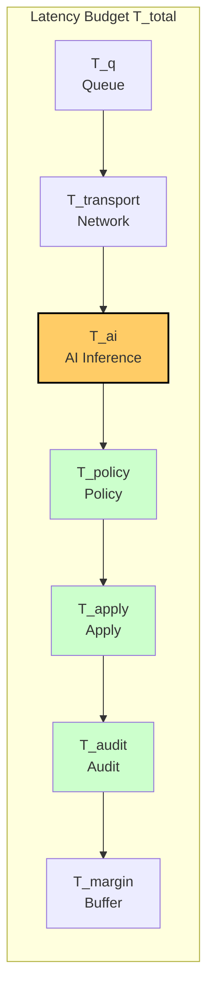
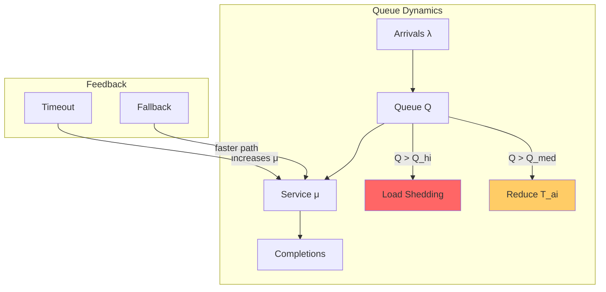
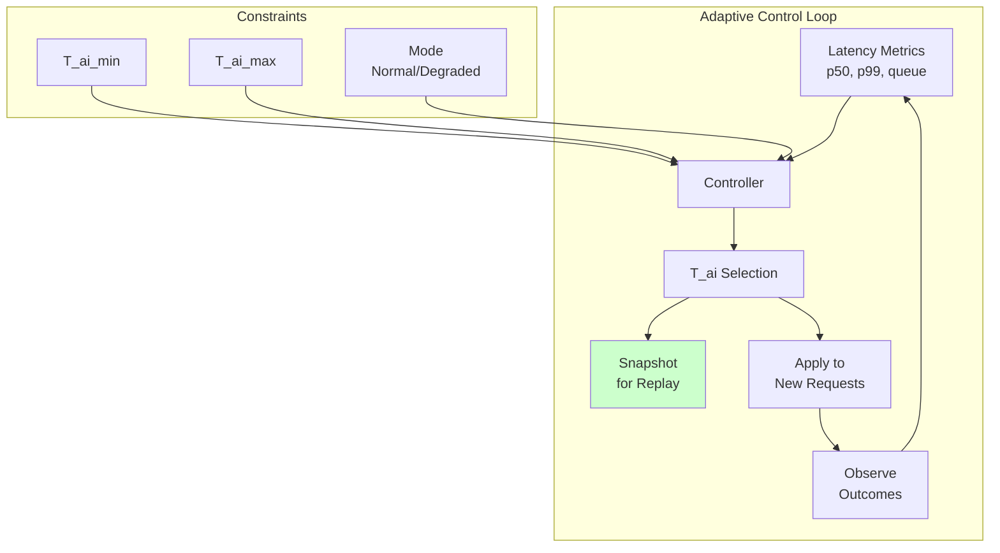
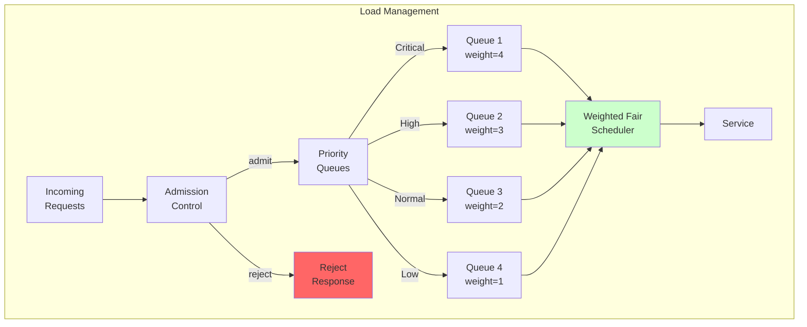
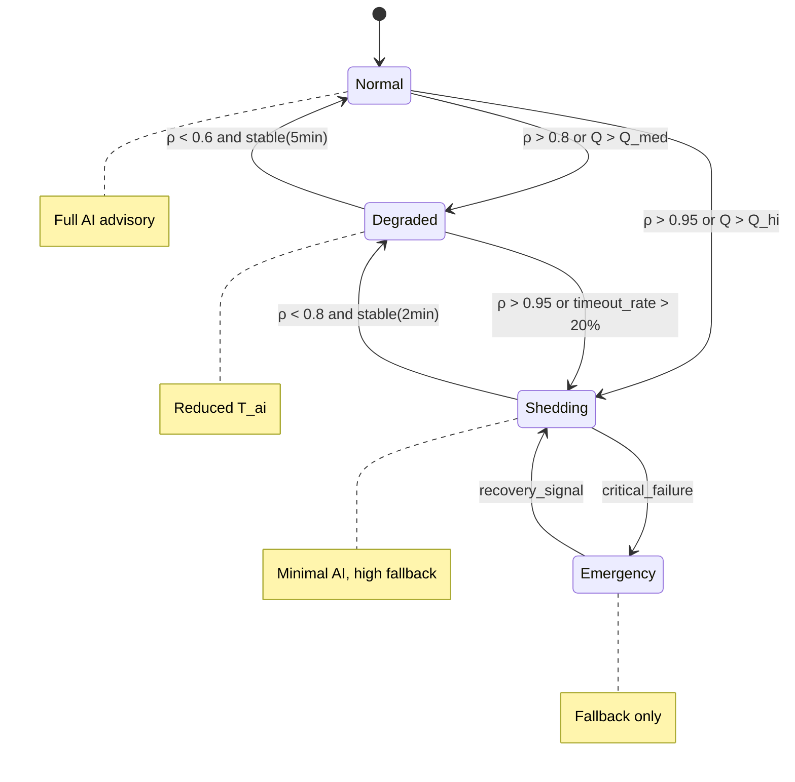
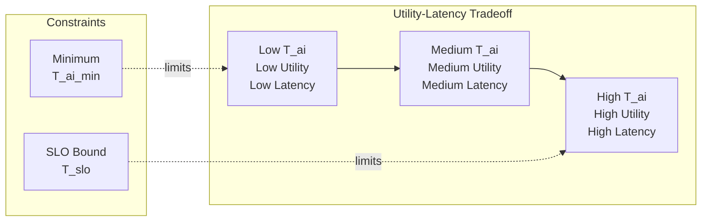
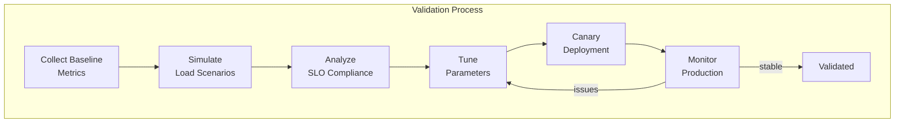

# Latency Budget Theory: Timing Constraints for AI-Integrated Systems

## Abstract

This document formalizes the latency budget theory for AI-deterministic system integration. We define a comprehensive timing model covering AI inference, policy evaluation, fallback execution, and queueing effects. We establish adaptive timeout mechanisms compatible with deterministic replay, prove SLO compliance under stated assumptions, and provide practical calibration guidelines. The model ensures bounded response times while maximizing AI advisory utility.

**Keywords**: latency budget, timeout, queueing theory, SLO, adaptive control, tail latency, load shedding

---

## 1. Introduction

### 1.1 Motivation

AI advisory systems must balance:
1. **Utility**: Longer AI timeout → better advisory quality
2. **Latency**: Shorter timeout → faster response
3. **Reliability**: Guaranteed completion within SLO
4. **Determinism**: Reproducible timing decisions for replay

### 1.2 Scope

This document covers:
- Latency budget decomposition
- Queueing model and stability
- Adaptive timeout with determinism
- SLO compliance proofs
- Degradation under overload

### 1.3 Relationship to Other Documents

| Document | Relationship |
|----------|--------------|
| 01-ai-advisory-pattern | T_ai timeout definition |
| 02-trust-boundary-model | Replay determinism requirements |
| 03-policy-enforcement-algebra | Policy evaluation latency |
| 04-fallback-state-machine | T_fb fallback timing |

---

## 2. Latency Budget Model

### 2.1 End-to-End Latency

**Definition 2.1 (Total Latency)**:
```
T_total = T_q + T_transport + T_ai + T_policy + T_apply + T_audit + T_margin
```

| Component | Symbol | Description | Typical Range |
|-----------|--------|-------------|---------------|
| Queue Wait | T_q | Time in request queue | 0-100ms |
| Transport | T_transport | Network/pipe latency | 1-10ms |
| AI Inference | T_ai | AI model response time | 50-200ms |
| Policy Eval | T_policy | Rule evaluation | 1-10ms |
| Apply | T_apply | Core state change | 1-10ms |
| Audit | T_audit | Witness/log commit | 1-5ms |
| Margin | T_margin | Safety buffer | 10-20ms |

### 2.2 Budget Constraints

**Definition 2.2 (SLO Constraint)**:
```
P(T_total > T_slo) ≤ ε
```
where T_slo is the service level objective and ε is the allowed violation rate.

**Definition 2.3 (Critical Budget)**:
```
T_critical = T_policy + T_apply + T_audit + T_fb_min
```
This is the minimum time required for non-AI operations plus fallback.

### 2.3 Budget Allocation Strategy

**Definition 2.4 (AI Budget Allocation)**:
```
T_ai = min(T_ai_max, T_total - T_critical - T_margin)
```

AI receives the remaining budget after reserving critical operations.



### 2.4 Fallback Budget Reservation

**Theorem 2.1 (Fallback Reserve)**:
```
T_ai ≤ T_total - T_fb_min - T_critical - T_margin
```
AI timeout cannot consume the fallback budget.

**Corollary 2.1 (Early Cutoff)**:
```
if remaining_time < T_fb_min + T_margin then
    trigger_early_cutoff()
    enter_fallback()
```

---

## 3. Queueing Model

### 3.1 System Model

**Definition 3.1 (Arrival Process)**:
```
λ(t): arrival rate at time t (requests/second)
```

**Definition 3.2 (Service Time)**:
```
S: service time random variable
E[S] = T_ai + T_policy + T_apply + T_audit
```

**Definition 3.3 (Utilization)**:
```
ρ = λ · E[S]
```

### 3.2 Stability Condition

**Theorem 3.1 (Queue Stability)**:
```
ρ < 1 ⟹ queue is stable (bounded in expectation)
```

**Corollary 3.1 (Instability)**:
```
ρ ≥ 1 ⟹ queue grows unboundedly
```

### 3.3 Queue Dynamics

**Definition 3.4 (Queue Evolution)**:
```
dQ/dt = λ(t) - μ(t)
```
where μ(t) is the service rate.

**Feedback Effect**: When timeout triggers, μ increases (faster completion via fallback).



### 3.4 Little's Law

**Theorem 3.2 (Little's Law)**:
```
L = λ · W
```
where L is average queue length and W is average wait time.

**Application**: To bound W ≤ W_max, we need L ≤ λ · W_max.

### 3.5 M/G/1 Queue Analysis

For AI service with general service time distribution:

**Definition 3.5 (Pollaczek-Khinchine Formula)**:
```
E[W] = (ρ · E[S] · (1 + C_s²)) / (2 · (1 - ρ))
```
where C_s = σ_S / E[S] is the coefficient of variation.

**Implication**: High variance (C_s > 1) significantly increases wait time.

---

## 4. Service Time Distribution

### 4.1 AI Latency Characteristics

AI inference latency typically exhibits:
- Right-skewed distribution
- Heavy tail (occasional slow responses)
- Mode < Mean < p99

**Definition 4.1 (Log-Normal Model)**:
```
T_ai ~ LogNormal(μ, σ²)
E[T_ai] = exp(μ + σ²/2)
Var[T_ai] = (exp(σ²) - 1) · exp(2μ + σ²)
```

### 4.2 Tail Latency

**Definition 4.2 (Percentile Latency)**:
```
p_k = inf{t : P(T_ai ≤ t) ≥ k/100}
```

| Percentile | Typical Ratio to Median |
|------------|------------------------|
| p50 | 1.0x |
| p90 | 1.5-2x |
| p99 | 2-4x |
| p999 | 3-10x |

### 4.3 Timeout Selection

**Definition 4.3 (Cost-Based Timeout)**:
```
T_ai* = argmin_T { C_timeout · P(T_ai > T) + C_wait · E[min(T_ai, T)] }
```

where:
- C_timeout: cost of timeout (fallback quality loss)
- C_wait: cost of waiting (latency impact)

---

## 5. Adaptive Timeout

### 5.1 Motivation

Fixed timeout is suboptimal:
- Too short: excessive timeouts, lost utility
- Too long: SLO violations under load

### 5.2 Adaptive Controller

**Definition 5.1 (Adaptive Timeout)**:
```
T_ai(t) = f(metrics(t), mode(t), constraints)
```

where:
- metrics(t): recent latency percentiles, queue depth
- mode(t): Normal, Degraded, Shedding
- constraints: T_ai_min ≤ T_ai ≤ T_ai_max

### 5.3 Percentile-Based Adaptation

**Algorithm 5.1 (EWMA Percentile Tracker)**:
```
p99_estimate(t) = α · p99_observed + (1-α) · p99_estimate(t-1)
T_ai(t) = min(T_ai_max, max(T_ai_min, β · p99_estimate(t)))
```

where α ∈ (0, 1) is smoothing factor and β ∈ (1, 1.5) is safety margin.

### 5.4 Mode-Based Adjustment

| Mode | T_ai Adjustment | Trigger |
|------|-----------------|---------|
| Normal | T_ai = β · p99_estimate | ρ < 0.7 |
| Degraded | T_ai = 0.7 · T_ai_normal | 0.7 ≤ ρ < 0.9 |
| Shedding | T_ai = T_ai_min | ρ ≥ 0.9 or Q > Q_hi |

### 5.5 Determinism Compatibility

**Requirement 5.1 (Replay Determinism)**:
Adaptive timeout must be reproducible from logged state.

**Solution**: Log controller state snapshot with each decision:
```
ControllerSnapshot := {
    p99_estimate: Duration,
    mode: Mode,
    T_ai_selected: Duration,
    metrics_window_hash: Hash,
    controller_ver: Version
}
```

**Replay Rule**:
```
replay_T_ai(snapshot) = snapshot.T_ai_selected
```
Do not recompute from "current" metrics.



---

## 6. Load Management

### 6.1 Admission Control

**Definition 6.1 (Admission Policy)**:
```
admit(request) :=
    if Q < Q_lo then ADMIT
    else if Q < Q_hi then ADMIT_WITH_REDUCED_TAI
    else if priority(request) = HIGH then ADMIT_WITH_MIN_TAI
    else REJECT
```

### 6.2 Load Shedding

**Definition 6.2 (Shedding Policy)**:
```
shed(request) :=
    if Q > Q_critical then REJECT_ALL_LOW_PRIORITY
    if wait_time(request) > W_max then REJECT
```

### 6.3 Priority Queues

**Definition 6.3 (Priority Classes)**:
```
Priority = {Critical, High, Normal, Low}
```

| Priority | Action Classes | Queue Weight |
|----------|---------------|--------------|
| Critical | A3 (with approval) | 4 |
| High | A2 | 3 |
| Normal | A1 | 2 |
| Low | A0 | 1 |

### 6.4 Fairness Guarantee

**Definition 6.4 (Weighted Fair Queueing)**:
```
service_share(class) = weight(class) / Σ weights
```

**Theorem 6.1 (No Starvation)**:
```
∀ class c: service_rate(c) ≥ min_rate(c)
```
where min_rate(c) = λ(c) · min_share(c).



---

## 7. Degradation Under Overload

### 7.1 Degradation Triggers

| Trigger | Condition | Action |
|---------|-----------|--------|
| Queue High | Q > Q_hi | Reduce T_ai |
| Utilization High | ρ > 0.9 | Enter Degraded mode |
| Latency Spike | p99 > 2 · baseline | Reduce T_ai |
| Timeout Rate High | timeout_rate > 10% | Enter Shedding mode |

### 7.2 Degradation Modes

**Definition 7.1 (Operating Modes)**:
```
Mode = {Normal, Degraded, Shedding, Emergency}
```

| Mode | T_ai | Admission | Fallback |
|------|------|-----------|----------|
| Normal | Adaptive | Full | F0 (AI) |
| Degraded | Reduced | Selective | F1 preferred |
| Shedding | Minimum | High priority only | F2 |
| Emergency | Zero | Critical only | F3 |

### 7.3 Mode Transitions



### 7.4 Graceful Degradation Theorem

**Theorem 7.1 (Graceful Degradation)**:
```
overload ⟹ degraded_mode ∧ bounded_latency ∧ ¬failure
```
Overload leads to degradation, not system failure.

*Proof*: 
1. Overload triggers mode transition
2. Each mode has bounded T_ai
3. Fallback provides bounded completion
4. Therefore, latency remains bounded
□

---

## 8. Utility-Latency Tradeoff

### 8.1 Utility Function

**Definition 8.1 (Advisory Utility)**:
```
U(decision) = quality_gain - penalty_cost
```

where:
- quality_gain: improvement over fallback baseline
- penalty_cost: cost of unsafe/incorrect decisions

### 8.2 Optimization Problem

**Definition 8.2 (Constrained Optimization)**:
```
maximize E[U(decision)]
subject to:
    P(T_total > T_slo) ≤ ε
    T_ai ≤ T_ai_max
    T_ai ≥ T_ai_min
```

### 8.3 Tradeoff Curve



### 8.4 Optimal Operating Point

**Theorem 8.1 (Optimal Timeout)**:
Under log-normal service time and linear utility:
```
T_ai* ≈ p_k where k = 100 · (1 - C_timeout/C_wait)
```

For typical C_timeout/C_wait ≈ 0.1, optimal is around p90.

---

## 9. Formal Properties

### 9.1 Bounded Completion

**Theorem 9.1 (Bounded Completion)**:
```
∀ request r: T_total(r) ≤ T_max
```
where T_max = T_ai_max + T_critical + T_margin.

*Proof*:
1. T_ai bounded by T_ai_max (timeout)
2. T_critical bounded by WCET of deterministic components
3. T_margin is constant
4. Sum is bounded
□

### 9.2 SLO Compliance

**Theorem 9.2 (Conditional SLO Compliance)**:
```
Under assumptions A1-A4:
P(T_total > T_slo) ≤ ε
```

**Assumptions**:
- A1: Arrival rate bounded: λ ≤ λ_max
- A2: Service time within calibrated envelope
- A3: Controller stable: ρ < 1
- A4: Timeout/fallback guards correct

*Proof Sketch*:
1. By A3, queue is stable (Theorem 3.1)
2. By A1, queue wait bounded in expectation
3. By A2, service time tail bounded
4. By A4, timeout ensures completion
5. Union bound over components gives ε
□

### 9.3 Stability

**Theorem 9.3 (Queue Stability)**:
```
ρ < 1 ⟹ E[Q] < ∞
```

### 9.4 Fairness

**Theorem 9.4 (No Starvation)**:
```
∀ priority class c: lim_{t→∞} served(c,t)/t ≥ min_rate(c)
```
No class is starved under weighted fair queueing.

### 9.5 Graceful Degradation

**Theorem 9.5 (Degradation Safety)**:
```
overload ⟹ mode_transition ∧ bounded_response ∧ ¬unsafe_state
```

### 9.6 Deterministic Replay

**Theorem 9.6 (Replay Consistency)**:
```
∀ snapshot s: replay_T_ai(s) = s.T_ai_selected
```
Replay uses logged timeout, not recomputed.

### 9.7 Budget Feasibility

**Theorem 9.7 (Budget Feasibility)**:
```
∀ t: T_ai(t) + T_critical + T_fb_min + T_margin ≤ T_total
```
Budget allocation always feasible.

### 9.8 Fallback Reserve Preservation

**Theorem 9.8 (Reserve Preservation)**:
```
∀ request r: remaining_budget(r) ≥ T_fb_min when entering fallback
```
Fallback always has sufficient budget.

### 9.9 Timeout Soundness

**Theorem 9.9 (Timeout Soundness)**:
```
timeout(r) ⟹ ◇≤T_fb fallback_complete(r)
```
Timeout always leads to fallback completion within T_fb.

### 9.10 Control Stability

**Theorem 9.10 (Controller Stability)**:
```
|T_ai(t+1) - T_ai(t)| ≤ Δ_max
```
Adaptive controller changes are bounded (no oscillation).

---

## 10. TLA+ Specification

### 10.1 Variables

```tla
VARIABLES
    clock,              \* Monotonic time
    queue,              \* Request queue by priority
    requests,           \* Request state: {queued, running, done}
    budget,             \* Remaining budget per request
    tai,                \* Selected T_ai per request
    mode,               \* Operating mode
    controller_state,   \* Adaptive controller state
    metrics             \* Recent latency metrics
```

### 10.2 Budget Allocation

```tla
\* Allocate AI budget for request
AllocateBudget(req) ==
    LET t_critical == T_policy + T_apply + T_audit + T_fb_min
        t_margin == T_margin
        t_available == T_total - t_critical - t_margin
        t_ai == Min(T_ai_max, Max(T_ai_min, t_available))
    IN [tai |-> t_ai, deadline |-> clock + T_total]

\* Check budget feasibility
BudgetFeasible(req) ==
    budget[req].tai + T_critical + T_fb_min + T_margin <= T_total
```

### 10.3 Mode Transitions

```tla
\* Transition to Degraded mode
EnterDegraded ==
    /\ mode = "Normal"
    /\ \/ utilization > 0.8
       \/ Len(queue) > Q_med
    /\ mode' = "Degraded"
    /\ UNCHANGED <<clock, queue, requests, budget>>

\* Transition to Shedding mode
EnterShedding ==
    /\ mode \in {"Normal", "Degraded"}
    /\ \/ utilization > 0.95
       \/ Len(queue) > Q_hi
       \/ timeout_rate > 0.2
    /\ mode' = "Shedding"
    /\ UNCHANGED <<clock, queue, requests, budget>>

\* Recovery to Normal
RecoverNormal ==
    /\ mode = "Degraded"
    /\ utilization < 0.6
    /\ stable_duration >= 300  \* 5 minutes
    /\ mode' = "Normal"
    /\ UNCHANGED <<clock, queue, requests, budget>>
```

### 10.4 Invariants

```tla
\* Budget feasibility invariant
BudgetFeasibilityInv ==
    \A req \in DOMAIN budget:
        budget[req].tai + T_critical + T_fb_min + T_margin <= T_total

\* Bounded completion invariant
BoundedCompletionInv ==
    \A req \in DOMAIN requests:
        requests[req].state = "done" =>
            requests[req].completion_time - requests[req].arrival_time <= T_max

\* No starvation invariant
NoStarvationInv ==
    \A class \in PriorityClasses:
        served_rate[class] >= min_rate[class]

\* Controller stability invariant
ControllerStabilityInv ==
    \A t1, t2 \in Times:
        t2 = t1 + 1 => Abs(tai[t2] - tai[t1]) <= Delta_max
```

---

## 11. Calibration Guidelines

### 11.1 Initial Calibration

**Step 1: Measure Baseline**
```
Collect T_ai samples under normal load
Compute p50, p90, p99, p999
Fit distribution (log-normal recommended)
```

**Step 2: Set Initial Parameters**
```
T_ai_max = p99 * 1.2
T_ai_min = p50 * 0.5
T_total = T_ai_max + T_critical + T_margin
```

**Step 3: Validate**
```
Run load test
Verify SLO compliance
Adjust if needed
```

### 11.2 Recommended Defaults

| Parameter | Interactive | Batch | Notes |
|-----------|-------------|-------|-------|
| T_total | 200ms | 1000ms | End-to-end budget |
| T_ai_max | 150ms | 800ms | Maximum AI timeout |
| T_ai_min | 30ms | 100ms | Minimum AI timeout |
| T_fb_min | 20ms | 50ms | Reserved for fallback |
| T_critical | 30ms | 50ms | Policy + apply + audit |
| T_margin | 20ms | 100ms | Safety buffer |
| Q_hi | 500 | 2000 | High queue threshold |
| Q_med | 200 | 1000 | Medium queue threshold |

### 11.3 Online Tuning

**Algorithm 11.1 (Online Calibration)**:
```
every calibration_window:
    collect latency samples
    update p99_estimate with EWMA
    if SLO_violation_rate > target:
        decrease T_ai_max by step
    else if timeout_rate > target:
        increase T_ai_max by step
    apply bounded adjustment
```

---

## 12. Measurement and Validation

### 12.1 Key Metrics

| Metric | Definition | Target |
|--------|------------|--------|
| p50_latency | Median response time | < T_total/2 |
| p99_latency | 99th percentile | < T_slo |
| timeout_rate | Timeouts / requests | < 5% |
| fallback_rate | Fallbacks / requests | < 10% |
| slo_violation_rate | Violations / requests | < ε |
| queue_depth | Average queue length | < Q_med |
| utilization | ρ = λ · E[S] | < 0.8 |

### 12.2 Validation Protocol



---

## 12.3 Assumptions Ledger

**Purpose**: Explicit enumeration of assumptions required for SLO theorem validity.

| ID | Assumption | Verifiable? | Verification Method | Failure Mode |
|----|------------|-------------|---------------------|--------------|
| A1 | λ ≤ λ_max (bounded arrival) | Yes | Admission control enforces | Overload → shedding |
| A2 | ρ < 1 (stability) | Yes | Real-time monitoring | Instability → degraded mode |
| A3 | Service time ∈ calibrated envelope | Partial | Periodic recalibration | Drift → SLO violation |
| A4 | Timeout/fallback guards correct | Yes | Testing, formal verification | Bug → unbounded latency |
| A5 | Log-normal distribution fit | Partial | Goodness-of-fit tests | Poor fit → inaccurate bounds |
| A6 | Independent requests | Partial | Correlation analysis | Batching → queue effects |
| A7 | Stationary process | No | Regime detection | Regime shift → recalibration |

**Assumption Validity Envelope**:

```
Valid(SLO_theorem) iff:
    A1 ∧ A2 ∧ A4 ∧ (A3 within tolerance) ∧ (A5 within tolerance)
```

**Regime Shift Detection**:
```
regime_shift_detected iff:
    |p99_current - p99_baseline| > threshold OR
    |λ_current - λ_baseline| > threshold OR
    distribution_fit_score < min_score
```

**Response to Assumption Violation**:

| Assumption | Violation Response |
|------------|-------------------|
| A1 | Increase shedding, alert ops |
| A2 | Enter degraded mode, reduce T_ai |
| A3 | Trigger recalibration, widen margins |
| A4 | Critical bug, halt and investigate |
| A5 | Switch to empirical bounds, widen margins |
| A6 | Enable batch-aware queueing |
| A7 | Full recalibration required |

**SLO Theorem Scope Statement**:

> **Theorem 9.2 is CONDITIONAL**: SLO compliance P(T > T_slo) ≤ ε holds ONLY when assumptions A1-A4 are satisfied and A3, A5 are within calibrated tolerance. The theorem does NOT guarantee compliance during regime shifts, uncalibrated deployments, or assumption violations.

---

## 12.4 M/G/1 Model Validity Envelope

**Problem**: M/G/1 is an approximation. When is it valid?

**Validity Conditions**:

| Condition | Requirement | Verification |
|-----------|-------------|--------------|
| Single server | One AI model instance per queue | Architecture check |
| FCFS discipline | No priority preemption within queue | Implementation check |
| Infinite buffer | Queue can grow unboundedly | False in practice → admission control |
| Stationary arrivals | λ constant over analysis window | Traffic analysis |
| Independent service | Service times uncorrelated | Correlation test |

**When M/G/1 Breaks Down**:

| Scenario | Issue | Mitigation |
|----------|-------|------------|
| Multi-class priority | Not single queue | Use priority queueing bounds |
| Bursty arrivals | Non-Poisson | Add burst margin, use MMPP model |
| Correlated service | Batch effects | Batch-aware analysis |
| Finite buffer | Admission control | Include rejection probability |
| Non-stationary | Time-varying λ | Sliding window analysis |

**Recommended Approach**:
1. Use M/G/1 as baseline approximation
2. Add empirical correction factors from production data
3. Validate bounds against actual p99 measurements
4. Widen margins when model assumptions violated

---

## 13. Limitations

### 13.1 Explicit Limitations

| Limitation | Description | Mitigation |
|------------|-------------|------------|
| Distribution Assumption | Log-normal may not fit all AI models | Empirical validation |
| Stationarity | Assumes stable arrival/service patterns | Adaptive recalibration |
| Independence | Assumes independent requests | Batch handling |
| Tail Bounds | Heavy tails hard to bound | Conservative margins |

### 13.2 What We Do NOT Claim

1. **Exact SLO guarantee**: Probabilistic, not absolute
2. **Optimal utility**: Tradeoff, not maximum
3. **Zero timeouts**: Some timeouts expected
4. **Universal parameters**: Domain-specific tuning required

---

## 14. Novel Contributions

### 14.1 Contribution Summary

| # | Contribution | Novelty Claim |
|---|--------------|---------------|
| C1 | **Integrated Budget Model** | AI + policy + fallback in unified framework |
| C2 | **Deterministic-Compatible Adaptation** | Adaptive timeout with replay support |
| C3 | **Guaranteed Fallback Reserve** | Formal reservation of T_fb_min |
| C4 | **Conditional SLO Theorem** | Provable compliance under assumptions |
| C5 | **Mode-Based Degradation** | Structured overload response |

### 14.2 Comparison with Prior Art

| Approach | Strengths | Gaps Addressed |
|----------|-----------|----------------|
| Fixed Timeout | Simple, deterministic | No adaptation to load |
| Adaptive Timeout | Responsive | No replay determinism |
| Circuit Breaker | Failure isolation | No latency budget |
| Load Shedding | Overload protection | No utility optimization |

---

## 15. Cross-Document Mapping

### 15.1 Dependencies

| This Document | Depends On | Relationship |
|---------------|------------|--------------|
| T_ai definition | 01-ai-advisory-pattern | Timeout semantics |
| Replay determinism | 02-trust-boundary-model | Snapshot requirements |
| Policy latency | 03-policy-enforcement-algebra | T_policy bounds |
| Fallback timing | 04-fallback-state-machine | T_fb constraints |

### 15.2 Provides To

| This Document | Provides To | What |
|---------------|-------------|------|
| Timing constraints | 06-isolation-experiments | Latency under isolation |
| Budget parameters | 07-bitcoin-case-study | Domain calibration |
| Budget parameters | 08-industrial-case-study | Domain calibration |
| SLO metrics | 09-comparative-evaluation | Performance baseline |

---

## 16. Conclusion

This document establishes a formal latency budget theory for AI-deterministic system integration. Key results:

1. **Integrated budget model** covering all system components
2. **Adaptive timeout** compatible with deterministic replay
3. **Guaranteed fallback reserve** through budget allocation
4. **Conditional SLO compliance** under stated assumptions
5. **Graceful degradation** under overload

The model enables formal reasoning about timing constraints while maximizing AI advisory utility.

---

## References

1. Kleinrock, L. "Queueing Systems, Volume 1: Theory." Wiley (1975).
2. Dean, J., Barroso, L.A. "The Tail at Scale." CACM (2013).
3. Harchol-Balter, M. "Performance Modeling and Design of Computer Systems." Cambridge (2013).
4. Amazon. "Timeouts, retries, and backoff with jitter." AWS Architecture Blog (2019).
5. Google. "Site Reliability Engineering." O'Reilly (2016).

---

*Document Version: 1.0*
*Last Updated: 2026-03-25*
*Authors: Kiro + Codex (AI Research Collaboration)*
*R&D Dialogue Rounds: 20 questions across 4 sessions*
