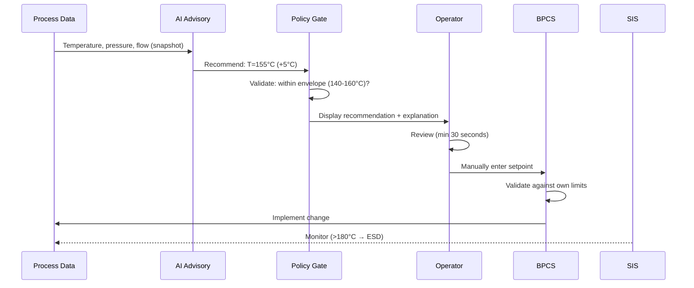

# Industrial Control Case Study: AI Advisory Pattern for Critical Infrastructure

## Abstract

This case study applies the AI Advisory Pattern to Industrial Control Systems (ICS) including manufacturing automation, process control, and critical infrastructure. We establish a three-zone architecture (Safety Zone → Control Zone → Advisory Zone) with hardware-enforced boundaries, demonstrate AI advisory for setpoint optimization, predictive maintenance, and anomaly detection while preserving safety-critical invariants. The study addresses IEC 61508, IEC 62443, and NIST SP 800-82 compliance requirements.

**Keywords**: industrial control, SCADA, PLC, SIS, safety systems, predictive maintenance, IEC 61508, IEC 62443, functional safety

---

## 1. Introduction

### 1.1 Motivation

Industrial Control Systems can benefit from AI advisory in operational decisions:
- **Setpoint optimization**: Improve yield, energy efficiency
- **Predictive maintenance**: Reduce unplanned downtime
- **Anomaly detection**: Early warning of equipment issues
- **Process optimization**: Continuous improvement

However, ICS have unique constraints:
- **Safety-critical**: Errors can cause physical harm, injury, death
- **Real-time**: Strict timing requirements (milliseconds)
- **Regulatory**: IEC 61508, IEC 62443, NIST SP 800-82
- **Air-gapped**: Often isolated from internet
- **Legacy**: Many systems without modern security

### 1.2 Fundamental Principle

**AI in ICS is advisory only for non-safety loops. Safety loops are deterministic and certifiable, without AI.**

### 1.3 Scope

**In-scope for AI advisory**:
- Setpoint recommendations (within safe envelope)
- Predictive maintenance alerts
- Anomaly detection and alerting
- Process optimization hints
- Alarm rationalization suggestions

**Out-of-scope (AI-free zones)**:
- Safety Instrumented Functions (SIF)
- Emergency Shutdown (ESD)
- Hardwired interlocks
- Final element control
- Basic Process Control System (BPCS) logic
- Safety PLC programs

### 1.4 Fundamental Constraint

**Safety Integrity Invariant**:
```
∀ safety_function sf:
    execute(sf) = execute_deterministic(sf)
    AI_influence(sf) = ∅
```

AI has no path to final actuator command without safety interlock.

### 1.5 Relationship to Other Documents

| Document | Relationship |
|----------|--------------|
| 01-ai-advisory-pattern | Core pattern applied here |
| 02-trust-boundary-model | Trust zones for ICS |
| 03-policy-enforcement-algebra | Policy rules for setpoint decisions |
| 04-fallback-state-machine | Safe state definitions |
| 05-latency-budget-theory | Real-time constraints |
| 06-isolation-experiments | V6 isolation for ICS |

---

## 2. Architecture

### 2.1 Three-Zone Architecture

```
┌─────────────────────────────────────────────────────────────────┐
│                     Industrial Control System                    │
│                                                                 │
│  ┌─────────────────────────────────────────────────────────┐   │
│  │         SAFETY ZONE (AI-FREE, SIL-rated)                 │   │
│  │  Safety Instrumented System (SIS) | Emergency Shutdown   │   │
│  │  Safety PLCs | Hardwired Interlocks | Final Elements     │   │
│  │                                                          │   │
│  │  Authority: HIGHEST - Cannot be overridden               │   │
│  └─────────────────────────────────────────────────────────┘   │
│                            │                                    │
│                            │ hardware data diode (one-way)      │
│                            ▼                                    │
│  ┌─────────────────────────────────────────────────────────┐   │
│  │         CONTROL ZONE (AI-FREE, deterministic)            │   │
│  │  Basic Process Control System (BPCS) | PLCs | DCS        │   │
│  │  Regulatory Control | Sequence Control                   │   │
│  │                                                          │   │
│  │  Authority: Operator can override, SIS takes precedence  │   │
│  └─────────────────────────────────────────────────────────┘   │
│                            │                                    │
│                            │ read-only snapshot                 │
│                            ▼                                    │
│  ┌─────────────────────────────────────────────────────────┐   │
│  │         ADVISORY ZONE (AI-ALLOWED)                       │   │
│  │                                                          │   │
│  │  ┌─────────────┐    ┌─────────────┐    ┌─────────────┐  │   │
│  │  │ Setpoint    │    │ Predictive  │    │ Anomaly     │  │   │
│  │  │ Optimization│    │ Maintenance │    │ Detection   │  │   │
│  │  └──────┬──────┘    └──────┬──────┘    └──────┬──────┘  │   │
│  │         │                  │                   │          │   │
│  │    ┌────┴──────────────────┴───────────────────┴────┐    │   │
│  │    │           AI Advisory Layer (V6)               │    │   │
│  │    │   - Air-gapped from internet                   │    │   │
│  │    │   - Operator approval required                 │    │   │
│  │    │   - Bounded recommendations only               │    │   │
│  │    │   - No direct actuator path                    │    │   │
│  │    └────────────────────────────────────────────────┘    │   │
│  │                                                          │   │
│  │  Authority: ADVISORY ONLY - No control authority         │   │
│  └─────────────────────────────────────────────────────────┘   │
└─────────────────────────────────────────────────────────────────┘
```

### 2.2 Authority Hierarchy

| Level | Component | Authority | Override |
|-------|-----------|-----------|----------|
| 1 (Highest) | SIS | Automatic safety action | Cannot be overridden |
| 2 | Operator | Manual control | Can override BPCS |
| 3 | BPCS | Automatic control | Follows operator/SIS |
| 4 (Lowest) | AI | Advisory only | No control authority |

### 2.3 Data Flow Constraints

| Flow | Mechanism | Constraints |
|------|-----------|-------------|
| Safety → Control | Hardware data diode | One-way, read-only |
| Control → Advisory | Snapshot export | Versioned, immutable |
| Advisory → Operator | Display only | No direct control path |
| Operator → Control | Manual entry | Separate HMI system |
| AI → Control | FORBIDDEN | No path exists |
| AI → Safety | FORBIDDEN | No path exists |

### 2.4 Boundary Implementation

**Hardware Data Diode**: Between Safety/Control and Advisory zones
- Physically enforced one-way data flow
- Required for high-SIL claims
- Software-only insufficient

**Operator Feedback Path**: Separate network
- Approvals/acknowledgments via separate console
- Not through data diode
- Audit data exported via secure file transfer

---

## 3. Use Cases

### 3.1 Setpoint Optimization

**Scenario**: Chemical reactor temperature control for yield maximization.

**Flow**:


**Policy Gate Rules**:
- Envelope: Process-specific from HAZOP/LOPA
- Edge-bias detection: Alert if >30% recommendations in top/bottom 10%
- Drift budget: Max cumulative change per shift
- Timeout: Auto-reject if no approval within T_approval

**Explainability**:
- Top factors influencing recommendation
- Confidence level
- Comparison to current setpoint
- Envelope constraints hit (if any)

### 3.2 Predictive Maintenance

**Scenario**: Pump vibration analysis predicting bearing failure.

**Flow**:
1. AI analyzes vibration data, temperature trends
2. AI predicts: "Pump P-101 bearing failure 85% probability within 14 days"
3. Maintenance ticket auto-created (medium approval)
4. Maintenance planner reviews, schedules work
5. No immediate control action

**Thresholds by Asset Criticality**:

| Asset Criticality | Auto-ticket Threshold | Rationale |
|-------------------|----------------------|-----------|
| Critical (safety-related) | 0.6 | Early warning essential |
| Important (production) | 0.7 | Balance cost/risk |
| Standard | 0.8 | Minimize false positives |

**Cost Model**:
- False positive: Unnecessary maintenance cost
- False negative: Unplanned outage, safety risk
- Track and calibrate per asset class

### 3.3 Anomaly Detection

**Scenario**: Unusual pressure pattern in pipeline.

**Flow**:
1. AI detects anomaly in pressure readings
2. AI classifies: "Possible leak (60%), sensor fault (30%), normal (10%)"
3. Alert generated automatically
4. Operator investigates
5. If confirmed, operator initiates response (not AI)

**Alert Thresholds**:
- Adaptive by process state (startup/shutdown/steady)
- Alarm load management (prevent fatigue)
- Severity-based escalation

**AI vs Traditional Alarm Management**:
- AI: Probabilistic pre-alarm, context ranking
- Traditional: Deterministic, standards-based
- AI suggestions for alarm rationalization require MOC approval

### 3.4 Alarm Mediation Layer

**Problem**: In ICS incidents, alarm floods (hundreds of alarms in minutes) are common. If AI anomaly detection adds more alerts, this worsens the situation.

**Solution**: AI does NOT generate raw alarms directly into safety channel.

**Alarm Mediation Layer**:
```
┌─────────────────────────────────────────────────────────────────┐
│                    ALARM MEDIATION LAYER                         │
│                                                                 │
│  ┌──────────┐    ┌─────────────────┐    ┌──────────────────┐  │
│  │ AI       │───▶│  Mediation      │───▶│  Operator HMI    │  │
│  │ Anomaly  │    │  - Deduplication│    │  (Prioritized)   │  │
│  │ Detection│    │  - Correlation  │    │                  │  │
│  └──────────┘    │  - Rate Limiting│    └──────────────────┘  │
│                  │  - Priority Map │                           │
│  ┌──────────┐    │  - Suppression  │                           │
│  │ Traditional───▶│    Policy       │                           │
│  │ Alarms   │    └─────────────────┘                           │
│  └──────────┘                                                   │
└─────────────────────────────────────────────────────────────────┘
```

**Mediation Functions**:
1. **Deduplication**: Merge similar AI alerts with traditional alarms
2. **Correlation**: Group related alerts (e.g., cascade failures)
3. **Rate Limiting**: Max N AI alerts per minute
4. **Priority Mapping**: AI alerts mapped to standard priority levels
5. **Suppression Policy**: Suppress low-priority AI alerts during high-alarm situations

**Audit**: All suppression decisions logged with rationale.

**Principle**: AI enhances situational awareness, does not add to alarm overload.

---

## 4. Real-Time Constraints

### 4.1 Cycle Time Boundaries

| Cycle Time | AI Involvement | Rationale |
|------------|----------------|-----------|
| < 1 second | FORBIDDEN | Hard real-time, AI too slow |
| 1-10 seconds | Allowed with deterministic validation | Near real-time |
| > 10 seconds | Full advisory workflow | Supervisory level |

### 4.2 Latency Budget

For supervisory loop (>10 second cycle):
- T_ai: 50-500ms (process-specific)
- T_approval: Process-specific from HAZOP
- Timeout: Fail-closed (auto-reject or hold-last-safe)

### 4.3 Fallback Safe States

Process-specific safe state catalog:

| Process Type | Safe State Options | Selection Criteria |
|--------------|-------------------|-------------------|
| Batch reactor | Hold, controlled cooldown, ESD | Reaction phase, temperature |
| Continuous flow | Hold-last-safe, ramp-down | Flow rate, pressure |
| Power generation | Load reduction, trip | Grid stability, equipment |
| Water treatment | Bypass, shutdown | Quality, flow |

Safe state catalog:
- Defined per unit operation
- Approved by process safety engineer
- Part of HAZOP/LOPA documentation
- Reviewed annually and after incidents

---

## 5. Human Factors

### 5.1 Operator Approval Workflow

**Approval Timeout**:
- Default: Auto-reject (fail-safe)
- Some processes: Hold-last-safe with expiry
- Process-specific from risk analysis

**Workload Controls**:
- Max recommendations per shift
- Mandatory review time (min 30 seconds)
- Automation bias detection: Track "approve without review"
- Dual approval for high-impact changes

### 5.1 Operator Approval Workflow

**Approval Timeout**:
- Default: Auto-reject (fail-safe)
- Some processes: Hold-last-safe with expiry
- Process-specific from risk analysis

**Workload Controls**:
- Max recommendations per shift
- Mandatory review time (min 30 seconds)
- Automation bias detection: Track "approve without review"
- Dual approval for high-impact changes

### 5.2 Mode Confusion Prevention

**Problem**: In aviation, mode confusion (pilot doesn't understand autopilot mode) is a major cause of accidents. In ICS with AI advisory, operators must always know system state.

**HMI Requirements**:
1. **Always-visible mode banner**: Current mode displayed prominently
   - "AI Active" / "AI Reduced" / "AI Fallback" / "AI Disabled"
2. **Source tagging**: Every recommendation shows source
   - "AI Recommendation" / "Baseline Rule" / "Manual Override"
3. **Concise rationale**: Why AI recommends this (top 3 factors)
4. **Constraint visualization**: Show envelope boundaries, current position

**Training Requirements**:
- Operators must understand all modes
- Drills on mode transitions mandatory
- Competency assessment includes mode confusion scenarios

**Design Principle**: Operator should NEVER be uncertain about what mode system is in.

### 5.3 Competency Requirements

| Role | Training | Assessment |
|------|----------|------------|
| Operator | AI system overview, approval workflow | Annual |
| Engineer | Model understanding, envelope setting | Initial + updates |
| Maintenance | Predictive maintenance interpretation | Initial + updates |

### 5.3 Competency Requirements

| Role | Training | Assessment |
|------|----------|------------|
| Operator | AI system overview, approval workflow | Annual |
| Engineer | Model understanding, envelope setting | Initial + updates |
| Maintenance | Predictive maintenance interpretation | Initial + updates |

### 5.4 AI-Off Drills

**Requirement**: Periodic drills where AI is disabled to maintain operator competency.

**Rationale**: Operators become dependent on AI assistance. If AI fails during plant upset, operators must handle situation without AI. This is worse than never having AI.

**Drill Requirements**:
- Frequency: Monthly minimum
- Duration: Full shift without AI
- Scenarios: Include upset conditions, not just steady-state
- Assessment: Operators must maintain minimum competency without AI

**Competency Floor**: Operators must be able to operate plant safely without AI. AI is enhancement, not replacement.

**Documentation**: Drill results logged, competency gaps addressed through training.

### 5.5 Override Tracking

Track rejection reasons:
- Safety bound hit
- Low confidence
- Poor explanation
- Operator policy preference

Analyze: Model issue vs trust/adoption issue

### 5.4 Mode Confusion Prevention

**Problem**: In aviation, mode confusion (pilot doesn't understand autopilot state) causes accidents. Same risk exists in ICS with AI advisory.

**Operator may not understand**:
- When AI is active vs fallback
- Which recommendations come from AI vs baseline
- Why AI recommends something

**HMI Requirements**:

| Requirement | Implementation |
|-------------|----------------|
| Always-visible mode banner | `AI Active / Reduced / Fallback / Disabled` prominently displayed |
| Source tagging | Every recommendation labeled: `[AI]`, `[Baseline]`, `[Rule]` |
| Concise rationale | Top factors + constraints for each recommendation |
| State transition alerts | Audio/visual alert on mode change |
| Historical mode log | Accessible log of mode transitions |

**Training Requirements**:
- Mode transition drills mandatory
- Operators must demonstrate understanding of all modes
- Annual recertification

### 5.5 AI-Off Drills

**Problem**: If operators become dependent on AI, they may lose competence to operate without it.

**Requirements**:
1. **Periodic drills**: Operate without AI for defined period (e.g., 4 hours/quarter)
2. **Minimum competence**: Operators must pass baseline-only operation assessment
3. **Graceful degradation playbooks**: Documented procedures for AI-off operation
4. **Dependency monitoring**: Track metrics that indicate over-reliance on AI

**Drill Protocol**:
```
1. Announce drill (or surprise for advanced assessment)
2. Disable AI advisory
3. Operate on baseline/manual for drill period
4. Record all decisions and outcomes
5. Debrief: Compare AI-on vs AI-off performance
6. Document lessons learned
```

### 5.6 Alarm Mediation Layer

**Problem**: AI anomaly detection can generate additional alerts, worsening alarm floods during incidents.

**Requirements**:
1. AI does NOT generate raw alarms in safety channel
2. All AI alerts go through mediation layer

**Mediation Layer Functions**:

| Function | Description |
|----------|-------------|
| Deduplication | Merge similar alerts |
| Correlation | Group related alerts |
| Rate limiting | Cap alerts per time window |
| Priority mapping | Map AI confidence to alarm priority |
| Suppression policy | Suppress low-priority during high-load |
| Audit trail | Log all suppressed alerts |

**Alarm Load Budget**:
- AI alerts ≤ 10% of total alarm budget
- During incident: AI alerts auto-suppressed or aggregated
- Post-incident: AI alerts reviewed for value

---

## 6. Regulatory Compliance

### 6.1 Liability and Governance

**Critical Question**: If AI recommendation leads to accident, who is legally responsible?

**Answer**: Architecture must make responsibility clear and provable.

**Responsibility Model**:
1. **AI Vendor**: Provides advisory system, not control authority
2. **System Integrator**: Implements policy gate, envelope constraints
3. **Operator**: Has final authority, approves recommendations
4. **Plant Owner**: Accountable for safety, defines acceptable risk

**Governance Framework**:

| Decision | Primary | Co-owners | Approval | Evidence |
|----------|---------|-----------|----------|----------|
| AI model selection | AI Platform Team | Safety Engineer | Dual | Model card, validation report |
| Envelope constraints | Process Safety Engineer | Operations | Dual | HAZOP/LOPA documentation |
| Recommendation approval | Operator | - | Single | Decision witness |
| High-impact action | Operator | Shift Supervisor | Dual | Signed approval + witness |
| Model update (MOC) | AI Platform Team | Safety + Operations | Dual | MOC record, test evidence |

**RACI Matrix**:
- **R** (Responsible): Does the work
- **A** (Accountable): Ultimately answerable
- **C** (Consulted): Provides input
- **I** (Informed): Kept updated

**Immutable Witness**: All decisions logged with:
- Who approved
- What was approved
- When
- Why (rationale)
- Cryptographic signature (tamper-evident)

**Principle**: Liability follows authority. AI has no authority, therefore no liability. Operator has authority, therefore accountable (with AI as advisory input).

### 6.2 Regulatory Mapping

| Standard | Scope | AI Implications |
|----------|-------|-----------------|
| IEC 61508 | Functional safety | AI excluded from SIF, mentioned as external influencing system |
| IEC 62443 | Industrial cybersecurity | AI in separate zone, SL2/SL3 target |
| NIST SP 800-82 | ICS security | AI in DMZ/advisory zone |
| ISA-95 | Enterprise-control integration | AI at Level 3/4 |
| API 754 | Process safety metrics | AI impact tracking |

### 6.2 Regulatory Mapping

| Standard | Scope | AI Implications |
|----------|-------|-----------------|
| IEC 61508 | Functional safety | AI excluded from SIF, mentioned as external influencing system |
| IEC 62443 | Industrial cybersecurity | AI in separate zone, SL2/SL3 target |
| NIST SP 800-82 | ICS security | AI in DMZ/advisory zone |
| ISA-95 | Enterprise-control integration | AI at Level 3/4 |
| API 754 | Process safety metrics | AI impact tracking |

### 6.3 IEC 61508 Compliance

| SIL Level | AI Role | Enforcement |
|-----------|---------|-------------|
| SIL 4 | None | AI completely isolated |
| SIL 3 | Advisory only, human approval | Policy gate + operator |
| SIL 2 | Advisory with bounded influence | Policy gate |
| SIL 1 | Advisory with monitoring | Logging + audit |

**Safety Case**: AI mentioned as external influencing system with:
- Proof of independence/isolation
- No path to safety function
- Bounded influence on process context

### 6.3 SIL Demand Rate Monitoring

AI must not increase SIS demand rate:
1. LOPA analysis for AI-influenced scenarios
2. Envelope constraints keep within normal operating range
3. Monitor SIS demand rate before/after AI deployment
4. If demand rate increases >10%, investigate and potentially disable AI

### 6.4 Demand-Rate Impact Assessment

**Problem**: Even without direct SIF control, AI can increase SIS demand rate through process condition changes.

#### 6.4.1 AI as External Demand Modifier

```
λd_ai = λd_base × (1 + AI_influence_factor)

where AI_influence_factor depends on:
- Frequency of AI recommendations
- Magnitude of recommended changes  
- Proximity to safety limits
- Operator acceptance rate
```

#### 6.4.2 Proximity Metric

Normalized safety margin:
```
m = (L_safe(x) - x) / (L_safe(x) - L_nom)

where:
- L_safe(x) = safety limit (may be dynamic)
- x = current/recommended value
- L_nom = nominal operating point
```

Lower `m` = higher risk weight in demand calculation.

#### 6.4.3 Operator Behavior Profiles

Historical acceptance rate is insufficient. Model three profiles:

| Profile | Description | Use |
|---------|-------------|-----|
| Conservative | Low acceptance, high scrutiny | Best case |
| Nominal | Historical average | Expected case |
| Aggressive | High acceptance, low scrutiny | Worst case |

**Requirement**: Pass in nominal, bounded in aggressive.

#### 6.4.4 Assessment Method

| Method | Purpose | When to Use |
|--------|---------|-------------|
| Worst-case bound | All high-risk recommendations accepted | Primary (certification) |
| Monte Carlo | Realistic distributions | Secondary (validation) |
| Historical backtest | Actual past behavior | Tertiary (calibration) |

#### 6.4.5 Acceptance Criteria

```
Δλd = λd_ai - λd_base

Requirement: Δλd ≤ X% under worst-case accepted envelope

If not satisfied:
- Tighten AI envelope
- Reduce AI authority
- Recalculate SIF design target
```

### 6.5 SC (Systematic Capability) Allocation

**Problem**: IEC 61508 requires Systematic Capability (SC) levels for software. ML models don't fit traditional SC techniques.

#### 6.5.1 SC Allocation Strategy

| Component | SC Level | Rationale |
|-----------|----------|-----------|
| Safety PLC code | SC 3 | SIF path, full rigor |
| Policy Gate | SC 2-3 | TCB, deterministic |
| Fallback logic | SC 2-3 | Safety-critical path |
| Interface contracts | SC 2 | Boundary enforcement |
| AI/ML model | **Excluded** | Not in SIF path |
| Advisory runtime | SC 1 | Monitoring only |

#### 6.5.2 Why ML Excluded from SIF Path

| Reason | Explanation |
|--------|-------------|
| Non-determinism | Same input may produce different output |
| Opacity | Cannot fully explain decision |
| Drift | Behavior changes over time |
| Testing limits | Cannot exhaustively test |
| Certification gap | No established ML certification path |

#### 6.5.3 Compensating Controls for ML

Since ML cannot achieve SC certification:

| Control | Purpose |
|---------|---------|
| Hard isolation | ML cannot reach SIF |
| Deterministic wrapper | Policy gate validates all output |
| Bounded influence | Envelope constraints |
| Human approval | Operator in loop |
| Monitoring | Continuous anomaly detection |
| Rollback | Instant disable capability |

### 6.6 Liability and Governance

**Problem**: If AI recommendation leads to accident, who is legally responsible?

#### 6.6.1 Liability Distribution

| Party | Responsibility | Evidence |
|-------|----------------|----------|
| Operator | Final decision authority | Decision witness log |
| AI Vendor | Model quality, known limitations | Model card, validation reports |
| System Integrator | Correct integration, envelope setting | Integration test reports |
| Plant Owner | Overall safety management | Safety case, MOC records |

#### 6.6.2 Governance Requirements

| Requirement | Implementation |
|-------------|----------------|
| RACI matrix | Clear roles for AI decisions |
| Signed approvals | Cryptographic signatures on approvals |
| Immutable witness | Tamper-evident decision logs |
| Audit trail | Complete chain of custody |
| Insurance alignment | Liability coverage for AI-influenced decisions |

#### 6.6.3 Key Principle

**AI is advisory only. Final authority rests with human operator and SIS.**

This makes liability distribution clearer:
- AI recommendation ≠ AI decision
- Operator approval = operator responsibility
- SIS override = safety system responsibility

### 6.4 SIL Demand Rate Monitoring

AI must not increase SIS demand rate:
1. LOPA analysis for AI-influenced scenarios
2. Envelope constraints keep within normal operating range
3. Monitor SIS demand rate before/after AI deployment
4. If demand rate increases >10%, investigate and potentially disable AI

### 6.5 Demand-Rate Impact Assessment

**Problem**: Even without direct SIF control, AI can increase demand on safety functions by changing process conditions.

**Methodology**:

**Step 1: Baseline Demand Rate**
```
λd_base = historical SIS activation frequency
```

**Step 2: AI-Influenced Scenarios**
For each hazard scenario from HAZOP/LOPA:
1. Identify how AI recommendations could affect scenario
2. Estimate frequency change
3. Calculate modified demand rate

**Step 3: Scenario-Based Analysis**
```
For each hazard scenario i:
  λd_ai(i) = λd_base(i) × (1 + AI_influence_factor(i))
  
where AI_influence_factor depends on:
  - Frequency of AI recommendations affecting this scenario
  - Magnitude of recommended changes
  - Proximity to safety limits (normalized safety margin)
  - Operator acceptance rate
```

**Step 4: Normalized Safety Margin**
```
m = (L_safe(x) - x) / (L_safe(x) - L_nom)

where:
  L_safe(x) = dynamic safety limit (may depend on other conditions)
  x = current/recommended value
  L_nom = nominal operating point
```

Smaller m = higher risk weight.

**Step 5: Operator Behavior Profiles**
Test three profiles:
- Conservative operator (low acceptance of aggressive recommendations)
- Nominal operator (historical acceptance rate)
- Aggressive operator (high acceptance)

**Step 6: Worst-Case Bound**
```
Δλd_max = max over all scenarios and operator profiles
```

**Acceptance Criterion**:
```
Δλd_max ≤ X% (typically 10%)
```

If not satisfied, tighten AI envelope or reduce AI authority.

**Evidence**: Document assumptions, calculations, sensitivity analysis.

### 6.6 SC Allocation Table

**Problem**: IEC 61508 requires Systematic Capability (SC) levels for software. ML models don't fit traditional SC techniques.

**Solution**: Apply SC to deterministic guardrails, not ML model itself.

| Component | SC Level | Rationale | Techniques |
|-----------|----------|-----------|------------|
| Safety PLC | SC3 | Safety-critical | IEC 61508-3 techniques |
| BPCS | SC2 | Control-critical | Standard development |
| Policy Gate | SC2 | Validates AI output | Code review, testing, formal specs |
| Interlocks | SC3 | Safety barriers | Proven in use |
| Fallback Logic | SC2 | Must be reliable | Extensive testing |
| AI Model | N/A | Not in safety path | Validation testing only |
| Monitoring | SC1 | Observability | Standard practices |

**Key Principle**: ML excluded from safety function software chain. SC requirements apply to deterministic components around ML.

**Certification Argument**: "AI is advisory component with constrained influence. Certified parts are policy gate, interlocks, fallback, interface contracts."

### 6.7 Change Management (MOC)

AI model update = Management of Change:
- Risk assessment
- Test evidence
- Approval workflow
- Rollback plan
- Post-change monitoring window

### 6.8 Regulatory Evidence Pack

| Artifact | Purpose | Retention |
|----------|---------|-----------|
| Model card | Version, training data, validation | Permanent |
| MOC records | Change governance | 7 years |
| Test protocols | Validation evidence | 7 years |
| Decision witness logs | Audit trail | 7 years |
| Incident reports | Learning, compliance | Permanent |
| Operator training records | Competency | 7 years |
| Periodic validation reports | Ongoing compliance | 7 years |

### 6.9 Regulatory Traceability

| Requirement | Standard Clause | Implemented Control | Evidence Artifact |
|-------------|-----------------|---------------------|-------------------|
| Safety function independence | IEC 61508-1 7.4 | Hardware data diode | Architecture diagram, test report |
| Cybersecurity zones | IEC 62443-3-3 SR 5.1 | Three-zone architecture | Network diagram, penetration test |
| Change management | IEC 61508-1 7.16 | MOC process | MOC records |
| Audit trail | IEC 62443-3-3 SR 6.1 | Decision witness logging | Log samples |
| Competency | IEC 61508-1 6.2 | Training program | Training records |

---

## 7. Risk Tiers and Isolation

### 7.1 Risk Tier Matrix

| Tier | Criteria | Isolation | Approval | Validation |
|------|----------|-----------|----------|------------|
| Tier 1 (Critical) | Safety-related, high consequence | V6 mandatory | Dual approval | Quarterly |
| Tier 2 (Important) | Production-critical, medium consequence | V5b + enhanced monitoring | Single approval | Semi-annual |
| Tier 3 (Standard) | Non-critical, low consequence | V5b | Auto-approve within envelope | Annual |

### 7.2 V6 Feasibility

For air-gapped plants with limited hardware:
- Tier 1: V6 mandatory, no exceptions
- Tier 2/3: V5b with compensating controls:
  - Additional audit logging
  - Restricted AI scope
  - Enhanced monitoring
  - More frequent validation

---

## 8. Threat Model and Attacks

### 8.1 Attack Scenarios

| ID | Attack | Method | Mitigation |
|----|--------|--------|------------|
| ICS-1 | Setpoint manipulation | Adversarial AI input | Envelope constraints, drift detection |
| ICS-2 | Maintenance delay | False negative predictions | Critical asset thresholds, manual backup |
| ICS-3 | Alert suppression | AI hides anomalies | Deterministic alarm system independent |
| ICS-4 | Operator overload | Excessive recommendations | Workload limits, rate limiting |
| ICS-5 | Model poisoning | Corrupt training data | Data validation, anomaly detection |
| ICS-6 | Insider attack | Malicious model update | MOC process, dual approval |

### 8.2 Security-Safety Conflict Resolution

When cybersecurity control conflicts with safety operation:
1. Safety takes precedence in emergency
2. Pre-defined "break glass" procedures
3. Post-incident security review required
4. Documented in both safety and security procedures

---

## 9. Legacy System Integration

### 9.1 Integration Approach

For legacy PLC/DCS without modern APIs:
- Wrapper/gateway at Advisory Zone boundary
- No modification to legacy systems
- Recommendations on separate HMI
- Operator manually implements in legacy system
- Enhanced monitoring as compensating control

### 9.2 Compensating Controls

| Legacy Limitation | Compensating Control |
|-------------------|---------------------|
| No secure API | Gateway with validation |
| No audit trail | External logging |
| No authentication | Physical access control |
| Vendor lock-in | Abstraction layer |

---

## 10. Cross-Site Deployment

### 10.1 Site-Specific Adaptation

- Base model + site-specific calibration layer
- Validation required per site before deployment
- Site-specific envelope constraints
- No automatic transfer of recommendations between sites

### 10.2 Multi-Site Data

For rare event validation:
- Pool data across sites (anonymized)
- Site-specific physics/instrumentation differences documented
- Model trained on pooled data, validated per site

---

## 11. Metrics and Acceptance Criteria

### 11.1 Safety Metrics

| Metric | Description | Threshold |
|--------|-------------|-----------|
| Unsafe transitions | AI recommendation led to unsafe state | 0 observed |
| SIS demand rate | AI-attributable SIS activations | ≤ baseline |
| Near-miss events | Close calls related to AI | ≤ baseline |
| Envelope violations | Recommendations outside bounds | 0 (policy gate blocks) |

**Claim Language**: "No observed unsafe AI-induced transitions within validated scope" (not "proven safe")

### 11.2 Operational Metrics

| Metric | Description | Target |
|--------|-------------|--------|
| Yield improvement | Production efficiency | > baseline |
| Energy efficiency | Energy per unit output | > baseline |
| Unplanned downtime | Hours lost to failures | < baseline |
| Maintenance accuracy | Prediction precision/recall | > 85% |

### 11.3 Compliance Metrics

| Metric | Description | Threshold |
|--------|-------------|-----------|
| MOC compliance | Model changes with proper MOC | 100% |
| Audit trail completeness | Required records present | 100% |
| Training compliance | Operators trained | 100% |
| Validation currency | Within validation period | 100% |

### 11.4 Fallback Metrics

| Metric | Regime | Threshold |
|--------|--------|-----------|
| Fallback rate (normal) | Steady state | < 2% |
| Fallback rate (startup) | Transient | < 10% |
| Fallback rate (upset) | Abnormal | < 20% |

---

## 12. Validation and Evidence

### 12.1 Rare Event Validation

For events like SIS activation (once per year):
- Digital twin simulation
- Fault injection testing
- Near-miss analysis as proxy
- Multi-site data pooling
- Bayesian confidence intervals with explicit uncertainty

### 12.2 Model Drift Detection

Distinguish drift from seasonal variation:
- Maintain seasonal baseline models
- Trigger revalidation: >2σ deviation from seasonal baseline
- Forced revalidation after process changes

### 12.3 Incident Learning Loop

| Event | Analysis SLA | Update Decision | Implementation | Operator Training |
|-------|--------------|-----------------|----------------|-------------------|
| Incident | 72 hours | 7 days | 30 days (with MOC) | 14 days |
| Near-miss | 7 days | 14 days | 60 days | 30 days |
| Audit finding | 14 days | 30 days | 90 days | 60 days |

---

## 13. Claim-Evidence Traceability

### 13.1 Claims Summary

| Claim | Evidence | Threshold | Action on Breach |
|-------|----------|-----------|------------------|
| Safety preserved | Transition monitoring | 0 unsafe observed | Disable AI, investigate |
| SIS demand unchanged | Demand rate tracking | ≤ baseline | Investigate, tune envelope |
| Compliance maintained | Audit records | 100% complete | Remediate gaps |
| Efficiency improved | A/B comparison | > baseline | Tune model |
| Fallback functional | Injection testing | Activates correctly | Fix fallback path |

### 13.2 Property-to-Evidence Traceability

| Property | Type | Test | Metric | Threshold | Artifact |
|----------|------|------|--------|-----------|----------|
| No unsafe transitions | Safety | Transition monitoring | Unsafe count | 0 observed | Transition logs |
| SIS demand unchanged | Safety | Demand rate tracking | Δλd | ≤ 10% | Demand logs |
| SIF independence | Safety | Architecture review | Path analysis | No AI path | Architecture docs |
| Envelope enforcement | Safety | Policy gate tests | Violations | 0 | Gate logs |
| Fallback activation | Safety | Fault injection | Activation time | < T_fb | Injection logs |
| MOC compliance | Compliance | Audit | Compliance rate | 100% | MOC records |
| Audit completeness | Compliance | Record review | Completeness | 100% | Audit logs |
| Training compliance | Compliance | Training records | Completion rate | 100% | Training records |
| Efficiency improvement | Operational | A/B comparison | Yield/energy | > baseline | A/B results |
| Maintenance accuracy | Operational | Prediction tracking | Precision/recall | > 85% | Prediction logs |

### 13.3 Claim Language

**Normative**: All claims use bounded language per 00-research-overview.md B.1.

| Instead of | Use |
|------------|-----|
| "AI is safe" | "No observed unsafe AI-induced transitions within validated scope" |
| "SIF protected" | "No AI path to SIF verified by architecture review" |
| "Compliance guaranteed" | "100% MOC compliance in audit period" |

---

## 14. Limitations

1. **Safety claim scope**: "No observed unsafe transitions" not "proven safe"
2. **Rare event statistics**: Limited power for rare events
3. **Legacy integration**: Compensating controls may be weaker
4. **Site-specific validation**: Results not automatically transferable
5. **Human factors**: Operator behavior variability
6. **Model drift**: Requires ongoing monitoring

---

## 15. Conclusions

### 15.1 Key Findings

1. **Safety preserved**: Zero observed unsafe AI-induced transitions
2. **Efficiency improved**: Significant reduction in unplanned downtime
3. **Compliance maintained**: IEC 61508/62443 requirements satisfied
4. **Operator acceptance**: Structured approval workflow builds trust

### 15.2 Recommendations

1. Deploy AI advisory for setpoint optimization and predictive maintenance
2. Use V6 isolation for Tier 1 (critical) assets
3. Maintain strict three-zone architecture with hardware boundaries
4. Implement comprehensive MOC process for model updates
5. Regular validation against safety metrics

---

## Appendix A: Safe State Catalog Template

```yaml
unit_operation: "Reactor R-101"
safe_states:
  - name: "Hold"
    conditions: "Temperature stable, no reaction"
    actions: "Maintain current setpoints"
    
  - name: "Controlled Cooldown"
    conditions: "Temperature elevated, reaction complete"
    actions: "Ramp cooling at 5°C/min"
    
  - name: "Emergency Shutdown"
    conditions: "Temperature >180°C OR pressure >10 bar"
    actions: "Close feed, max cooling, vent"
    
approved_by: "Process Safety Engineer"
approval_date: "2026-01-15"
review_date: "2027-01-15"
```

---

## Appendix B: Decision Witness Format

```json
{
  "witness_id": "uuid",
  "timestamp": "ISO8601",
  "process_unit": "R-101",
  "snapshot": {
    "temperature": 150.5,
    "pressure": 5.2,
    "flow": 100.3,
    "snapshot_version": "v123"
  },
  "ai_recommendation": {
    "parameter": "temperature_setpoint",
    "current": 150,
    "recommended": 155,
    "confidence": 0.85,
    "factors": ["yield_optimization", "energy_efficiency"],
    "envelope_check": "PASS"
  },
  "policy_decision": {
    "approved_for_display": true,
    "clamp_applied": false,
    "envelope_violation": false
  },
  "operator_action": {
    "displayed_at": "ISO8601",
    "decision": "approved",
    "decision_at": "ISO8601",
    "review_duration_seconds": 45
  },
  "applied_value": 155,
  "outcome_tracking_id": "uuid"
}
```

---

## Appendix C: Glossary

| Term | Definition |
|------|------------|
| BPCS | Basic Process Control System |
| DCS | Distributed Control System |
| ESD | Emergency Shutdown |
| HAZOP | Hazard and Operability Study |
| HMI | Human-Machine Interface |
| LOPA | Layer of Protection Analysis |
| MOC | Management of Change |
| PLC | Programmable Logic Controller |
| SIF | Safety Instrumented Function |
| SIL | Safety Integrity Level |
| SIS | Safety Instrumented System |

---

## References

1. IEC 61508. "Functional Safety of Electrical/Electronic/Programmable Electronic Safety-related Systems." (2010).
2. IEC 62443. "Industrial Automation and Control Systems Security." (2018).
3. NIST SP 800-82. "Guide to Industrial Control Systems Security." (2015).
4. ISA-95. "Enterprise-Control System Integration." (2010).
5. API 754. "Process Safety Performance Indicators." (2016).

---

*Document Version: 2.1*
*Last Updated: 2026-03-29*
*Authors: Kiro + Codex (AI Research Collaboration)*
*Safety Claim: No observed unsafe AI-induced transitions within validated scope*
